:::info **Пожалуйста, ознакомьтесь с [*Правилами использования материалов на данном ресурсе*](../Disclaimer).**
:::
_______________________________________________  
## Описание.  
Этот экшен используется как для ***автоматического решения каптч через сервисы***, так и для ***ввода вручную***.  

**Капча** — это автоматически генерируемый тест для проверки, является ли пользователь человеком или компьютером (ботом). Простые их варианты часто представляет собой искаженную надпись из букв и/или цифр. Они могут быть написаны в различных цветовых сочетаниях с применением шума, искривлений, наложения дополнительных линий или произвольных фигур.  

| 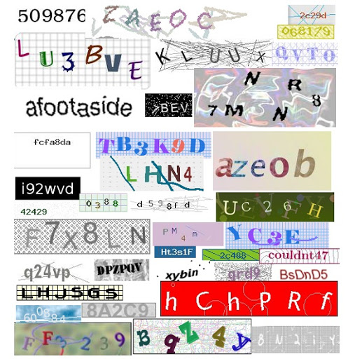    | 
| :--------: | 
| **Примеры текстовых капч.**  |  

Встречаются и другие виды капч, где надо не просто ввести символы с картинки, а произвести какое-то действие. Например, вас просят найти автобусы, пальмы, мотоциклы и другие предметы; решить пазл; расставить предметы в определённом порядке или рассортировать их.  

#### Дополнительные примеры капч:  

|     |  |
| :--------: | :-------: |
| [**ReCaptcha**](https://developers.google.com/recaptcha)  | [**HCaptcha**](https://www.hcaptcha.com/)    |  

|     |  |
| :--------: | :-------: |
| [**FunCaptcha**](https://www.arkoselabs.com/arkose-matchkey/)  | [**CloudFlare**](https://www.cloudflare.com/)    |
_______________________________________________  
## Как добавить в проект?  
Есть два способа:  
### Через окно эмулятора/устройства.  
**ПКМ по капче в окне → «Это капча!»**  

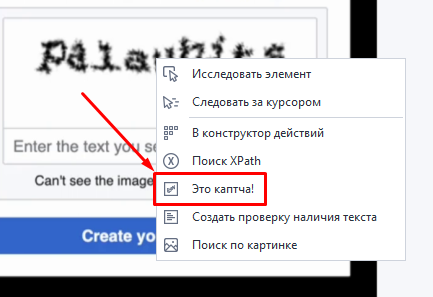  

### Через контекстное меню.  
**Добавить действие → Android → Распознать капчу**.  

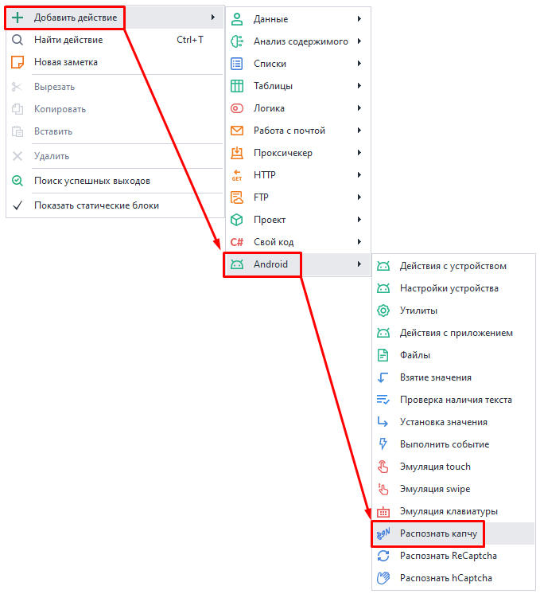  

:::tip **Минус второго способа.**
Вам придётся предварительно скачать изображение на компьютер, а затем указать путь к нему в экшене.
:::  
_______________________________________________ 
## Работа с окном.  
### Вкладка «Основное».  
Внешний вид окна отличается в зависимости от способа открытия:  

| 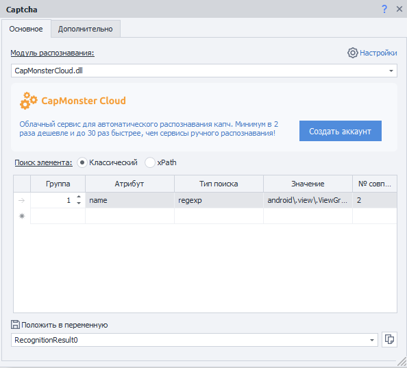 | 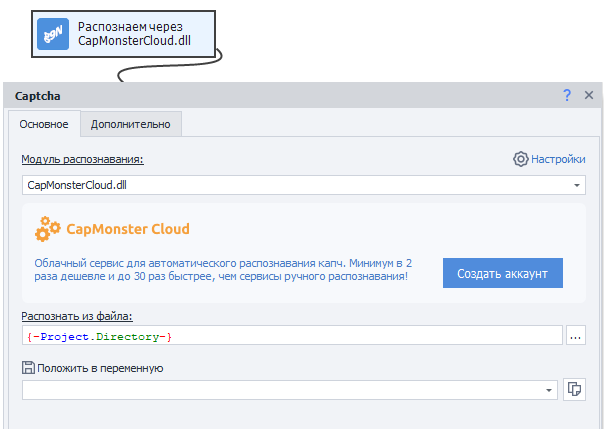 |
| :--------: | :-------: |
| **При открытии через окно эмулятора/устройства** | **Через контекстное меню** |   

#### Модуль распознавания.  
Из выпадающего списка выбираем сервис, в который мы будем отправлять капчу на распознавание. **Рекомендуем выбирать CapMonster Cloud**, он самый надёжный и стабильный.   

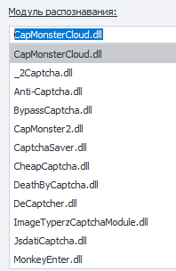

:::info `MonkeyEnter.dll`
Этот модуль используется для ручного разгадывания капч. Никакой из сервисов автоматического распознавания использоваться не будет.
:::  

#### Поиск элемента.  
Существует два способа поиска элементов на странице:  
- **Классический**.  
Поиск по параметрам HTML элемента: тэг, атрибут и его значение. 
- **xPath**.  
Поиск с помощью ***XPath выражений***. С помощью него можно реализовать более универсальный и устойчивый к изменениям вёрстки способ поиска данных.

#### Распознать из файла.  
Указываем путь к картинке с капчей, которую хотим разгадать. Можно написать переменную.  

#### Положить в переменную.  
Добавляем переменную, куда сохраним полученный ответ на задание. 

#### Настройки. 
При клике по кнопке с шестерёнкой вы попадёте в настройки программы, где будет возможность скорректировать данные для модулей распознавания.  
_______________________________________________ 
### Вкладка «Дополнительно».  
| 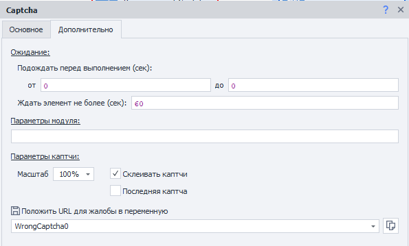 | 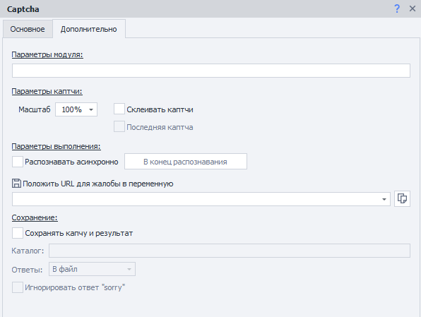 |
| :--------: | :-------: |
| **При открытии через окно эмулятора/устройства** | **Через контекстное меню** |  

#### Ожидание.  
- **Подождать перед выполнением**.  
Указываем диапазон *ОТ* и *ДО* в секундах, в пределах которого случайным образом будет выбираться время паузы перед началом работы.  
- **Ждать элемент не более**.  
Если капча не найдётся за указанное здесь время в секундах, то экшен завершится с ошибкой (выход по красной ветке).  
  
#### Параметры модуля.  
В этом поле можно указать дополнительные параметры или условия, необходимые для разгадывания капчи. Такие как:  
- *Чувствительность к регистру*;  
- *Распознавание кириллицы*;  
- *Математическая значение*;  
- *Несколько слов*.  

:::info **Формат записи дополнительных параметров**.
`название_параметра=значение_параметра`.  
Несколько значений разделяются символом `&`.
:::  

**Примеры записи для CapMonster Cloud API:**  
- `CapMonsterModule = ZennoLab.vk` (выбор одного из текстовых модулей);  
- `CaseSensitive = true` (чувствительность к регистру);  
- `Numeric = false` (капча состоит не только из цифр);  
- `Math = true` (в задании присутствует математическая операция).  

#### Масштаб.  
С помощью этой настройки можно уменьшить или увеличить размер отправляемой картинки с капчей.  

#### Склеивать каптчи.  
Некоторые капчи состоят из нескольких картинок, поэтому может понадобиться объединить их для быстрого и корректного решения.  

Установите флаг на **Склеивать каптчи** для первого элемента. Затем по каждому следующему элементу кликайте **ПКМ → Приклеить к каптче** из контекстного меню.  

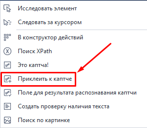  

При каждом клике будет создаваться новый экшен. У последнего нужно обязательно поставить чекбокс **Последняя капча**.  

#### Асинхронное распознавание.  
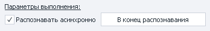  

Эта настройка позволяет не ждать ответа от сервиса, а продолжать выполнение шаблона.  

При этом создаётся экшен **Ожидание распознавания капчи**. Настроек у него нет, доступна лишь одна кнопка **В начало распознавания**, после клика на которую вас перенаправит на основной экшен решения капчи. Это особенно удобно, если на холсте эти экшены находятся далеко друг от друга. В основном же экшене есть обратная кнопка **В конец распознавания**.  

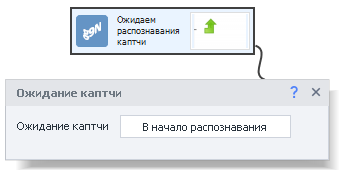  

**Процесс работы:**  
1. Шаблон доходит до основного экшена **Распознать капчу**.  
2. Отправка капчи на сервис.  
3. Продолжение работы шаблона вплоть до экшена **Ожидание капчи**.  
4. Ждёт ответа от сервиса.  
5. После получения результата его можно поместить в переменную.

#### Положить URL для жалобы.  
Данная опция нужна, чтобы пожаловаться сервису на некорректное распознавание конкретной капчи. По условиям некоторых солверов вы можете потребовать возврат денег за неуспешно пройденную капчу.  

В поле вы указываете название переменной, в которой будет храниться URL-сервиса, на который нужно отправлять жалобы.  

:::warning **Рекомендуем ответственно использовать эту возможность.**
Если будете часто жаловаться и запрашивать возврат средств, то сервис может вас заблокировать.  

Сначала постарайтесь разобраться в причинах частых ошибок и устранить их.
:::  
_______________________________________________ 
### Сохранение.  
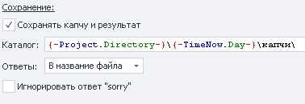  

В этом разделе вы можете сохранить картинку с капчей и ответ на неё в указанный каталог.  

#### Доступные параметры:  
- **Каталог**. Указываем директорию, в которую будем загружать картинки. Можно использовать ***переменные***.  
- **Ответы**. Выбираем из двух вариантов, куда будут сохраняться ответы на капчи:  
    - *В названии файла*.  
    Удобно, но не всегда получается использовать, потому что Windows не поддерживает символы, встречающиеся в некоторых заданиях.  
    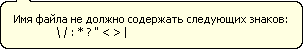  
    - *В файл*.  
    Картинка с капчей будет сохраняться с именем `captcha(X).png`, где **X** — это порядковый номер капчи.  
    Также будет создан текстовый файл `captcha(X).txt` с ответом на эту капчу.  
- **Игнорировать ответ “sorry”**. При возникновении некоторых ошибок экшен возвращает **`sorry`** вместо ответа на капчу. Если включить эту опцию, то программа не будет сохранять капчи с таким ответом.  

:::tip **Сохранение капч с ответами может быть полезно**.
При [создании собственного модуля](https://capmonster.cloud/UserModules) в **CapMonster Cloud**.
:::  
_______________________________________________ 
## Примеры использования.  
### Типичный случай.  
1. Кликаем ПКМ по изображению капчи и выбираем из контекстного меню **Это капча!**  
1.2. *Сразу после добавления этого экшена откроется **окно ручного распознавания**, его можно закрыть.*  
2. Выбираем необходимый модуль распознавания.  
2.1. *Не забудьте указать API ключ в **настройках** и убедиться, что на балансе сервиса есть деньги.*  
3. Теперь кликаем ПКМ по полю, куда нужно ввести ответ на капчу и выбираем пункт **Поле для результата распознавания капчи**.  
3.1. *Также можно вручную найте поле с помощью **Конструктора действий** и ввести ответ через экшен **Установка значения**.*  

### Когда нужно склеить.  
Для данного примера мы будем использовать тестовую страницу с таким исходным кодом:  
```html  
<!DOCTYPE html>
<html>
<head>
	<title>CAPTCHA Test</title>
</head>
<body>
	
	
	
	
</body>
</html>  
``` 
Здесь каждый символ — это отдельный HTML элемент.  

1. Кликаем по первой картинке **ПКМ → Это капча!**  
2. В настройках экшена включаем опцию **Склеивать капчи**.  
3. Теперь ПКМ по каждой оставшейся картинке → **Приклеить к капче**.  
4. В итоге получится 4 экшена:  
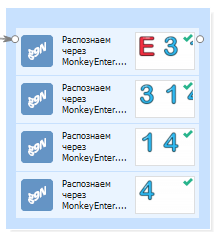  
5. После запуска первые три экшена будут собирать картинки и приклеивать друг к другу, а только последний экшен соберёт заключительную часть и отправит на сервис для распознавания.  
:::tip **Если в результате ответа на капчу нужно выдать математическое действие.**.
То в **Параметры модуля** не забудьте добавить `Math = true`.

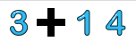
::: 
_______________________________________________ 
## Полезные советы.  
### Капча из простого текста.  
Иногда на слабозащищенных ресурсах встречаются капчи, которые не нарисованы графическим текстом на картинке, а написаны обычным текстом (просто буквы как, например, в блокноте).  

Такую капчу нужно не отсылать на сервис, а просто спарсить прямо из текста страницы. Сделать это можно через экшен ***Данные***. Выбираете текст страницы, включив опцию **парсить результат**, и в параметры вписываете ***регулярное выражение*** для парсинга страницы.  

### Математические капчи.  
Ещё встречаются такие же простые текстовые капчи, как в прошлом примере, но с математическими выражениями (сложение, вычетание, умножение или деление).  

Их содержание можно превратить в изображение и отправить на сервис для распознавание, а можно использовать ***JavaScript*** из раздела ***Свой код***.  

В поле кода вставляем ссылку на переменную с математическим выражением, а в качестве результата получаем ответ на него.  

### Flash каптча.
Её также можно просто превратить в обычную картинку и отправить на сервис. Найдите этот flash в ***Древе элементов*** и через ПКМ откройте контекстное меню. Там нужно выбрать пункт **Это капча!**
_______________________________________________ 
 
