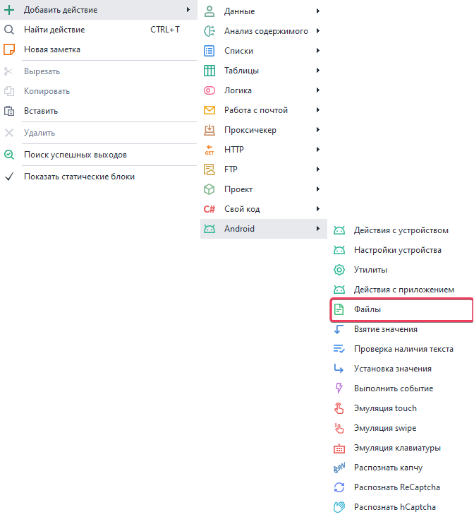
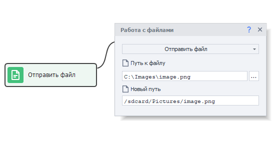
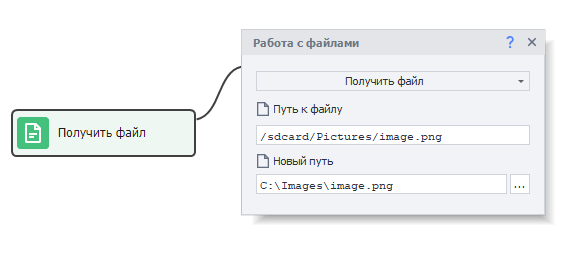

---
sidebar_position: 5
title: Работа с файлами
description: Отправка файлов на устройство и обратно.
---  

Данный экшен позволяет отправлять файлы с компьютера на устройство и наоборот.  
### Как добавить в проект?  
***Нажимаем ПКМ → Добавить действие → Android → Файлы***  

  

### Отправка файла.  
   
Эту функция нужна, чтобы скопировать файл с компьютера на устройство.  
#### Доступные параметры:  
- *Путь к файлу*. Полный путь к файлу на компьютере.  
- *Новый путь*. Место, куда будет сохранен скопированный файл.  
Можно указать полный путь, задав название файла: ***/sdcard/Pictures/pic.png*** или же указать  
только папку: ***/sdcard/Pictures/***. Во втором сценарии файл будет скопирован с имеющимся названием.   
Медиафайлы будут автоматически обновлены в галерее после отправки.  
> *Для отправки файлов в папки, которые находятся в режиме **Только для чтения**, такие как **/system**, необходимо предварительно выполнить команду `mount -o remount,rw /system` с помощью экшена **Консольная команда (ADB Shell)***  
### Получение файла.  
  

С помощью данного действия можно наоборот скопировать файл уже с устройства на компьютер. Параметры идентичны тем, что описаны в прошлой функции, без каких-либо нюансов.