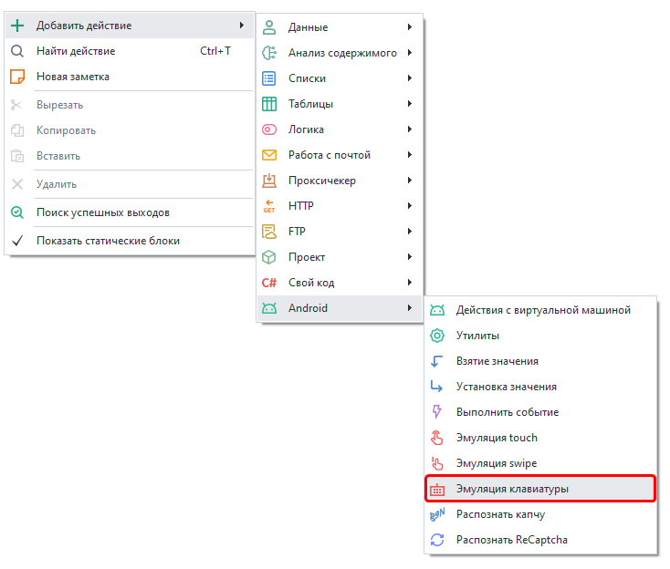

:::info **Пожалуйста, ознакомьтесь с [*Правилами использования материалов на данном ресурсе*](../Disclaimer).**
:::

## Эмуляция клавиатуры в ZD.  
  
Экшен позволяет эмулировать ввод данных в текстовые поля с помощью клавиатуры. А также нажатие системных кнопок, таких как кнопка **«Домой»**, **«Все запущенные приложения»**, **«Назад»**,  питание, звук и прочие.  

**Краткое содержание**

<!--All you need is a blank line-->

    + Добавление действия в проект. 
    + Что можно указать в поле «Текст»?  
    + Какие есть макросы клавиш?
    + Задержка.
    + Эмуляция swipe в ZD.

### Как добавить в проект?  
***Нажимаем ПКМ → Добавить действие → Android → Эмуляция клавиатуры***  

_______________________________________________ 
### Что можно указать в поле «Текст»?  
 

В текстовое поле экшена можно ввести простой текст, переменные или макросы специальных клавиш: `{AndroidKeys.BACK}`, `{AndroidKeys.HOME}`, `{AndroidKeys.CLEAR}`. Последние эмулируют некоторые системные (и не только) кнопки Android.   

### Какие есть макросы клавиш?  
- `{AndroidKeys.ENTER}`. Новая строка. Отправка формы на сайтах. Подтверждение действий в приложениях.    
- `{AndroidKeys.APP_SWITCH}`. Отображение недавно запущенных приложений.  
- `{AndroidKeys.BACK}`. Возврат назад.  
- `{AndroidKeys.CLEAR}`. Очистить поле ввода.  
- `{AndroidKeys.HOME}`. Возврат на рабочий стол.  
- `{AndroidKeys.COPY}`. Копирование выделенного текста в буфер обмена.  
- `{AndroidKeys.POWER}`. Эмуляция нажатия кнопки питания.  
- `{AndroidKeys.VOLUME_DOWN/UP}`. Уменьшение или увелечение громкости.  
- `{AndroidKeys.CAMERA}`. Активация камеры.  
- `{AndroidKeys.DEL}`. Удаление одного символа слева от курсора.  

Это только часть доступных команд, остальные можно найти [**Здесь**](https://developer.android.com/reference/android/view/KeyEvent).  

**Помимо имени для вызова кнопки можно также использовать ее цифровой код.  
Найти его можно по ссылке выше, нажав на название макроса.**

<!--All you need is a blank line-->

   

>  
 
### Задержка.  
  
Данный параметр позволяет выставить паузу между выводом символов.  

  
Однако если убрать чекбокс возле слова “Задержка”, то это ее отключит, и текст будет выводиться моментально.  
:::warning **Внимательно.**
При отключении задержки перестают работать Android макросы. Они будут напечатаны как обычный текст.
::: 

## Эмуляция swipe в ZD.   
С помощью этого действия можно совершить свайп. Он применяется при вертикальной прокрутке страниц в браузере и других приложениях; при перемещении по горизонтальному меню; при движении по экрану по диагонали.   
### Как добавить в проект?  
*Нажимаем ПКМ → Добавить действие → Android → Эмуляция swipe*  

 
_______________________________________________ 
### Доступные параметры.  
 
#### Координаты.  
Указываем координаты начальной ***(X от и Y от)*** и конечной ***(X до и Y до)*** точек свайпа.  
Где ***X*** – координата по горизонтали, а ***Y*** – по вертикали.  
#### Long Tap And Swipe.  
Если поставить здесь галочку, то перед свайпом будет эмулировано долгое нажатие.  
#### Продолжительность (мс).  
Эта настройка регулирует скорость в милисекундах, с которой должен быть осуществлён свайп.  
#### Изогнутый.  
Позволяет выполнить более реалистичное движение пальца не по прямой, а кривой линии.

