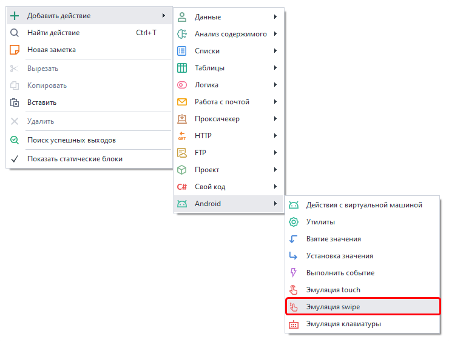
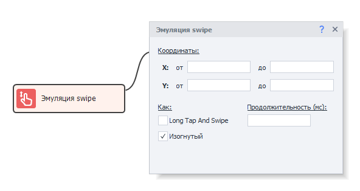

:::info **Пожалуйста, ознакомьтесь с [*Правилами использования материалов на данном ресурсе*](../../Disclaimer).**
:::
_______________________________________________
## Эмуляция swipe в ZD.   
С помощью этого действия можно совершить свайп. Он применяется при вертикальной прокрутке страниц в браузере и других приложениях; при перемещении по горизонтальному меню; при движении по экрану по диагонали.   
### Как добавить в проект?  
*Нажимаем ПКМ → Добавить действие → Android → Эмуляция swipe*  

 
_______________________________________________ 
### Доступные параметры.  
 
#### Координаты.  
Указываем координаты начальной ***(X от и Y от)*** и конечной ***(X до и Y до)*** точек свайпа.  
Где ***X*** – координата по горизонтали, а ***Y*** – по вертикали.  
#### Long Tap And Swipe.  
Если поставить здесь галочку, то перед свайпом будет эмулировано долгое нажатие.  
#### Продолжительность (мс).  
Эта настройка регулирует скорость в милисекундах, с которой должен быть осуществлён свайп.  
#### Изогнутый.  
Позволяет выполнить более реалистичное движение пальца не по прямой, а кривой линии.
