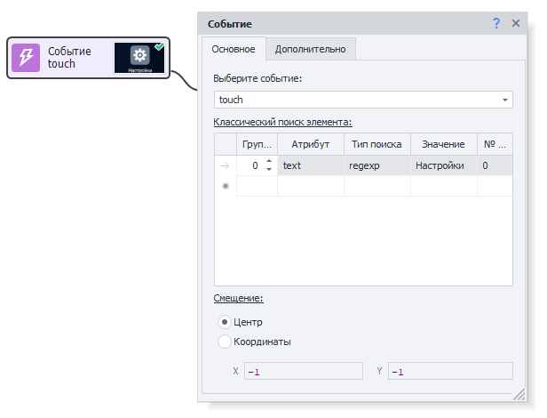
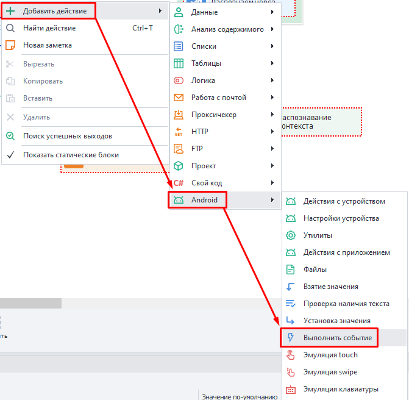
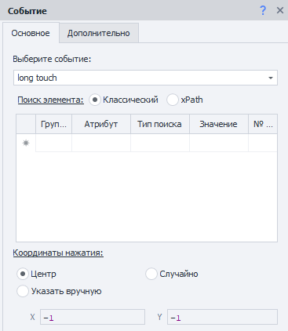
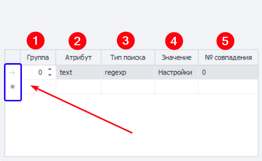
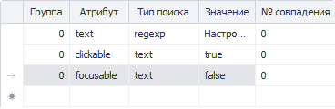
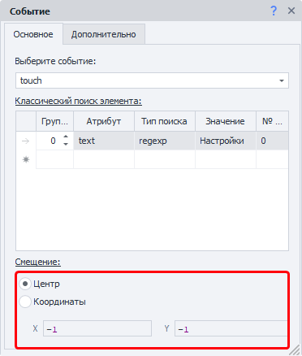
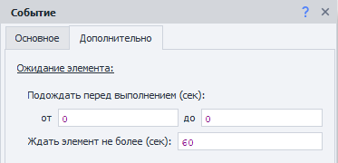
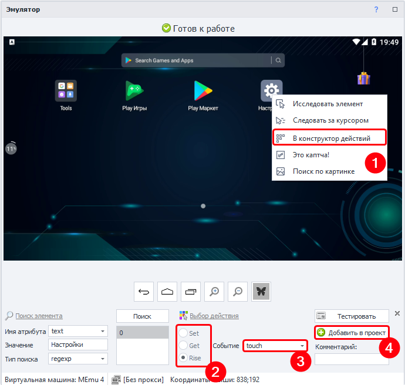

:::info **Пожалуйста, ознакомьтесь с [*Правилами использования материалов на данном ресурсе*](../Disclaimer).**
:::
_______________________________________________  
## Описание.  
Данный экшен используется для простого клика на элемент (touch) и для нажатия с удержанием (long touch).  

  

- **touch**. Применяется для кликов по кнопкам, пунктам в меню и чекбоксам.  
- **long touch**. Обычно нужен для вызова дополнительного меню у элементов.  

### Как добавить в проект?  
Через контекстное меню полотна:  
**Добавить действие → Android → Выполнить событие**.  

  
_______________________________________________  
## Вкладка «Основные».  
  

### Выберите событие.  
Здесь мы задаём, что именно хотим сделать с элементом:  
- *touch*;  
- *long touch*.  

#### Поиск элемента.  
Заполняем параметры для поиска элемента, с которым хотим взаимодействовать.  
_______________________________________________
### Условия поиска.  

**1. Группа** — определяет приоритет данного условия. Чем выше число, тем ниже приоритет.  
Если экшен не сможет найти элемент с высочайшим приоритетом (**0**), то он перейдёт к следующему условия. Перебор по приоритетам завершится, когда элемент будет найден, либо если все условия закончатся.  

Можно добавлять несколько условий с одинаковым приоритетом, тогда искаться будет сразу по всем этим условиям одновременно.  

**2. Атрибут** — указываем атрибут элемента, по которому будет выполняться поиск.  
**3. Тип поиска:**  
    - *text*. Поиск по полному или частичному совпадению текста;  
    - *notext*. Ищем среди элементов, в которых нет указанного текста;  
    - *regexp*. Выполняем поиск с помощью ***Регулярных выражений***.  
      
**4. Значение** — задаём значение для атрибута.  
**5. № совпадения** — порядковый номер найденного элемента (нумерация с нуля).  

#### Удаление условия. 
Для удаления одного из условий поиска кликните ЛКМ по полю слева от него (на скриншоте выше выделено синим цветом), а затем нажмите клавишу **Delete** на клавиатуре.  

#### Множественное условие.  
Поиск элемента может осуществляться сразу по нескольким условиям:  

  

Всегда старайтесь подбирать условия таким образом, чтобы в результате поиска оставался только один элемент.  
_______________________________________________  
### Смещение.  
  

- **Центр**. Нажатие *(touch/long touch)* будет выполнено ровно по центру элемента.  
- **Координаты**. Здесь же можно задать координаты внутри найденного элемента, куда произведётся нажатие.  

#### Примеры координат.  
- `0`;`0`. Верхний левый угол элемента.  
- `99`;`49`. Выбирается пиксель на пересечении 100-го по горизонтали и 50-го по вертикали.  
- `-1`;`-1 (любое отрицательное число)`. Клик по центру элемента.  
    - `-1`;`9`. Кликаем пиксель на пересечении центра элемента по горизонтали и 10-го пикселя сверху.  
    - `0`;`-26`. По горизонтали клик будет произведён в самой левой точке элемента, а по вертикали - в центре элемента.  
    - `-760`;`-2600`. И это тоже клик по центру элемента.  
:::tip **Если задать значение превышающее высоту или ширину элемента.**  
То оно будет уменьшено до ближайшего реального значения.
:::  
_______________________________________________  
## Вкладка «Дополнительно».  
  

### Подождать перед выполнением.  
Указываем диапазон **ОТ** и **ДО** в секундах, из которого будет браться случайное значение для ожидания перед выполнением.  

### Ждать элемент не более.  
Если по истечению указанного времени в секундах элемент не появится, то экшен завершит работу с ошибкой.  
_______________________________________________  
## Пример использования. 
Этот экшен нужно использовать каждый раз, когда вам нужно нажать на какой-либо элемент. Например, для клика по ярлыку **Настройки** на главном окне эмулятора.  

  

**1**. ПКМ по ярлыку → **В конструктор действий**.  
**2**. Выбираем действие **Rise**.  
**3**. Событие **touch**.  
**4**. **Добавляем в проект**.  
_______________________________________________
