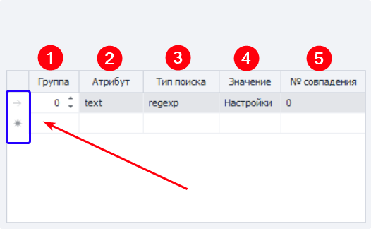

:::info **Пожалуйста, ознакомьтесь с [*Правилами использования материалов на данном ресурсе*](../Disclaimer).**
:::
_______________________________________________  
## Описание.  
Этот экшен используется для того, чтобы задать значение в поле ввода.  

### Как добавить в проект?  
Через контекстное меню полотна:  
**Добавить действие → Android → Установка значения**.  

 
_______________________________________________
## Работа с экшеном.  
### Выбор поля для установки значения.  
**1**. В ***Окне эмулятора*** кликаем ПКМ по нужному элементу, для которого хотим установить значение. Затем из Контекстного меню выбираем ***В конструктор действий***.   
**2**. После этого в нижней части окна эмулятора откроется конструктор, в котором нам нужно выбрать тип действия **Set**.  
**3**. Устанавливаем значение в текстовом поле.  
**4**. **Добавляем в проект** нажатием специальной кнопки.  

  
_______________________________________________
### Вкладка «Основные».  
  

#### Что вставляем.  
  

Пишем текст, который хотим вставить. Помимо простого текста, можно также использовать ***Макросы переменных*** — `{-Variable.someVar-}` и `{-Profile.Name-}`.  

#### Поиск элемента.  
Заполняем параметры для поиска элемента, с которым хотим взаимодействовать.  

### Условия поиска.  
  

**1. Группа** — определяет приоритет данного условия. Чем выше число, тем ниже приоритет.  
Если экшен не сможет найти элемент с высочайшим приоритетом (**0**), то он перейдёт к следующему условия. Перебор по приоритетам завершится, когда элемент будет найден, либо если все условия закончатся.  

Можно добавлять несколько условий с одинаковым приоритетом, тогда искаться будет сразу по всем этим условиям одновременно.  

**2. Атрибут** — указываем атрибут элемента, по которому будет выполняться поиск.  
**3. Тип поиска:**  
    - *text*. Поиск по полному или частичному совпадению текста;  
    - *notext*. Ищем среди элементов, в которых нет указанного текста;  
    - *regexp*. Выполняем поиск с помощью ***Регулярных выражений***.  
**4. Значение** — задаём значение для атрибута.  
**5. № совпадения** — порядковый номер найденного элемента (нумерация с нуля).  

#### Удаление условия. 
Для удаления одного из условий поиска кликните ЛКМ по полю слева от него (на скриншоте выше выделено синим цветом), а затем нажмите клавишу **Delete** на клавиатуре.  

#### Множественное условие.  
Поиск элемента может осуществляться сразу по нескольким условиям:  

  

Всегда старайтесь подбирать условия таким образом, чтобы в результате поиска оставался только один элемент.  
_______________________________________________
### Вкладка «Дополнительно».  
  

#### Подождать перед выполнением.  
Указываем диапазон **ОТ** и **ДО** в секундах, из которого будет браться случайное значение для ожидания перед выполнением.  

#### Ждать элемент не более.  
Если по истечению указанного времени в секундах элемент не появится, то экшен завершит работу с ошибкой.  

#### Эмуляция.  
Можно поставить задержку для обращения к эмулятору, от 15 до 5000 милисекунд. В контексте данного экшена, это означает замедленный ввод символов, как при печате с клавиатуры. Ведь вживую почти невозможно напечатать какое-либо слово мгновенно.  
_______________________________________________
## Пример использования.  
По умолчанию на главном экране эмулятора находится строка ввода для поиска по Google Play. Так что давайте попробуем ввести в неё какой-нибудь текст.  

  

1. Кликаем ПКМ по полю поиска и отправляем элемент в ***Конструктор действий***.  

  

2. Проверяем, что элемент может быть найден по выставленным критериям поиска **(1)**.  
3. Теперь вводим желаемый текст в поле **Значение (2)**.
4. Нажимаем **Тестировать (3)** и проверяем, что всё работает правильно.  
5. В случае успеха завершаем настройку нажатием **Добавить в проект (4)**. 

_______________________________________________