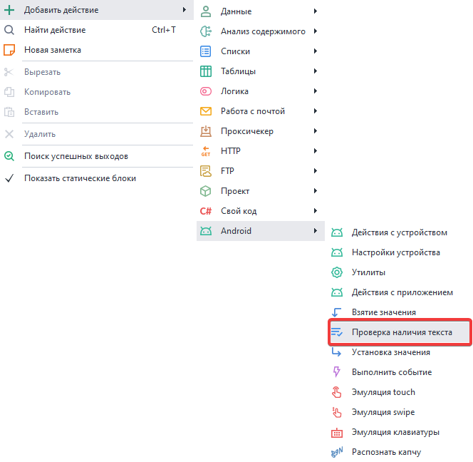
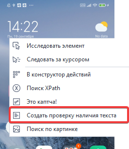
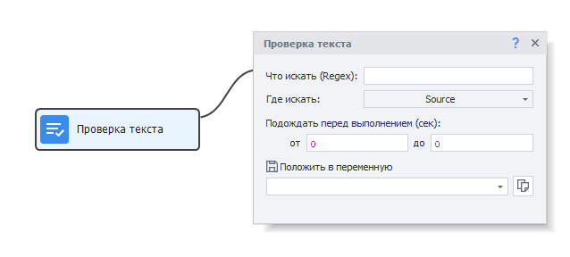

:::info **Пожалуйста, ознакомьтесь с [*Правилами использования материалов на данном ресурсе*](../Disclaimer).**
:::
_______________________________________________
## Описание.  
Данное действие **выполняет проверку наличия текста** на экране. Также его можно использовать для определения корректности авторизации и успешности выполнения определённого действия.  

### Как добавить в проект?  
Есть два способа:  

- Через контекстное меню полотна:  
**Добавить действие → Android → Проверка наличия текста**.  

  

- Через контекстное меню окна эмулятора:  
**Курсор мыши на текст → ПКМ → Создать проверку наличия текста**.  

 
_______________________________________________
## Работа с экшеном.  
  

### Что искать (Regex).  
Пишем текст, который хотим найти. Поле поддерживаем ***регулярные выражения***.  

### Где искать.  
Выбираем данные, среди которых будет произведён поиск:  
- **Source**.  
Полная структура элементов на экране. Такая же формируется в экшене ***Получить структуру элементов (XML)***.  
- **Text**.  
Массив строк, в котором содержится текст, отображаемый на экране. То есть значения атрибутов `text` и `content-desc`.  

### Подождать перед выполнением.  
Указываем время в секундах, которое экшен будет ожидать перед выполнением.
_______________________________________________