---
sidebar_position: 3
title: Утилиты
description: Обзор экшена Утилиты
---  

В данном экшене собраны различные функции, которые будут нам полезны при работе с проектом.  

**Краткое содержание**

<!--All you need is a blank line-->

    + Консольная команда (ADB Shell).  
    + Установка Geo-позиции.
    + Настройка WiFi.  
    + Сбросить Google Advert Id.     
    + Получить структуру элементов (XML).  
    + Масштабирование. 
    + Отправить SMS на устройство. 
    + Получить параметры подключения ADB.
    + Получить буфер обмена устройства.
    + Задать буфер обмена на устройстве.
    + Выполнить запрос SQLite3. 
    + Выполнить скрипт Frida.

### Как добавить утилиты в проект?  
***Нажимаем ПКМ → Добавить действие → Android → Утилиты***  

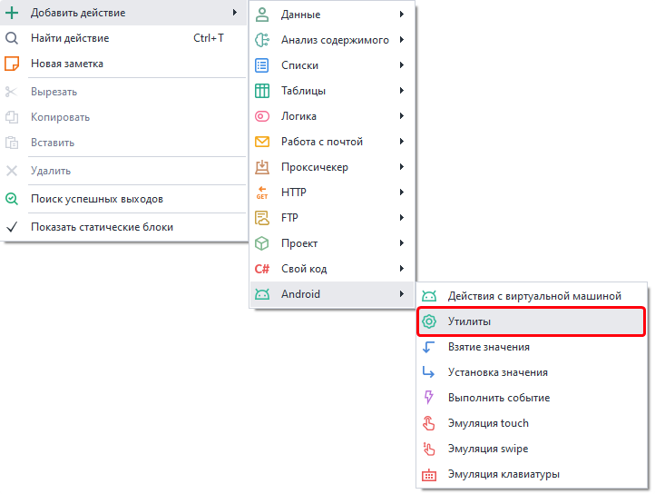   
## Доступные утилиты.  
### Консольная команда (ADB Shell)  
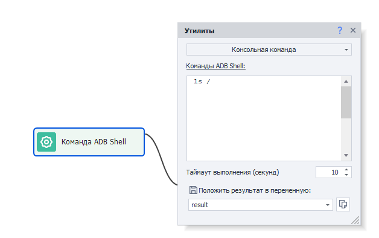  
> *Уточним, что данный экшен <mark>не является командой ADB в прямом смысле</mark>. Его стоит воспринимать как консоль или терминал эмулятора. Все команды вводятся <mark>без ADB Shell в начале</mark>.*  

Принцип работы этой утилиты схож с работой в приложении [**Terminal Emulator for Android**](https://apkpure.com/terminal-emulator-for-android/jackpal.androidterm). То есть она позволяет выполнить встроенные в Android консольные Linux команды.  

У этого экшена есть таймаут в 10 секунд. Если команда не выполнилась за это время, то экшен завершит работу с ошибкой (выход по красной ветке).  

Примеры команд:  
- **`ls -la /sdcard/Download`** — получить все файлы и директории по пути *`/sdcard/Download`*.  
- **`pm list packages`** — все установленные приложения.  
- **`pm list packages -3`** — только сторонние приложения.  
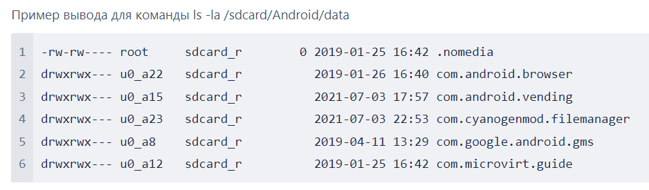    
#### Положить результат в переменную.  
Здесь необходимо указать существующую или новую переменную, в которую будет сохранён результат работы.  
#### Отправка/получение файлов и папок.  
Рассматриваемая утилита также поддерживает выполнение команд для отправки и получения файлов с устройства:  
- Отправить папку: *`adb push`* **`"c:\MyFolder"`**   **`/sdcard/`**.  
- Отправить файл: *`adb push`* **`"{-Project.Directory-}myFile.txt"`** **`/sdcard/myFileNewName.txt`**.  
- Получить папку: *`adb pull`* **`/sdcard/myFolder`** **`c:\Users\Public`**.  
- Получить файл: *`adb pull`* **`/sdcard/myFile.txt`** **`"{-Project.Directory-}myFileNewName.txt"`**.  
> Первый путь в запросе это **откуда** берем файл, второй **куда** отправляем.  
### Установка Geo-позиции.  
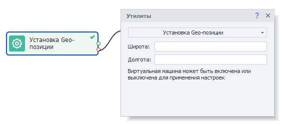    
Данная утилита позволяет подменить местоположение устройства.  
#### Доступные параметры:  
- *Широта*. Допустимые значения от -90 до 90.  
- *Долгота*. Допустимые значения от -180 до 180.  
Можно использовать дробные значения, используя разделитель [**.**] точка, либо [**,**] запятая.  
Например, широта и долгота Нью-Йорка: *40.7143* и *-74.006*  
### Настройка WiFi.  
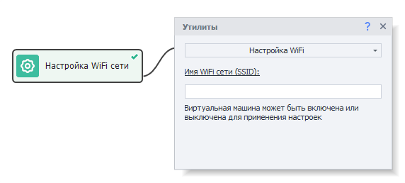   
С помощью этого действия можно подменить имя WiFi сети (SSID), через который “подключен” эмулятор.  
### Сбросить Google Advert Id.  
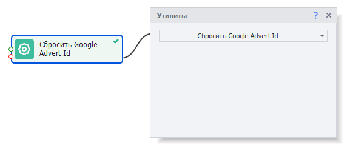    
Эта утилита сбрасывает рекламный идентификатор устройства.  
### Получить структуру элементов (XML).  
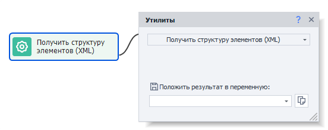  
Позволяет получить структуру элементов экрана в виде XML строки. Это те же данные, что отображены в  
*Окне дерева элементов*, только в виде **XML строки**. Затем эти данные можно разобрать с помощью экшена  
*Обработка JSON и XML*.  
#### Одни из полезных атрибутов, которые можно получить у элемента:  
- координаты и ширину с высотой (атрибут **bounds**),  
- отображаемый текст (атрибут **text**),  
- сведения о том, отображён ли элемент (атрибут **displayed**).  
### Масштабирование.  
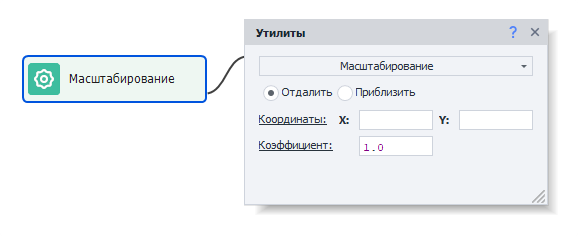  
Этим действием можно изменять масштаб: **Отдалить** (уменьшить) или **Приблизить** (увеличить).  
#### Доступные параметры:  
- *Координаты*. Это точка, относительно которой будет изменяться масштаб.  
- *Коэффициент*. Как сильно нужно уменьшить\увеличить масштаб.  
### Отправить SMS на устройство.  
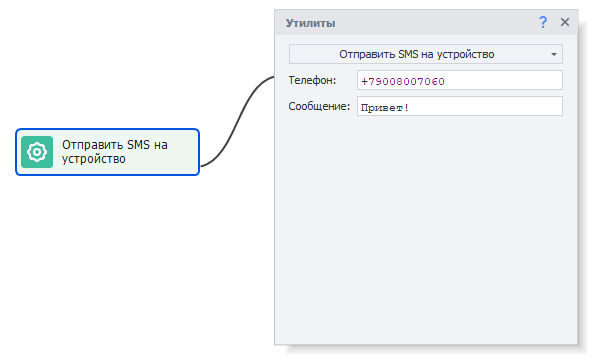   
Данная утилита эмулирует отправку SMS на устройство.  
#### Доступные параметры:  
- *Телефон*. Номер телефона отправителя.  
- *Сообщение*. Текст сообщения, которое будем отправлять.  
> *На устройстве должно быть установлено приложение для приема сообщений. Например, Google Сообщения, LineageOS Messaging или другое.*  
### Получить параметры подключения ADB.  
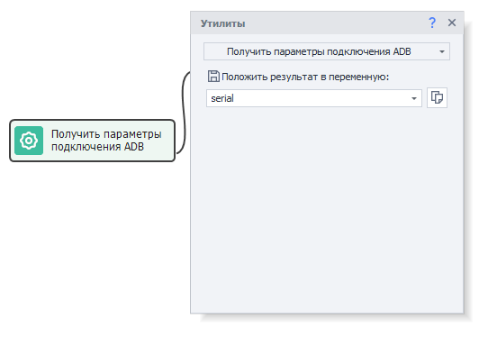  
С помощью этого экшена можно получить адрес и порт подключенного устройства. Используется при необходимости выполнить специфичные команды ADB: `adb -s serial mdns services`  
### Получить буфер обмена устройства.  
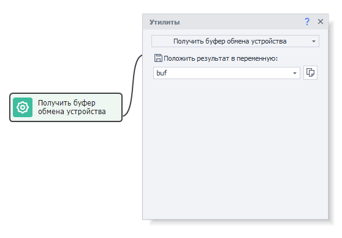  
Позволяет сохранить содержимое буфера обмена устройства в переменную.  
### Задать буфер обмена на устройстве.  
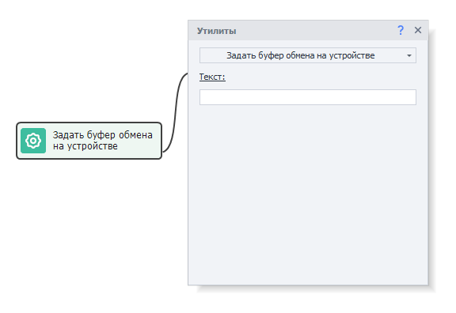   
Утилита позволяет задать содержимое буфера обмена на устройстве. Содержимое может быть вставлено в нужное поле через макрос `{AndroidKeys.PASTE}`.  
### Выполнить запрос SQLite3.  
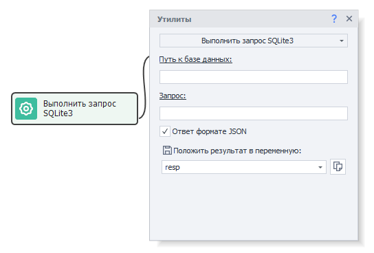  
Через это действие можно выполнить SQL-запрос к базе данных на устройстве. При первом запуске все необходимые файлы будут автоматически установлены на устройство в зависимости от его архитектуры.  
#### Доступные параметры:  
- *Путь к базе данных*. Полный путь к файлу. Например, `/data/data/com.android.providers.contacts/databases/contacts2.db`.  
- *Запрос*. SQL-запрос. Такой как `SELECT * FROM contacts`.  
- *Ответ в формате JSON*. При установке этого параметра результат запроса будет возвращен в формате JSON (данные можно прочесть с помощью экшена **Обработка JSON и XML**). В противном случае ответ вернется в виде массива строк. Разделителем в строке является символ **|** (вертикальная черта).  
### Выполнить скрипт Frida.  
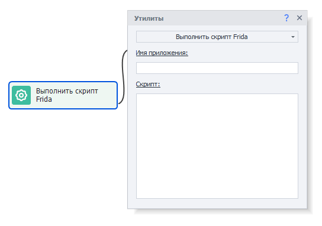   
Утилита для выполнения скрипт Frida. При первом запуске все необходимые файлы будут автоматически установлены на устройство в зависимости от его архитектуры. После чего будет запущен сервер Frida.  
#### Доступные параметры:  
- *Имя приложения*. Название приложения, в которое необходимо загрузить скрипт.  
- *Скрипт*. Содержимое скрипта. Поддерживаются макросы.    

