---
sidebar_position: 3
title: Действия с устройством
description: Как взаимодействовать с устройством через ProjectMaker
---  
:::info **Пожалуйста, ознакомьтесь с [*Правилами использования материалов на данном ресурсе*](../Disclaimer).**
:::

export const VideoSample = ({source}) => (
  <video controls playsInline muted preload="auto" className='docsVideo'>
    <source src={source} type="video/mp4" />
</video>
); 

**Краткое содержание**

<!--All you need is a blank line-->

    + Добавление действия в проект.  
    + Выбрать устройство.
    + Запустить или перезапустить.  
    + Остановить устройство.     
    + Создать устройство.  
    + Переименовать.  
    + Клонировать. 
    + Экспортировать.
    + Импортировать.
    + Выполнить полный сброс. 
    + Удалить устройство. 
    + Получить список.

   

### 1. Как добавить действие в проект?  

Для вызова контекстного меню нажимаем правой кнопкой мыши по пустому месту.  
Затем **Добавить действие → Android → Действия с устройством**.  

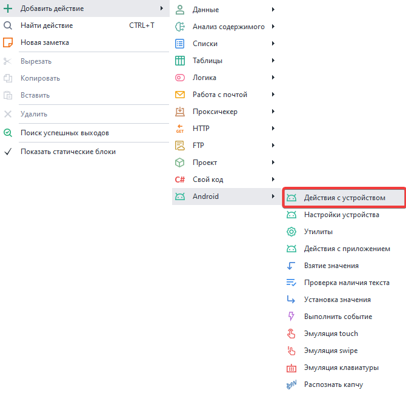  
_______________________________________________
### 2. Как выбрать устройство?  

С помощью данного действия можно выбрать устройство, с которым будет вестись работа.  

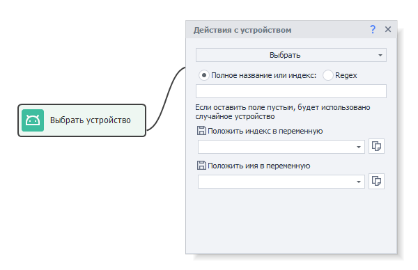 

#### Доступные настройки:  
 

***Полное название или индекс***
  

Пишем здесь Имя устройства, как оно указано в окне Мульти-Memu (1), или Индекс (2).  
Нумерация индексов начинается с нуля. Если здесь ничего не указать, то будет выбрано  
случайное устройство.  

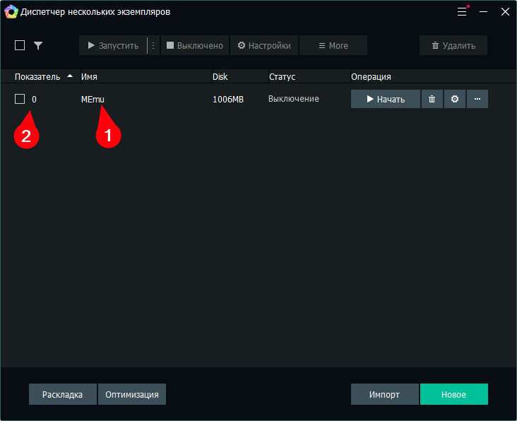     

  

- ***Regex***.  
В этом случае будет выбрано случайное устройство из списка, согласно заданному Regex выражению.  
Так можно сгруппировать устройства задав префиксы в названиях (*Например: OK_1, OK_2, VK_1, VK_2*)  
и рандомно выбирать, задав маску (*OK или VK*).  
- ***Положить индекс\имя в переменную***.  
Данный параметр позволяет сохранить имя или индекс выбранного устройства в переменные.  

### 3. Как запустить или перезапустить устройство?  

Данное действие запускает выбранное ранее устройство либо перезапускает уже работающее устройство.  

 

***Применять настройки профиля при запуске***.  
Если поставить галочку, то при запуске будут применены настройки заданные в текущем профиле. Такие как модель, идентификатор устройства, сотовый оператор и другие.  
:::warning **Обязательно.**
Перед запуском нужно ***Выбрать*** устройство, с которым будет работать программа.
:::

### 4. Как остановить устройство?  

Это действие останавливает запущенное устройство.  
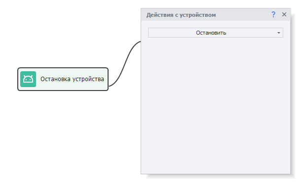   
_______________________________________________
### 5. Как создать устройство?  

С этим действием мы можем создать новое устройство. При создании будут сгенерированы новые данные устройства (IMEI, MAC и др.).  
:::info **Будьте внимательны.**
Создание нового устройства ресурсоёмкая операция. Возможно, будет легче сделать сброс настроек текущего устройства и сгенерировать новые идентификационные данные (описано ниже в пункте **Сброс**)*. 
:::    

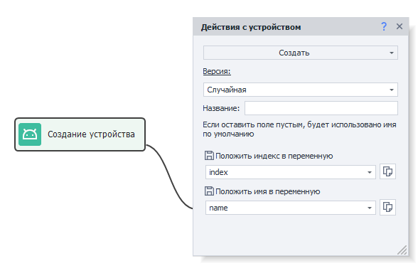 
#### Доступные настройки:  
- ***Версия***.  
Здесь нужно указать версию Android создаваемого устройства. Доступные значения **5.1, 7.1, 7.1 x64 и 9.0**.  
:::tip По умолчанию доступна только версия **7.1**
*Чтобы иметь возможность работать с другими версиями их нужно предварительно скачать.*
:::    
 
- ***Название***.  
Здесь указывается имя для создаваемого устройства. Можно оставить поле пустым, тогда будет выбрано значение по умолчанию.  
- ***Положить индекс\имя в переменную***.  
Позволяет сохранить имя или индекс создаваемого устройства в переменные.  
_______________________________________________
### 6. Как переименовать устройство?  

Позволяет изменить имя текущего устройства.  

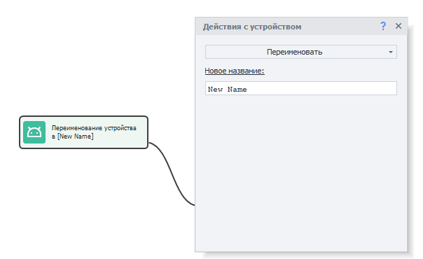  
:::info **Будьте внимательны.**
*Изменяется имя устройства, которое было выбрано с помощью функции **Выбрать** (описана в начале статьи).*
:::

:::warning **Важно.**
Устройство должно быть выключено при переименовании!
:::  

### 7. Как клонировать устройство?  

Действие для создания копии текущего устройства.  

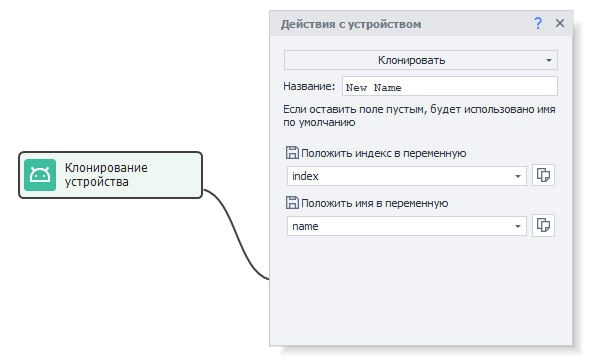
#### Доступные настройки:  
- ***Название***.  
Вводим имя для созданной копии. Можно оставить поле пустым, тогда будет выбрано значение по умолчанию.  
- ***Положить индекс\имя в переменную***.   
Позволяет сохранить имя или индекс копии устройства в переменные.  
_______________________________________________
### 8. Как экспортировать устройство?  

Данное действие создаёт полную копию устройства со всеми настройками и сохраняет в файл с  
расширением *.ova*. Данный файл можно перенести на другой компьютер и подключить с помощью функции **Импортировать** (описана ниже).

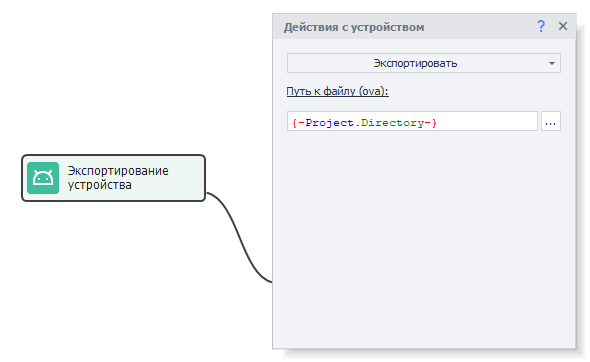

***Путь к файлу .ova***. Указываем путь, куда будет сохранена копия устройства.  
:::warning **Важно.**
Устройство должно быть выключено!
:::    

### 9. Как импортировать устройство?  

Позволяет загрузить устройство из файла, который мы сохранили в прошлом пункте.  

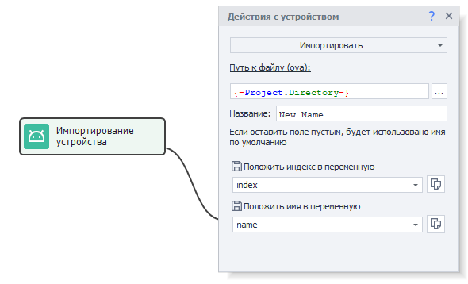
#### Доступные настройки:  
- ***Путь к файлу .ova***.   
Путь к файлу, в котором сохранено устройство. 
- ***Название***.  
Указываем имя для импортированного устройства. Можно оставить поле пустым, тогда будет выбрано значение по умолчанию.  
- ***Положить индекс\имя в переменную***.  
Позволяет сохранить имя или индекс импортированного устройства в переменные.  
_______________________________________________
### 10. Как выполнить полный сброс устройства?  

Это действие сбрасывает текущее устройство до состояния по умолчанию. Однако сгенерированные при создании идентификаторы устройства останутся неизменны.  

*Полный сброс* нужен, чтобы не удалять, а затем заново создавать устройство. Так как *Создание* крайне ресурсозатратное действие, которое долго выполняется. Выполнить полный сброс без восстановления системного раздела намного быстрее.  
:::warning **Очень важно.**
Устройство должно быть выключено для применения настроек! Все приложения, файлы и данные будут удалены! Данная функция сродни **factory reset** на телефонах.
:::

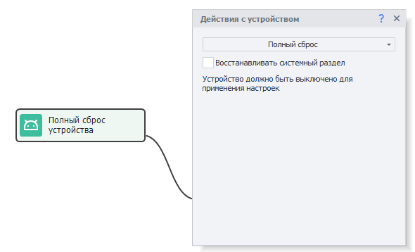

***Восстановление системного раздела***.  
Без привилегий суперпользователя ни одно приложение не имеет доступа к записи в системный раздел.  
Это означает, что при установке мессенджера никаких следов в системе не остается.  
Запись в системный раздел возможна только после явного подтверждения пользователя.  
Например, при установке Xposed Framework, чтобы восстановить устройство в изначальное состояние потребуется поставить галочку.  
:::tip **Интересно.**
*При включении опции **Восстановление системного раздела** сброс будет происходить дольше.*
:::  

### 11. Как удалить устройство?  

С помощью этого действия можно удалить устройство.  

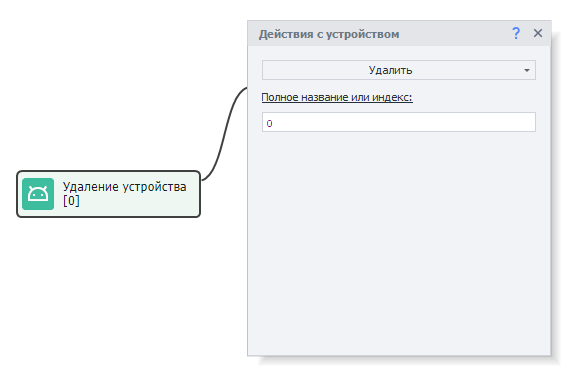

 

***Полное название или индекс***
  

Пишем здесь Имя устройства, как оно указано в окне Мульти-Memu (1), или Индекс (2).  
Нумерация индексов начинается с нуля.

     

 

### 12. Как получить список устройств?  

Представленное действие позволяет сохранить все доступные устройства в список.  

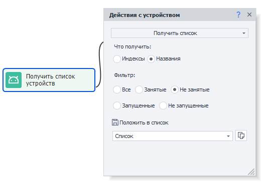 
#### Доступные настройки:  
- ***Что получить***.  
Можно выбрать что именно сохранить в список: индексы устройств или их названия.  
- ***Положить в список***.  
Это список, в который будет сохранен результат работы.  
- ***Фильтр***.  
Также можно отфильтровать получаемый список по состоянию устройства:  
  - **Все.** Сюда входят все созданные устойства, не зависимо от их состояния.  
  - **Занятые.** Устройство занято в одном из выполняющихся потоков. Работает только при выполнении в ZennoDroid. (ProjectMaker не видит потоки выполняющиеся в ZennoDroid).  
  - **Не занятые.** Устройство не используется ни в одном из выполняющихся потоков. Данный фильтр также работает только при выполнении в ZennoDroid.  
  - **Запущенные.** Устройство запущено, то есть в диспетчере задач присутствует хотя бы один процесс эмулятора.  
  - **Не запущенные.** Устройство остановлено. В диспетчере задач нет процессов эмулятора.  

#### Разница между занятым и запущенным состоянием:
Устройство, которое занято в выполняющемся потоке, не обязательно запущено. Оно вполне может быть остановлено (например, экспортируется, ему задаются настройки и т.д.). При этом запущенное устройство всегда занято.

