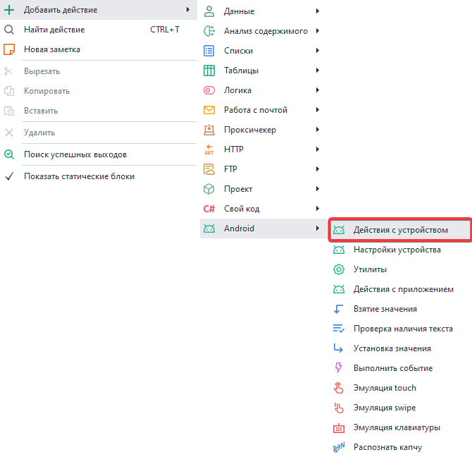

export const VideoSample = ({source}) => (
  <video controls playsInline muted preload="auto" className='docsVideo'>
    <source src={source} type="video/mp4" />
</video>
); 

> ***Краткое содержание**:*  
> *1. Добавление действия в проект.  
> 2. Настройка идентификатора устройств.  
> 3. Сотовый оператор.  
> 4. Модель устройства.  
> 5. Настройка MAC адреса Wi-Fi сети.  
> 6. Производительность виртуальной машины.    
> 7. Разрешение экрана.  
> 8. Режим рендеринга.  
> 9. Режим суперпользователя.  
> 10. Общие папки.  
> 11. Установка языка.  
> 12. Установка часового пояса.  
> 13. Установка даты и времени.  
> 14. Тип камеры.  
> 15. Способ подключения системного диска.  
> 16. Установка прокси.*  

### 1. Как добавить действие в проект?  

Для вызова контекстного меню нажимаем правой кнопкой мыши по пустому месту.  
Затем **Добавить действие → Android → Действия с устройством**.  

  

### 2. Как настроить идентификаторы устройства.  

С помощью данной функции можно изменить такие параметры как [IMEI](https://ru.wikipedia.org/wiki/IMEI), Android ID (идентификатор устройства), [IMSI](https://ru.wikipedia.org/wiki/IMSI), Sim Serial (серийный номер SIM карты).  

### 3. Как добавить сотового оператора?  

Все данные для этого действия можно найти [**на этом сайте**](https://www.mcc-mnc.com/)  

#### Доступные настройки:  
- ***Страна***. Две буквы из колонки ISO.  
- ***Код оператора***. Совокупность значений из колонок MCC и MNC (например, 25002 для Мегафона).  
- ***Название оператора***. Колонка Network (Baykal Westcom, BeeLine/VimpelCom, MTS).  
- ***Номер телефона***. Без знака "+" в начале, 79*** и так далее.  

### 4. Как указать модель устройства?  

#### Доступные настройки:  
- ***Производитель***. Чье устройство эмулируем (Samsung, Huawei, Xiaomi, Google, Meizu и т.д.).  
- ***Модель***. Какую модель используем. Можно найти в build.prop (подскажем как ниже).  
- ***ro.product.brand***. Если в этом поле значение не указано, то дублируем его из Производитель.  
- ***ro.product.board***. Для современных телефонов неактуально, можно оставить пустым.  
- ***ro.hardware*** и ***ro.build.fingerprint***. Возьмем из build.prop.  

#### Как найти данные в build.prop:  
Для этого необходимо сделать запрос в поисковую систему следующего вида:  
***build.prop phone_model*** *(например, build.prop Samsung s10)*.  
Переходим по одному из результатов и в тексте сообщения находим интересующие нас данные:  
*ro.product.brand=samsung  
ro.hardware.chipname=exynos9820  
ro.product.board = нет  
ro.product.model или ro.product.system.model*  

> ***Как узнать параметры своего телефона?***  
> Для этого нужно в терминале (например, [Terminal Emulator for Android](https://apkpure.com/terminal-emulator-for-android/jackpal.androidterm#google_vignette)) выполнить команду *getprop*.

### 5. Как настроить MAC адрес Wi-Fi сети:  
Формат - через двоеточие: XX:XX:XX:XX:XX:XX, либо без него: XXXXXXXXXXXX (12 знаков)  

### 6. Управление производительностью:  
Здесь можно настроить объем выделяемых для устройства ресурсов компьютера.  
#### Доступные настройки:  
> Перед изменением настроек убедитесь, что устройство **выключено**. 
- ***Процессоры***. Число выделяемых ядер процессора на работу эмулятора.  
- ***ОЗУ (МБ)***. Количество оперативной памяти в МБ, которое может использовать эмулятор. *Минимально 512мб, максимум 65 636мб*.  
**Важно!** Больше 4гб можно выделить только на Android x64, на х86 4гб — это максимум.  
> *В большинстве случае **достаточно связки 1/2 ЦПУ + 1/2ГБ ОЗУ**. Так как для эмуляции используются ресурсы вашего компьютера, но при высоких значениях он может начать тормозить. Рекомендуем **начать с минимальных показателей** и увеличивать их по мере необходимости.*  

### 7. Установить разрешение экрана:  
В этой настройке можно задать **Ширину** и **Высоту** экрана, а также плотность пикселей на дюйм (**DPI**).  
**Плотность (DPI)** — можно указать любые значения в диапазоне от 40 до 640, но лучше придерживаться стандартных показателей Memu.  
> *Изменение DPI может негативно повлиять на отображение элементов приложений.  
Они могут стать либо слишком большими, перекрывающими доступ к другим элементам,  
либо наоборот слишком мелкими.*  

### 8. Выбор режима рендеринга:  
Переключение между OpenGL и DirectX. Данная настройках больше нужна при запуске игр через эмулятор.  Оптимальное значение придётся вычислять экспериментальным путём, либо на основе того, что пишут в интернете. Так как одни игры лучше работают с OpenGL, а другие с DirectX. Также влияет видеокарта и ее драйвера.  
> Перед изменением настроек убедитесь, что устройство **выключено**.  

### 9. Включение режима суперпользователя:  
Позволяет включать и отключать **root-доступ** к устройству.  
> Перед изменением настроек убедитесь, что устройство **выключено**.  

### 10. Доступ к общим папкам:  
Здесь можно указать пути к общим папкам в Windows. Они позволяют легко пересылать файлы  
в эмулятор и из него.  
**Важно!** *Для одной виртуальной машины можно настроить не более 4-ех общих папок*.  
#### Примеры:  
- **В Memu**: */sdcard/Download*, **в Windows**: *C:\Users\USERNAME\Downloads\MeEmu Download*  
- **В Memu**: */sdcard/Movies*, **в Windows**: *C:\Users\USERNAME\Videos\Memu Video*  
- **В Memu**: */sdcard/Music*, **в Windows**: *C:\Users\USERNAME\Music\Memu Music*  
- **В Memu**: */sdcard/Pictures*, **в Windows**: *C:\Users\USERNAME\Pictures\Memu Photo*  
 
 ***USERNAME** — подставьте сюда имя пользователя, с которого запущен сеанс Windows.*
> Перед изменением настроек убедитесь, что устройство **выключено**.  

### 11. Выбор языка системы:  
Данная настройка меняет язык эмулятора.   
Доступные значения: ***en, ko, de, ja, fr, ru, es, pt, hr, cn, sr, it, cs, th, in, pl, tr, uk, ar, vi, fil***  
> Перед изменением настроек убедитесь, что устройство **выключено**.  

### 12. Установка часового пояса:  
Позволяет выбрать часовой пояс устройства.  
Указывается в формате: ***Europe/Moscow*** или ***America/New_York*** и т.д.  
Список всех доступных временных зон можно посмотреть [**Здесь**](https://en.wikipedia.org/wiki/List_of_tz_database_time_zones)  

### 13. Как задать дату и время:  
Можно произвольно установить: **год, месяц, день, час, минуту и секунду**.  
Если оставить все поля пустыми, то произойдет автоматическая синхронизация с текущим временем.  

### 14. Смена типа камеры: 
Какие доступны:  
- **Физическая**. Реальная камера, подключенная к компьютеру.  
- **Виртуальная**. Используется автоматически, если нет реальной. Она встроена в эмулятор и позволяет сканировать QR-коды с экрана.  

### 15. Выбрать способ подключения системного диска:  
Доступные способы:  
- **Общий диск**. Позволяет использовать один системный диск для всех эмуляторов, что значительно снижает занимаемое место. В этом случае диск работает в режиме  
*Только для чтения*, то есть на него не получится записать информацию.  
- **Независимый диск**. Выбрав эту настройку, мы сможем записывать информацию на системный раздел эмулятора (*/system*).  

### 16. Как поставить прокси:  
Данная настройка позволяет установить прокси на весь эмулятор.  
Формат для прокси:  
- **С авторизацией**: *protocol://login:password@ip:port*.  
- **Без авторизации**: *protocol://ip:port*.  
 Значения для **protocol**: ***http***, ***socks4*** или ***socks5***. Если не указать, то по умолчанию стоит ***http***.  
> *Лучше включать прокси до запуска эмулятора, иначе некоторые приложения успеют отправить данные через ваш реальный IP*.