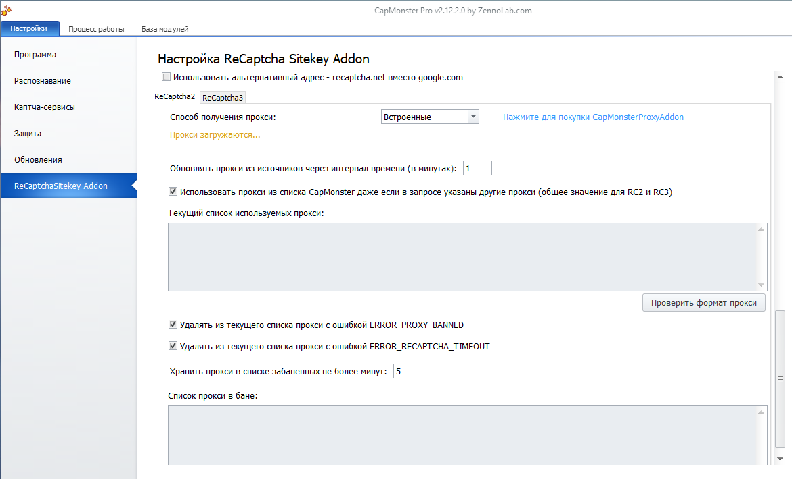

:::info **Пожалуйста, ознакомьтесь с [*Правилами использования материалов на данном ресурсе*](../Disclaimer).**
:::
_______________________________________________  
## Описание.  
В CapMonster для распознавания ReCaptcha можно использовать встроенные прокси от нашего партнёра **hit-proxy.com**.  

При покупке модуля *CapMonsterProxyAddon* вы получаете **прокси с безлимитным трафиком и поддержкой до 1000 одновременных подключений**.

Модуль *CapMonsterProxyAddon* приобретается в [Личном кабинете](https://userarea.zennolab.com/lk/userarea/UserCustomer.aspx) на срок один месяц.  

:::warning **Для каждой лицензии CapMonster нужно отдельно оплачивать аддон.**
:::

Аддон отлично работает с методами распознавания через *SiteKeyAddon для ReCaptcha*. Прокси привязываются к IP адресу активной лицензии CapMonster.  

### Подключение.  
Подключить купленный модуль можно в настройках CapMonster на вкладке *ReCaptchaSitekey Addon*. Для этого в качестве **Способа получения прокси** выберите *Встроенные*.  

 

После этого *RecaptchaSitekey Addon* будет распознавать Recaptcha с помощью прокси из *CapMonster ProxyAddon*.