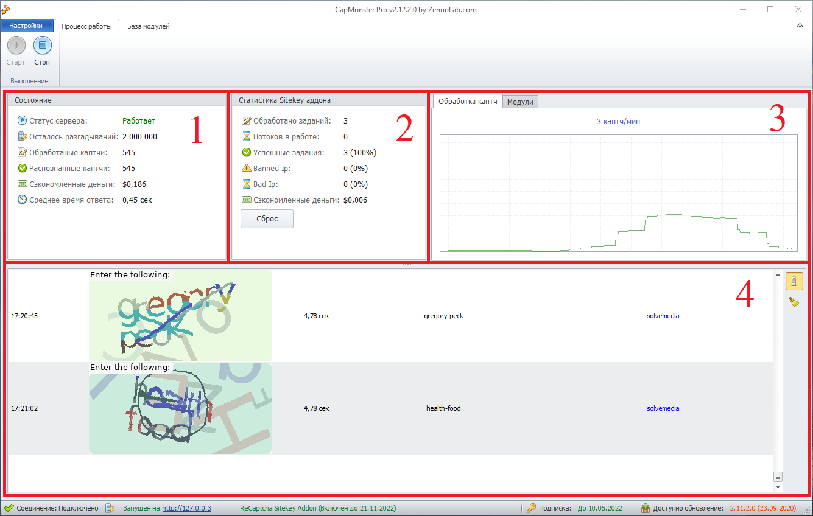
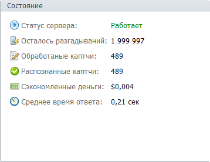
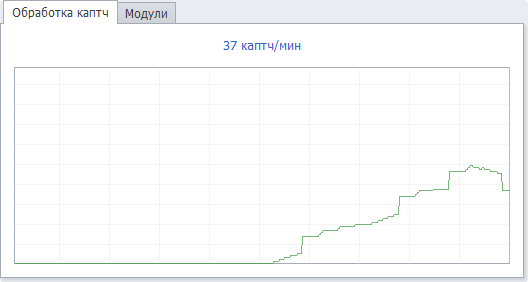
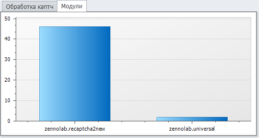
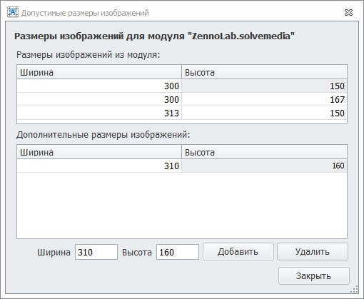
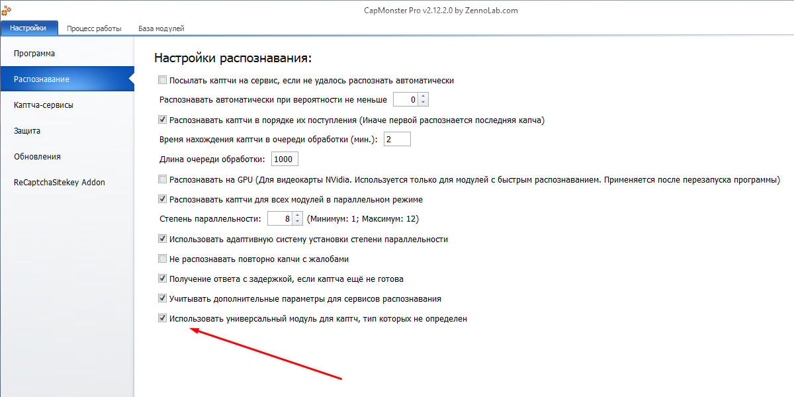
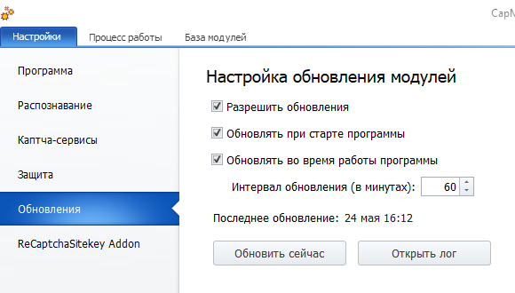
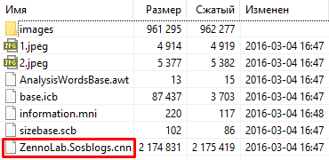

:::info **Пожалуйста, ознакомьтесь с [*Правилами использования материалов на данном ресурсе*](../Disclaimer).**
:::
_______________________________________________
## Запуск.  
Для начала распознавания включите эмуляцию каптча-сервисов в настройках и запустите программу кнопкой «Старт». После этого CapMonster автоматически будет перехватывать и решать капчи, отправляемые вашими SEO-программами.  

:::tip  **В настройках можно включить опцию, которая будет автоматически запускать сервис при включении программы.**  

:::

## Работа и статистика.  
После запуска CapMonster вам становится доступна статистика и мониторинг работы программы.  

  

### Состояние.  
Здесь отображается общая статистика распознавания каптч.  

  

- **Статус сервера** — работает/остановлен.  
- **Осталось разгадываний** — объем доступных для распознавания каптч в сутки.  
- **Обработанные каптчи** — количество каптч, которые программа получила.   
- **Распознанные каптчи** — число каптч, которые были решены.   
- **Сэкономленные деньги** — сумма, котороую вы бы потратили на распознавание через ручные сервисы.  
- **Среднее время ответа** — столько было в среднем потрачено на решение одной капчи.  

#### Подробнее о лимитах. 
Суточные лимиты (на 24ч.) зависят от версии программы:  
| Lite              | Standart | Pro |
| :----------------: | :------: | :----: |
| 100 000 простых, 20 000 сложных и ~2 200 ReCapctah2  |   500 000 простых, 100 000 сложных и ~11 100 ReCaptcha2   | До 2 000 000 простых, 400 000 сложных каптч и ~45 000 ReCaptcha2 |  

:::info **Эти лимиты не распространяются на**
Локальные модули, которые вы создали сами, и на ReCaptchaV3.
:::  

Счётчик обновляется раз в 10 секунд. Например, в Pro-версии каждые 10 секунд восстанавливается примерно по 231 капче, которые доступны для распознавания.  

Для своей версии (с учётом дополнительных пакетов) можно рассчитать показатель по формуле:  
`Суточный лимит / (86 400 / 10)`  

:::tip **Эти лимиты можно платно увеличить**
В [Личном кабинете](https://userarea.zennolab.com/) вы можете приобрести дополнительные каптчи. Они продаются пакетами по 3 000 000 штук за $97 (эквивалент стоимости Pro-версии).
:::  

### Статистика Sitekey аддона.  
В этом окне отображается статистика только для распознавания ReCaptcha через Sitekey.  

- **Обработано заданий** — количество задач ReCaptcha, которые были получены (также включают в себя подзадания по категориям: машины, дорожные знаки и т.д.).  
- **Потоков в работе** — показывает, сколько заданий сейчас находятся в процессе распознавания.  
- **Успешные задания** — число успешно полученных токенов.  
- **Banned Ip** — эти задания не были выполнены, так как IP попал в бан ReCaptcha.  
- **Bad Ip** — в данном случае задачи не решились из-за плохих прокси (медленные или невалидные).  
- **Сэкономленные деньги** — количество сэкономленных денег за успешно выполненные задания целиком.  
- **Сброс** — кнопка для сброса статистики Sitekey аддона.  

### Обработка каптч/Модули.  
Здесь показывается график распознавания каптч в минуту и распределение их по модулям.  
| Обработка каптч    | Модули |
| -------- | ------- |
|   |     |  

### Лог.  
Тут можно отслеживать активность программы.  

В этом окне отображаются:  

- *точное время получения задания*,  
- *обработанные каптчи*,  
- *время, потраченное на их решение*,  
- *ответ на каптчу*,  
- *модуль, который был использован*.  

## База модулей.  
В этой вкладке отображаются все доступные в CapMonster модули.  

  

Доступные характеристики модуля:  
- **Сложность капчи** *(зелёный флажок — простая, синий — сложная)*;  
- **Её название/тип**;  
- **Процент успеха при распознавании**;  
- **Номер версии модуля**;  
- **Комментарий с деталями**.  

Часть модулей мы добавляем сами по мере их разработки, а другие вы можете создать или приобрести, а затем подключить вручную.

Для добавления модуля нажмите «Добавить модуль» и выберите сохранённый файл на жёстком диске. А чтобы удалить — выделите ненужный модуль и нажмите «Удалить модуль».  

  

### Операции над модулями.  
Доступны в контекстном меню, при нажатии правой кнопкой мыши на нужном модуле.  

- **Использовать модуль** — включение или отключение модуля.  
- **Распознавать все капчи через этот модуль** — использовать один модуль для распознавания всех каптч. Полезно если нужный модуль не определяется автоматически.  
- **Принудительно переводить в UpperCase** — всегда выдавать ответ для каптчи в верхнем регистре.  
- **Допустимые размеры изображений** — позволяет установить размеры каптч. Это необходимо, когда есть подходящий для каптчи модуль, но размеры присылаемых каптч с ним не совпадают.  
  
- **Копировать полное имя модуля** — нужно, например, для передачи в дополнительных параметрах запроса, когда у программы не получается определить это автоматически.  
- **Удалить модуль** — можете удалить модули, которые ранее добавили.  

### Универсальный модуль.
Если для капчи нет отдельного модуля, она обрабатывается универсальным. Этот модуль распознаёт более 10 000 видов капч и работает на удалённом сервере, не нагружая ваш ПК.  

  

Чтобы каптчи без отдельного модуля автоматически отправлялись на Универсальный, вам нужно включить настройку **Использовать универсальный модуль для каптч, тип которых не определен**.  

  

| Пример распознавания каптч через данный модуль | 
| -------- | 
|   | 

### Почему сложные капчи решаются не мгновенно?
Многие популярные сервисы отслеживают попытки взлома своих капч и меняют алгоритмы, если замечают подозрительно быструю расшифровку.  

Основной признак взлома — статистика с результатами, где скорость распознавания значительно превышает человеческие возможности.  

Чтобы избежать подобных ситуаций, мы ввели ограничение на время распознавания сложных капч. Это значит, что ответ для некоторых типов будет выдаваться с небольшой задержкой, пропорциональной количеству символов. В это время процессор не нагружается, поэтому задержка никак не влияет на ресурсы компьютера.  

:::tip **К сложным капчам относятся**
Hotmail, Yandex, MailRu, Solvemedia, VK, OK, Special, Universal и другие.
:::

### Разница между «Локальным» и «Удалённым» модулем.  
В CapMonster Desktop **Локальные модули** — это те, которые устанавливаются и запускаются непосредственно на вашем компьютере. Они используют ресурсы вашей системы, так как вся обработка каптч происходит у вас локально. Это удобно, если у вас мощное железо, и вы хотите минимизировать задержки.  

Локальными также считаются модули, которые вы создали сами.  

| Обновление локальных модулей через настройки: | 
| -------- | 
|   | 

**Удалённые модули**, наоборот, работают и обновляются на наших серверах, то есть через облако, без нагрузки на ваш ПК.

#### Как легко определить тип модуля?
**1.** Найдите и откройте папку: `C:\Program Files\ZennoLab\RU\CapMonster Pro\<ВЕРСИЯ СОФТА>\Progs\Modules`  
**2.** Выберите нужный модуль с расширением `.cm` и откройте его любым архиватором.  
**3.** Если в архиве есть файл `.rnn` — модуль **Удалённый**.  
**4.** А если `.cnn``, то **Локальный**.  

| Удалённый    | Локальный |
| -------- | ------- |
|   |     | 