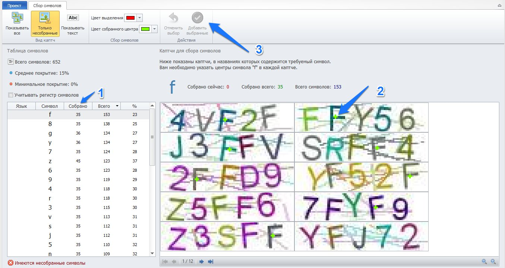
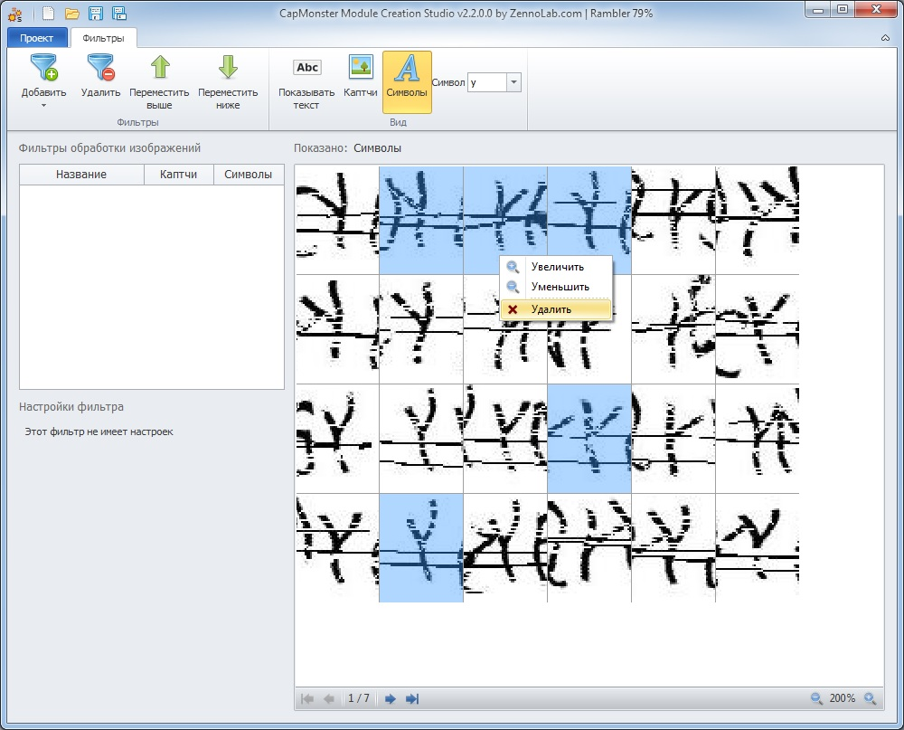

:::info **Пожалуйста, ознакомьтесь с [*Правилами использования материалов на данном ресурсе*](../Disclaimer).**
:::
_______________________________________________
## Приступаем к работе.  
В разделе **«Сбор символов»** расположены две таблицы:  
- **слева (1)** — список всех символов, где видно, сколько вариантов уже собрано и сколько ещё нужно,  
- **справа (2)** — таблица с изображениями капч, из которых эти символы можно выделять.

### Как проходит процесс:  
#### 1. Выбор символа.  
Кликните на нужную строку в таблице символов — после этого капчи справа автоматически отсортируются, и нужный символ будет встречаться в первых изображениях чаще всего.  

#### 2. Определение центров символов.  
На каждой капче кликайте в центр символа, пока не соберёте достаточно примеров выбранного знака.  

Таблица капч разбита на страницы — переходите между ними стрелками внизу.  

#### 3. Добавление символов.  
Нажмите **«Добавить выбранные»**, чтобы включить собранные символы в коллекцию.

Перед добавлением появится окно предпросмотра — убедитесь, что среди символов нет *мусора* (ошибочных выделений). Ненужные элементы можно выделить и удалить.  

#### 4. Повторить шаги 1-3 для каждого символа.  
_______________________________________________
### Совет.  
**Собирайте символы небольшими порциями**.  

Лучше несколько раз добавить по чуть-чуть, чем собирать весь набор за один раз — так вы не потеряете много работы в случае сбоя или отключения питания.  

При необходимости символы можно добавить позже — сбор доступен в любое время.  
_______________________________________________
## Обработка символов.
### Сколько собирать вариантов каждого символа? 
Количество необходимых примеров зависит от сложности и искажённости символов:  
- для **простых** (трафаретных) капч достаточно **от 5 вариантов** каждого символа,  
- для **сложных** (например, KCaptcha) — **до 200 вариантов**.  

Старайтесь, чтобы все символы были представлены примерно в одинаковом количестве.  

:::warning **Не торопитесь собирать слишком много сразу.**  
Начните с небольшого набора — возможно, этого уже будет достаточно. Если нет, вы всегда сможете **добавить недостающие варианты позже**.
:::
_______________________________________________
### Визуальные подсказки.  
- **Собранные, но ещё не добавленные** в коллекцию символы отмечаются *цветной точкой*.  
- **Уже добавленные** — точкой *другого цвета*.  

:::tip *Для удобства цвета можно изменить в настройках.*  
:::

Также можно **масштабировать** отображение капч, чтобы удобнее выделять символы — это никак **не влияет на результат**.  

:::info **Помните, что таблица капч разбита на страницы.**  
:::
_______________________________________________
### Удаление символов.  
Иногда требуется удалить ошибочно собранные или добавленные символы.  

Для этого:  
**1.** Перейдите в раздел **«Фильтры»**.  
**2.** Выберите отображение символов (вместо капч).  
**3.** В выпадающем списке укажите символ, чьи изображения нужно удалить.  
**4.** Выделите нужные картинки левой кнопкой мыши (с зажатым CTRL) и откройте контекстное меню правой кнопкой.  
**5.** Нажмите **«Удалить»**.  

_______________________________________________