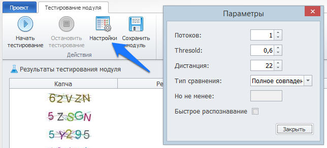

:::info **Пожалуйста, ознакомьтесь с [*Правилами использования материалов на данном ресурсе*](../Disclaimer).**
:::
_______________________________________________
## Описание.  
После обучения модуля необходимо провести его тестирование.  

В окне **Тестирование модуля** вы не только узнаете, какой у него процент распознавания и скорость работы, а ещё сможете посмотреть на результат работы.  

Это важная информация, которая помогает понять, как повысить качество распознавания и уменьшить время работы модуля.  
_______________________________________________
## Настройки тестирования.
В этом разделе можно изменить параметры тестирования и провести несколько пробных запусков. Изменение настроек может повлиять на процент распознавания.

При этом переобучение ядра не требуется — после тестирования достаточно просто сохранить модуль.

  

### Доступные параметры:  
#### Количество потоков для тестирования.  
Определяет, сколько процессов будет выполняться одновременно.  

#### Значение фильтра Threshold.  
Влияет на чувствительность распознавания.  

#### Минимальная дистанция между символами.  
:::tip **Ключевой параметр!**
:::  

- Если в результатах появляются лишние символы, попробуйте увеличить значение.  
- Если, наоборот, часть символов пропадает, попробуйте уменьшить.  

#### Тип сравнения.  
- *Полное совпадение*.  
Ответ должен полностью соответствовать правильному результату капчи.  
- *Совпадение подстроки (частичное совпадение)*.  
Используется, когда сайт принимает неполные, но частично верные ответы. В этом случае модуль будет считать корректными ответы, которые совпадают только частично.  

#### Диапазон совпадения (для режима подстроки).  
Задаёт, сколько символов подряд должны быть распознаны верно, чтобы ответ считался успешным.  

#### Быстрое распознавание.  
Опция, которая может повлиять на итоговую точность. Попробуйте включить или отключить её для сравнения результатов.  
_______________________________________________
## Улучшение распознавания.  
Повышение точности работы модуля сводится к поиску оптимального баланса между тремя типами ошибок распознавания символов. В идеале модуль должен допускать их примерно в равной пропорции — это говорит о хорошем «понимании» структуры капчи и стабильности работы алгоритма.  

### Ошибки распознавания символов.  
Перед разбором ошибок вспомним, какие бывают их типы при распознавании отдельных символов:  
- **Неправильное распознавание**.  
Символ присутствует, но определён неверно. Модуль видит вместо буквы `а` — букву `с`. Например: вместо `captcha` получается `ccptchc`.  
- **Пропуск символа**.  
Cимвол есть, но модуль его не замечает. Например: вместо `captcha` получается `aptcha`.  
- **Ложное срабатывание**.  
Модуль добавляет символ, которого на изображении нет (например, в промежутке между двумя буквами). Например: вместо `caputcha` получается `captcha`.

Поддержание баланса между этими типами ошибок позволяет добиться наиболее высокого процента успешного распознавания без необходимости повторного обучения ядра.  
_______________________________________________
### Модуль выдаёт слишком мало символов или не выдаёт их вовсе.  
При этом обучение прошло успешно — зелёный график близок к максимуму, красный и жёлтый стремятся к нулю.  

#### Возможные причины и решения:  
- **Слишком большое минимальное расстояние между символами.**  
Попробуйте уменьшить параметр. При слишком большом значении модуль распознаёт лишь редкие символы, но делает это корректно.  
**Например:** вместо `amcaptchatext` получается `aathet`.   
 
- **Несоответствие фильтров или масштабов.**  
Убедитесь, что те же фильтры применяются и к символам, и к капче. Если фильтр изменяет размер капчи, но не применяется к символам — модуль обучается на мелких буквах, а на реальной капче видит крупные и не может их сопоставить.  

- **Смещение центров масс.**  
Возможно, центры масс определяются не там, где собирались символы при обучении.  
    - Проверьте тест центров масс — кликая по символам, посмотрите, совпадают ли области отклика.  
    - Если не совпадают, попробуйте увеличить разброс центра масс и число дополнительных точек, чтобы охватить нужную область.  
    - Альтернатива — переобучить модуль с увеличенным разбросом центра символа (вместо или вместе с увеличением разброса центра масс).  
_______________________________________________
### Количество букв нормальное, но почти все распознаны неправильно.  
В тесте центров масс при клике точно по символу модуль выдаёт верный ответ, но при клике рядом (вблизи центра масс) — множество случайных символов.  

Вероятно, преобладает ошибка ложного срабатывания (тип 3). Попробуйте переобучить модуль, увеличив параметр, отвечающий за предотвращение ложных срабатываний.  

### Cлишком много символов.  
Все неверные, некоторые повторяются несколько раз подряд.  

Это та же ошибка, что и ранее (ложные срабатывания). Дополнительно минимальная дистанция между символами слишком мала — увеличьте этот параметр.  

### В тексте модуля виден правильный результат, но он разбавлен неверными символами.  
#### Возможные причины:  
- **Минимальная дистанция между символами слишком мала**;  
- **Слишком много ложных срабатываний (тип 3)**;  
- **Слишком низкий порог принятия символа**;  
- **Комбинация нескольких факторов выше**.
_______________________________________________