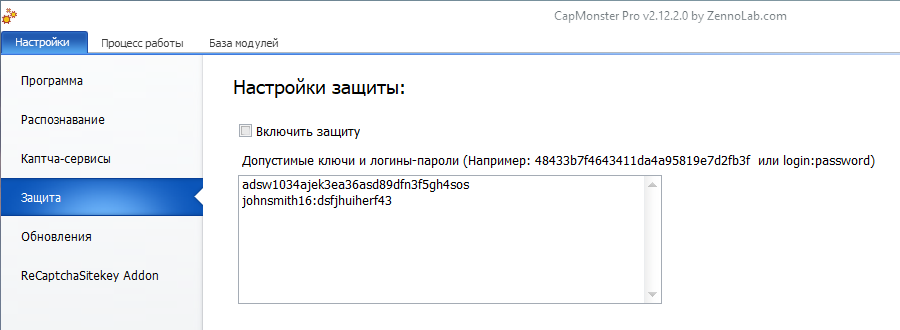

:::info **Пожалуйста, ознакомьтесь с [*Правилами использования материалов на данном ресурсе*](../Disclaimer).**
:::
_______________________________________________
## Описание.
CapMonster поддерживает защиту от использования сторонними пользователями. Чтобы её активировать, включите соответствующую опцию в настройках программы.  

  

При включённой защите отправлять капчи на CapMonster смогут только авторизованные пользователи, указавшие ключ доступа или логин и пароль. Ключи и пароли задаются в специальном поле.  

**Если защита отключена, отправлять капчи может любой пользователь.**