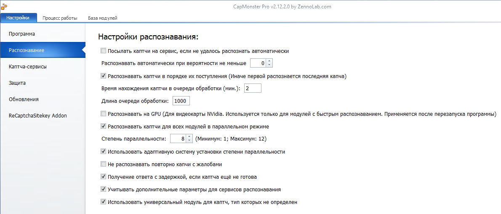

:::info **Пожалуйста, ознакомьтесь с [*Правилами использования материалов на данном ресурсе*](../Disclaimer).**
:::
_______________________________________________
## Описание.
Здесь собраны все настройки, которые влияют на процесс решения каптч.  

   
_______________________________________________
### Посылать каптчи на сервис, если не удалось распознать автоматически.  
Если программа не смогла распознать каптчу, она будет отправлена на сторонний сервис распознавания.  

### Распознавать автоматически при вероятности не меньше.
Каждая капча распознаётся с определённым уровнем уверенности модуля в правильности ответа. В этой настройке задаётся минимальный порог, при котором CapMonster возвращает результат.  

Если задание не вписывается в заданный порог, то программа вернёт пустой ответ. Однако при включении предыдущей настройки каптча отправится на сторонний сервис.  

### Распознавать каптчи в порядке их поступления.
При включённой настройке капчи распознаются в порядке их отправки на сервис; если настройка отключена, первыми обрабатываются последние поступившие капчи.  
_______________________________________________
### Время нахождения каптчи в очереди обработки.  
По истечении этого времени (в минутах) каптча будет удалена из очереди и не распознана.  

### Длина очереди обработки.  
Максимальное количество каптч в очереди на обработку.  

:::info При переполнении очереди все запросы будут возвращать ошибку `Капча не отправлена` или `CAPTCHA was not sent`.
:::  
_______________________________________________
### Распознать на GPU.
Опция позволяет использовать графический процессор видеокарты для распознавания капч, что существенно ускоряет процесс. Доступна только для видеокарт Nvidia и применяется лишь к локальным капчам, созданным вами в Module Creation Studio.  

:::warning Для применения настройки необходим перезапуск CapMonster.
::: 
_______________________________________________
### Распознавать каптчи для всех модулей в параллельном режиме.
Включает параллельный режим работы всех модулей распознавания, позволяя им обрабатывать несколько капч одновременно и тем самым ускоряя общий процесс работы.  

Эта настройка увеличивает количество потоков распознавания каптч для каждого загруженного модуля. Максимальное количество потоков зависит от количества ядер процессора.  

При отключенной настройке каждый модуль имеет только один поток распознавания.  

#### Степень параллельности.
Тут можно указать, сколько капч может одновременно обрабатывать модуль, когда включён параллельный режим. **Минимум: 1**, **Максимум: 12**.  

Чем выше значение, тем больше задач обрабатывается параллельно и тем выше общая скорость, но **возрастает нагрузка на процессор**.  

#### Использовать адаптивную систему установки степени параллельности.
Специальная система будет автоматически вычислять нагрузку на модуль и устанавливать оптимальную степень параллельности для него. Это позволяет оптимально использовать ресурсы программы.  

:::warning Не рекомендуется включать эту настройку, если
Вы постоянно распознаёте один-два типа капч при стабильной нагрузке: в такой ситуации адаптивная система наоборот может снизить скорость и общую производительность.
:::
_______________________________________________
### Не распознавать повторно каптчи с жалобами.  
При получении жалобы программа временно запоминает указанную капчу, а затем при повторной попытке распознавания возвращает сообщение о невозможности её обработки, в соответствии с правилами сервиса.  

### Получение ответа с задержкой, если каптча ещё не готова.  
Активирует режим ожидания готового ответа на капчу, если в момент запроса результат ещё не получен.

При включённой опции запрос будет некоторое время ожидать решения, а не возвращать сообщение **`CAPCHA_NOT_READY`**.

:::info Работает только с сервисами, которые поддерживают такую возможность.
::: 

### Учитывать дополнительные параметры для сервисов распознавания.  
Обработка дополнительных параметров решения каптчи. У каждого сервиса они свои, например, для Antigate API — это `regsense`, `numeric`, `calc`, `min_len`, `max_len`, `is_russian`

### Использовать универсальный модуль для каптч, тип которых не определен.  
Отправлять неизвестные типы каптч на распознавание универсальным модулем (**Universal**).