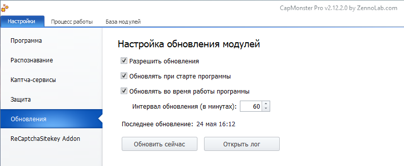

:::info **Пожалуйста, ознакомьтесь с [*Правилами использования материалов на данном ресурсе*](../Disclaimer).**
:::
_______________________________________________
## Описание.
Мы регулярно обновляем существующие модули распознавания и добавляем новые. Чтобы всегда иметь актуальную базу модулей, вы можете включить автоматическое обновление.  

  

### Разрешить обновления.
Включает автоматическое обновление базы модулей. Все актуальные изменения будут сразу доступы по мере их появления. 

### Обновлять при старте программы.  
При запуске программы будет выполнена проверка на наличие новых обновлений, которые сразу же установятся.  

### Обновлять во время работы программы.
Поиск последних изменений будет выполняться прямо во время работы программы.   

Здесь же можно задать **Интервал обновления** в минутах. Например, проверка обновлений может происходить один раз за час, или каждые полчаса.  

### Последнее обновление.  
Дата и время, в которые было выполнено последнее обновление.  

### Обновить сейчас.  
Обновление модулей можно также выполнить по нажатию этой кнопки.  

### Открыть лог.
Позволяет посмотреть лог обновлений.