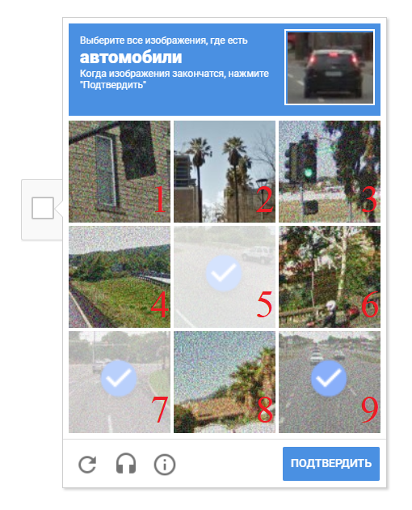
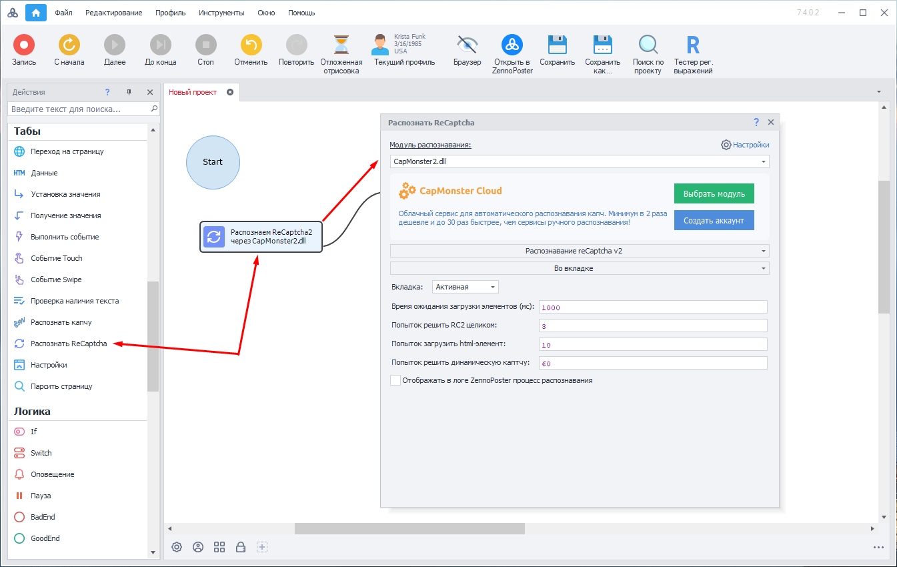
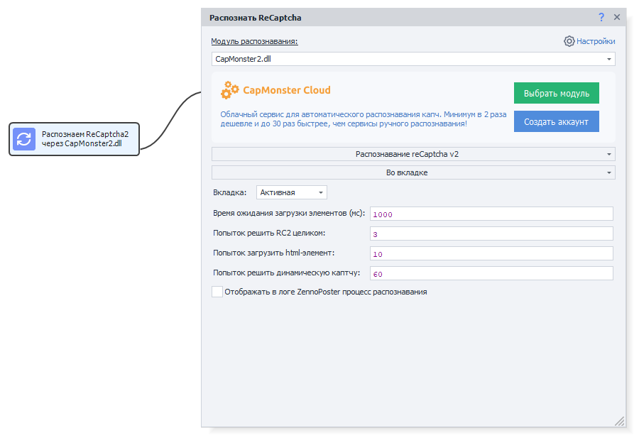

:::info **Пожалуйста, ознакомьтесь с [*Правилами использования материалов на данном ресурсе*](../Disclaimer).**
:::
_______________________________________________
## Описание.  
ReCaptchaV2 — это защита от ботов, выпущенная компанией Google. На веб-странице находится кнопка **«Я не робот»**, при нажатии на которую появляется несколько картинок, среди которых нужно выбрать все изображения, указанные в задании.  

| Так это выглядит | 
| -------- | 
|   | 

:::tip **[Демо-страница](https://2captcha.com/demo/recaptcha-v2) с примером ReCaptchaV2.**
:::

## Принцип работы.
Для отправки ReCaptchaV2 на распознавание в CapMonster нужно сформировать запрос, включающий:  
- изображение с набором вариантов ответа;  
- дополнительный параметр **Task** — *это текстовое задание самой капчи, например «Автомобили»*.  

После обработки CapMonster возвращает строку из цифр без разделителей — это номера изображений, на которые надо кликнуть. Цифры расположены по убыванию вероятности того, что на картинке есть указанный объект.  

### Пример.  
Если задание — выбрать изображения с автомобилями, а в ответе получено `597`, значит нужно отметить картинки **№5**, **№9** и **№7** и затем нажать **Подтвердить**.  

Цифра **5** стоит первой, потому что вероятность наличия автомобиля на этой картинке выше, чем на **9**-й и **7**-й.  



Если CapMonster не может уверенно определить как минимум две подходящие картинки (это минимальное количество правильных ответов), он вернёт пустую строку. В этом случае капчу можно дополнительно отправить на сервис ручного распознавания.  

## Использование с ZennoPoster.  
Для отправки ReCaptchaV2 из ZennoPoster вы можете использовать специальный экшен **распознать ReCaptcha2**.  

  

В этом экшене вы можете задавать необходимые параметры для распознавания.  



Также можно распознавать ReCaptchaV2 через SiteKey, указав ключ сайта и его URL.  

  

### Готовый сниппет.  
Для отправки ReCaptchaV2 из ZennoPoster версии выше **5.9.0.0** вы можете использовать подготовленный нами сниппет:  

[**СНИППЕТ**](./assets/RC2/Snippet.cs)

#### Примечание.  
Сниппет может выполнять любое количество попыток для решения ReCaptchaV2.  

Если вы используете медленные прокси, то можно увеличить время ожидания загрузки элементов, число повторных загрузок и задать настройку, проверяющую корректность распознанного ответа. Для этого вы можете изменять данные параметры:  
```csharp
// время ожидания
var waitTime = 3000;
// количество попыток распознать
var tryRecognize = 10;
// количество попыток выбрать изменяющиеся картинки
var dynamicImagesRecognizeAttempts = 20;
// количество попыток загрузить элемент
var tryLoadElement = 60;
// получить полный ответ
bool fullAnswer = false;
// получить сообщения о прогрессе распознавания
var needShowMessages = false;
// проверять корректность распознанного ответа
var needToCheck = true;
```

Поведение ReCaptchaV2 также зависит от IP-адреса, с которого выполняются эти действия. Иногда система игнорирует пропуск одной нужной картинки или случайный клик по неверной. Однако при частых ошибках ReCaptchaV2 может перестать принимать даже правильные ответы, поэтому рекомендуется использовать качественные прокси.