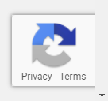

:::info **Пожалуйста, ознакомьтесь с [*Правилами использования материалов на данном ресурсе*](../Disclaimer).**
:::
_______________________________________________
## Описание.  
Эта версия капчи работает на фоне и проверяет пользователя, не требуя от него никаких действий.  

ReCaptchav3 анализирует поведение посетителей сайта и другие параметры, оценивая их по шкале от 0 до 1, где единица — это хорошо. На основе этой оценки система решает, что делать с пользователем: пропустить, заблокировать, ограничить функционал, отказать в действии или устроить дополнительную проверку.  

| Эта иконка на странице указывает на наличие ReCaptchaV3 | 
| :--------: | 
|   | 

### Принцип работы.
Как мы уже выяснили, принцип работы ReCaptchaV3 основан на анализе поведения пользователя. На сайте размещается специальный скрипт от Google, который незаметно собирает информацию о действиях посетителя — движения мыши, скорость кликов, время на странице и другие поведенческие факторы.  

Затем система на основе этих данных вычисляет уровень доверия и выдает токен — уникальную строку, отражающую вероятность того, что перед ней человек, а не бот. Этот токен передается на сервер сайта, где и происходит окончательная проверка пользователя.  

:::tip **Пример интеграции ReCaptchaV3 на странице:**  
```
<script src="https://www.google.com/recaptcha/api.js?render=reCAPTCHA_site_key"></script>
<script>
  grecaptcha.ready(function() {
      grecaptcha.execute('reCAPTCHA_site_key', {action: 'homepage'}).then(function(token) {
         //верификация пользователя
      });
  });
</script>
```
:::  

Чтобы отправить ReCaptchaV3 на распознавание в CapMonster, необходимо сформировать запрос, включающий три параметра: **URL страницы**, **sitekey** и **action** (например, `homepage`). В ответ CapMonster возвращает токен, который можно использовать для прохождения проверки на сайте.  
_______________________________________________
## Решение в ZennoPoster.  
Для получения заданий ReCaptchaV3 из ZennoPoster можно использовать специальный кубик **Распознать ReCaptcha**:  

  

В этом экшене можно задавать параметры каптчи: **action** и **min score**.  

Если у ZennoPoster не получается автоматически определить нужный Sitekey, тогда выберите режим **«Через SiteKey»** вместо *«Во вкладке»*. Для этого способа потребуется вручную указать **Sitekey целевого сайта** и его **URL-адрес**.  

    
_______________________________________________
## Распознавание ReCaptchaV3.  
### Поддерживаемые модули.  
Помимо CapMonster Desktop разгадывание ReCaptchaV3 поддерживается через следующие сторонние модули:   
- [**CapMonster Cloud**](https://capmonster.cloud/ru);  
- [Anti-Captcha](https://anti-captcha.com/ru/apidoc/task-types/RecaptchaV2Task);  
- [ImageTyperzCaptchaModule](https://www.imagetyperz.com/Forms/api/api.html#-recaptcha-submit-recaptcha);  
- [RuCaptcha](https://rucaptcha.com/api-docs/recaptcha-v2);  
- [DeathByCaptcha](https://blog.deathbycaptcha.com/api#newrec);  
- [2Captcha](https://2captcha.com/ru/2captcha-api#solving_recaptchav2_new);  

### Работа с токеном.  
После получения токена его необходимо передать в функцию верификации. Поскольку проверка может выполняться в любой момент, нужно успеть перехватить запрос на получение токена, и в ответе заменить его на токен из CapMonster.  

Для удобства вы можете воспользоваться готовым сниппетом, который автоматически выполняет подмену токена:  
```csharp
var sitekey = //SiteKey
string newToken = //New Token
string replaceRegex = @"(?<=\[""rresp"","").*?(?="")";

instance.ChangeResponse("https://www.google.com/recaptcha/api2/reload\\?k="+sitekey, 
                        new List<string> {replaceRegex}, new List<string> {newToken}, false);
```

#### Примечание.  
Использование SiteKey в сниппете не является обязательным. Однако следует учитывать, что без него будут перехватываться запросы от всех типов капч, включая ReCaptchaV2.  

Если это не создаёт неудобств, то можете воспользоваться упрощённой версией сниппета:  
```csharp
string newToken = //New Token
string replaceRegex = @"(?<=\[""rresp"","").*?(?="")";

instance.ChangeResponse("https://www.google.com/recaptcha/api2/reload", 
                        new List<string> {replaceRegex}, new List<string> {newToken}, false);
```
_______________________________________________