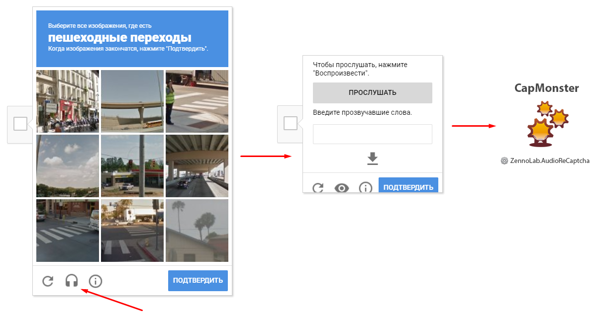

:::info **Пожалуйста, ознакомьтесь с [*Правилами использования материалов на данном ресурсе*](../Disclaimer).**
:::
_______________________________________________
## Описание.  
В CapMonster есть возможность решения звуковых ReCaptcha. Для этого используется модуль `ZennoLab.AudioReCaptcha`.  

**Принцип работы:** на странице с ReCaptcha выбираете вариант распознавания через аудиозапись и отправляете её в CapMonster для обработки.  



## Решение через ZennoPoster.  
Мы подготовили для вас сниппет, который поможет с отправкой звуковых ReCaptcha из ZennoPoster на CapMonster:  

[**Сниппет для решения ReCaptcha Audio**](./assets/Snippet_audioRC.cs)  

### Примечание.  
Сниппет гарантирует стабильную работу независимо от используемого в браузере User-Agent *(даже с мобильным или устаревшим)*.  

Однако обязательным условием для корректной работы является **использование прокси-сервера**. Это требование обусловлено поведением ReCaptcha: после 3-5 успешных распознаваний капчи с одного IP-адреса, сервис блокирует доступ к аудиофайлу.  

Для повышения надежности сниппет запрограммирован на повторную попытку в случае неудачи.  

Вы можете тонко настроить поведение сниппета, изменяя следующие переменные:  
- **Количество попыток загрузить элементы: `var tryLoadElement`**;  
- **Время ожидания: `var waitTime`**;  
- **Число попыток распознать капчу: `var tryRecognize`**;  
- **Необходимость проверки корректности ответа: `var needToCheck = true`**;  
- **Показ сообщения о прогрессе распознавания: `var needShowMessages = false`**.

:::info **Функция отправки каптчи на сервис выглядит следующим образом:**
```
ZennoPoster.CaptchaRecognition("CapMonster2.dll", str, "CapMonsterModule=ZennoLab.AudioReCaptcha&ParallelMode=true");
```  

Через знак `&` перечислены дополнительные параметры распознавания: *Имя модуля* и *включение Параллельного режима*.
:::
_______________________________________________
