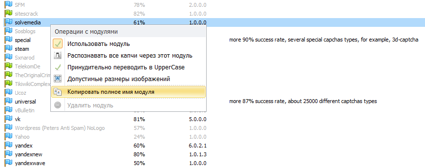
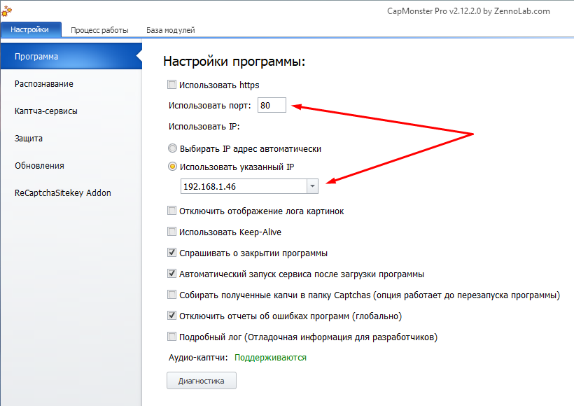
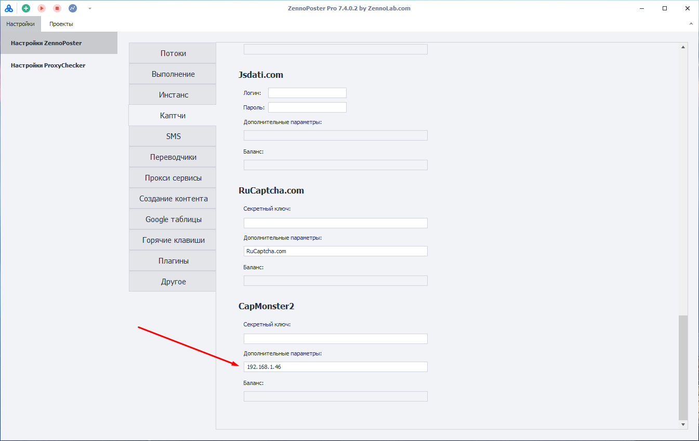

---
sidebar_position: 2
title: Подключение к внешним сервисам
description: Как подключить CapMonster к нужной программе?
---
import DisclaimerNotice from '@site/src/components/DisclaimerNotice';

<DisclaimerNotice />
## Как это работает?
CapMonster Desktop автоматически перехватывает капчи, отправленные на сервисы распознавания от большинства скриптов и программ.

Поддерживаются стандартные запросы этих сервисов — их формат описан в документации соответствующих API.

### CapMonster Desktop API.
При перехвате запроса, отправленного на сервис ручного распознавания, CapMonster сам **определяет тип каптчи и распознает её**.   

Кроме этого, можно в *Дополнительных параметрах* запроса указать конкретное **название модуля**, который должен обработать эту каптчу. Тогда программа не будет определять тип каптчи, а сразу отправит её на распознавание указанным модулем.

К **Дополнительным параметрам**, например, относятся:  
- *чувствительность к регистру*;  
- *капча состоит только из цифр*;  
- *математическая капча*.  

:::tip **Название модуля можно взять из списка модулей.**  
При нажатии на нужный модуль через ПКМ откроется меню → **Копировать полное имя модуля**.  

:::

Если мы хотим вручную выбрать модуль для распознавания **Solvemedia**, то дополнительный параметр для этого будет выглядеть так: `CapMonsterModule=ZennoLab.solvemedia`  

Программа также обрабатывает запрос баланса и возвращает значение **555**, чтобы скрипты и программы, которые останавливаются при низком балансе на сервисах ручного распознавания, продолжали работу без перебоев.  
_______________________________________________
### Автоматический возврат ответа (Pingback / Callback).  
Метод **pingback (callback)** позволяет получать готовый ответ от CapMonster без дополнительных запросов к `/res.php` или `/getTaskResult`.  

Чтобы получить ответ в автоматическом режиме необходимо:  

**1.** При создании задания (`/in.php` для RuCaptcha или `/createTask` для Anti-Captcha) укажите свой URL в параметре **pingback (RuCaptcha)** или **callbackUrl (Anti-Captcha)**.  
**2.** Обработайте HTTP POST-запрос, который наш сервер отправит на указанный URL:  
- Для API RuCaptcha данные приходят как *URL-encoded FormData* (`application/x-www-form-urlencoded`) и содержат два параметра: **id** — идентификатор капчи и **code** — готовый ответ.  
- Для API Anti-Captcha v2 структура запроса идентична ответу метода `/getTaskResult`.  
_______________________________________________
## Распознавание каптч, присланных с другого сервера.  
Для получения капч с определенного сервера, в настройках CapMonster вам нужно указать его IP и порт (по умолчанию 80). Запросы будут отправляться по этому адресу.  

  

:::warning **Режим эмуляции каптча-сервисов работает только на 80-м порту.**
:::
_______________________________________________
#### Как правильно добавить свой IP:  
**1.** Отредактируйте файл `MainSettings.xml`, расположенный в папке:  
`C:\Users\<ИМЯ ЮЗЕРА>\AppData\Roaming\ZennoLab\CapMonster\2\CapMonster`.  
**2.** Перед изменением файла `MainSettings.xml` выставьте в настройках CapMonster любой IP и закройте софт.  
**3.** Внесите в `MainSettings.xml` нужный IP, закройте файл с сохранением и запустите CapMonster.  
**4.** Теперь настройках должен появиться нужный IP.  

:::info **Опция «Выбирать IP адрес автоматически».**  
После её включения и дальнейшего перезапуска софта введенный ранее IP-адрес будет удален. Так что его придётся повторно ввести в файл `MainSettings.xml`.
:::  

Для применения изменений IP-адреса необходимо перезапустить программу через **Стоп** → **Старт**. После этого будет поднят web-сервер на указанном IP.

Теперь сервер, который отправляет капчи, должен использовать этот IP-адрес для передачи заданий. Вы можете указать этот IP напрямую в программе как сервис распознавания, либо настроить переадресацию с antigate.com (или другого используемого сервиса) на выбранный IP.  

Для переадресации отредактируйте файл **hosts**, который находится по пути: `C:\Windows\System32\drivers\etc\hosts`, добавив строку: `192.168.1.10 antigate.com`. **Вместо *192.168.1.10* — напишите ваш локальный IP**.  

:::tip **При использовании роутера.**  
Укажите IP-адрес, который роутер присвоил устройству с CapMonster в локальной сети (его можно посмотреть в настройках сети Windows).  

Если же подключение идёт напрямую через интернет-IP, укажите этот внешний адрес, но при этом необходимо настроить проброс портов на роутере.
::: 

| Если всё настроено правильно, то при переходе по этому IP-адресу в браузере откроется страница-заглушка CapMonster. | 
| -------- | 
|   |  
_______________________________________________
#### Отправка капч из ZennoPoster.  
При отправке капч из ZennoPoster по локальной сети в его настройках **Каптчи** укажите локальный IP-адрес, на котором запущен CapMonster.  

