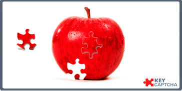

---
sidebar_position: 5
title: KeyCaptcha
description: Решение KeyCaptcha.
---
import DisclaimerNotice from '@site/src/components/DisclaimerNotice';

<DisclaimerNotice />
## Описание.  
**KeyCaptcha** — это пример нестандартной капчи, где вместо ввода символов с изображения пользователю **нужно собрать пазл**, перемещая его кусочки на экране.  

| Вот так она выглядит | 
| :--------: | 
|   | 

### Решение через ZennoPoster.  
:::info **Для разгадывания KeyCaptcha требуется активная подписка на CapMonster.**
:::

Чтобы разгадывать эту капчу в ZennoPoster, добавьте в проект следующий код:  
`ZennoPoster.CaptchaSpecialRecognition("keycaptcha.dll", instance);`
_______________________________________________
