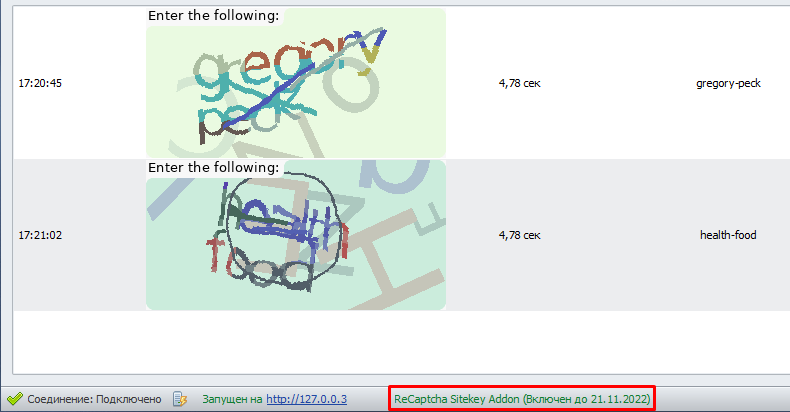
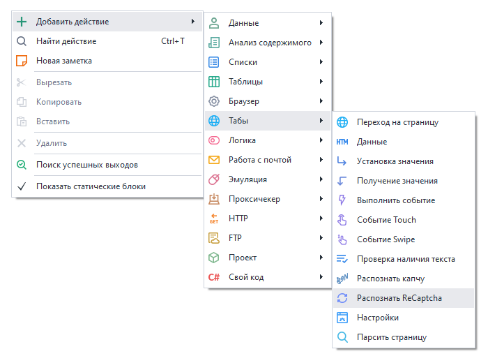
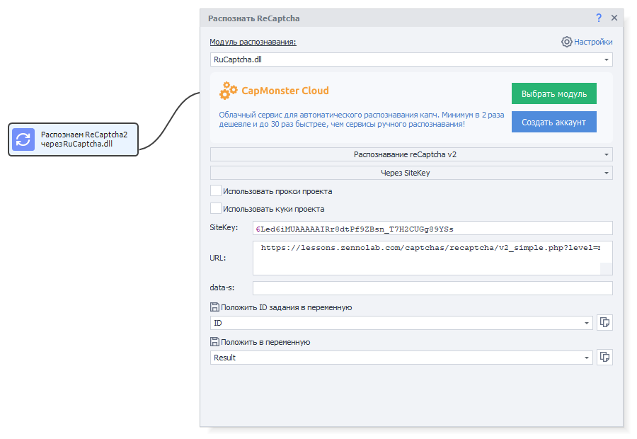

---
sidebar_position: 2
title: Решение ReCaptcha2 через Sitekey
description: Распознавание ReCaptchaV2 без браузера.
---
import DisclaimerNotice from '@site/src/components/DisclaimerNotice';

<DisclaimerNotice />
## Описание.  
CapMonster может распознавать ReCaptchaV2 без запуска браузера. Это позволяет подключать его к сторонним программам, которые отправляют капчу на сервисы распознавания методом sitekey.

Именно для такой работы и был разработан дополнительный модуль **ReCaptcha SiteKey Addon**.
_______________________________________________
## Подключение.
Модуль ReCaptcha SiteKey Addon приобретается в личном кабинете на тот же аккаунт, где оформлена подписка на CapMonster, и действует один месяц.  

Достаточно купить один аддон на весь аккаунт ZennoLab — он будет работать со всеми лицензиями CapMonster. После покупки нужно перезапустить программу, чтобы модуль подгрузился.  

| Сообщение о том, что аддон успешно подключён | 
| -------- | 
|   | 

### Системные требования.  
#### Минимальные:
Intel или AMD, 2 ядра, не менее 2,2 Ггц каждое ядро и 2 Гб оперативной памяти, операционная система Windows 7+.  

#### Рекомендуемые:  
Intel или AMD, 4+ ядра, не менее 3,1 Ггц каждое ядро и 4 Гб оперативной памяти, операционная система Windows 10/Windows Server 2012+.
_______________________________________________
## Распознавание.
### В ZennoPoster.  
Сначала нужно выбрать в Project Maker специальное действие для решения ReCaptchaV2.  

Затем в настройках экшена выбираем способ **Во вкладке**. В этом случае нужный Sitekey определиться автоматически.  

На большинстве сайтов после выбора всех нужных картинок срабатывает событие **autosubmit**, которое автоматически отправляет решение капчи. В ZennoPoster для этого предусмотрена настройка **«Выполнять autosubmit»**.  

Если у ZennoPoster не получается автоматически определить нужный Sitekey, тогда выберите режим **«Через SiteKey»** вместо *«Во вкладке»*. Для этого способа потребуется вручную указать **Sitekey целевого сайта** и его **URL-адрес**.  

:::tip **Найти Sitekey на странице можно с помощью DevTools (или через F12).**  
В содержимом страницы ищите строку с `sitekey`. Она может выглядеть примерно так:  

:::
_______________________________________________
### Из других программ.  
Есть два способа получения капч из стороннего софта:  

#### Режим эмуляции сервисов распознавания.  
В настройках CapMonster выберите сервисы, которые нужно эмулировать. Затем в своей программе укажите отправку ReCaptcha на один из этих сервисов. CapMonster перехватит запрос, решит капчу и вернёт ответ в формате API выбранного сервиса.  

#### Прямое обращение к CapMonster.  
Из сторонних программ можно отправлять запросы на распознавание ReCaptchaV2 напрямую через API поддерживаемых сервисов:  
- [**CapMonster Cloud**](https://capmonster.cloud/ru);  
- [Anti-Captcha](https://anti-captcha.com/ru/apidoc/task-types/RecaptchaV2Task);  
- [ImageTyperzCaptchaModule](https://www.imagetyperz.com/Forms/api/api.html#-recaptcha-submit-recaptcha);  
- [RuCaptcha](https://rucaptcha.com/api-docs/recaptcha-v2);  
- [DeathByCaptcha](https://blog.deathbycaptcha.com/api#newrec);  
- [2Captcha](https://2captcha.com/ru/2captcha-api#solving_recaptchav2_new);  

:::tip **Например, запрос может быть таким:**  
`http://127.0.0.3/in.php?key=123sdffff&method=userrecaptcha&googlekey=sitekey&pageurl=https://site.com`
:::

Здесь указываются:  
- **URL сервиса распознавания** *(`http://ip:port`, по умолчанию порт 80, где запущен CapMonster)*;  
- **API-ключ от этого сервиса**;  
- **Метод распознавания** *(через googlekey)*;  
- **Sitekey**, получаемый с целевого сайта;  
- **URL страницы с капчей**.  

В ответ вы получите строку `OK|CaptchaID`, по которой можно получить результат запросом:  
`http://127.0.0.3/res.php?action=get&id=CaptchaID`

Запросы, отправленные на сервис, перехватываются CapMonster и возвращают такой же ответ, как от оригинального сервиса.  

Распознавание капчи выполняется на удалённом модуле ReCaptchaV2 на наших серверах. Для кликов по картинкам используется встроенный локальный браузер, который автоматически подбирает подходящий user-agent для ReCaptcha и поддерживает прокси, указанный в запросе или настроенный в программе.
_______________________________________________
## Лимиты, ресурсы, процент и скорость распознавания.  
### Лимиты.
Количество ReCaptchaV2, которые можно распознать за сутки, зависит от версии CapMonster:  
- **Pro** — примерно 45 000 капч за 24 часа;  
- **Standart** — примерно 11 000 капч за 24 часа;  
- **Lite** — примерно 2 200 капч за 24 часа;  

### Ресурсы ПК.  
Модуль практически не нагружает процессор — **менее 1%** во время работы, а оперативная память расходуется **до 150 Мб на поток**, так как распознавание **выполняется в браузере** с загрузкой и кликами по ReCaptcha2.  

### Точность и время ответа.  
Поскольку распознавание проходит на удалённом модуле ReCaptchaV2, процент успешности такой же, как при обычном решении через браузер — **примерно 83%**, в зависимости от типа задания.  

А среднее время ответа на капчу зависит от сайта, количества запросов и используемых прокси. По результатам тестирования:  
- **Среднее время**: 40 секунд;  
- **Минимальное**: 14 секунд;  
- **Максимально долгое**: 254 секунды.
_______________________________________________
