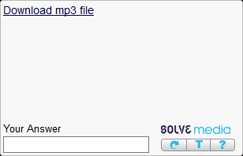

---
sidebar_position: 7
title: SolveMedia Audio
description: Решение звуковой капчи от SolveMedia.
---
import DisclaimerNotice from '@site/src/components/DisclaimerNotice';

<DisclaimerNotice />
## Описание.  
В CapMonster есть возможность решения звуковых SolveMedia. Для этого используется модуль `ZennoLab.AudioSolveMedia`.  
_______________________________________________
## Решение через ZennoPoster.  
Мы подготовили для вас сниппет, который поможет с отправкой звуковых капч от SolveMedia из ZennoPoster на CapMonster:  

[**Сниппет для решения SolveMedia Audio**](./assets/Snippet_audioSM.cs)  

### Примечание. 
  

Перед загрузкой страницы с капчей Solve Media и запуском сниппета **обязательно отключите плагины** — иначе ссылка для скачивания аудиофайла просто не появится.  

 

Также обратите внимание на **ключевые параметры** работы сниппета, которые вы можете настроить под свои задачи:  
- **время ожидания загрузки нужного элемента: `var waitTime`**;  
- **количество попыток обновить или подгрузить элемент на странице: `var tryLoadElement`**;  
- **папка для временного хранения аудиофайлов (она создаётся автоматически в директории вашего проекта): `var mainAudiofolderName = "sm_audio"`**.    

:::info **Функция отправки каптчи на сервис выглядит следующим образом:**
```
ZennoPoster.CaptchaRecognition("CapMonster2.dll", base64StringAudioBytes, "CapMonsterModule=ZennoLab.AudioSolveMedia");
```  
:::
_______________________________________________

## Качество распознавания.  
:::tip **Для стабильной работы важно использовать качественные прокси.**
:::

Дело в том, что и графическая, и звуковая версии этой капчи со временем начинают искажаться при слишком частых запросах. В результате распознать их становится сложно — как человеку, так и нашей системе. Поэтому указанный в модуле процент успешного распознавания стоит рассматривать как **ориентировочный**.  

На *свежем* IP-адресе точность обычно **выше заявленного уровня**, но после нескольких сотен решённых капч она естественно снижается.  

Кроме того, на результат влияет и **длина аудиозаписи** — чем больше слов в ней произносится, тем сложнее распознавание.  
_______________________________________________
