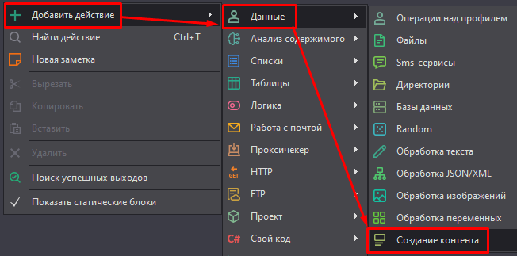
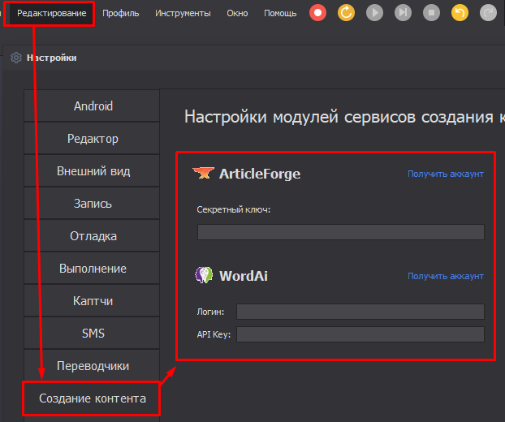
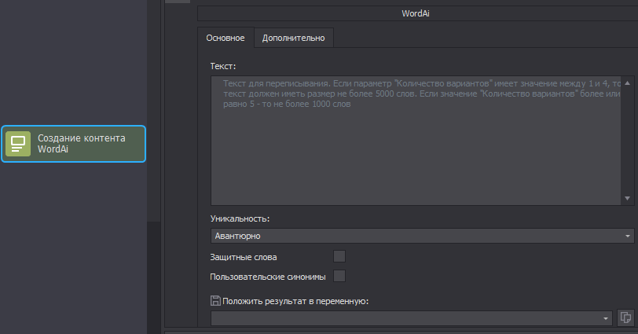

:::info **Пожалуйста, ознакомьтесь с [*Правилами использования материалов на данном ресурсе*](../Disclaimer).**
:::
_______________________________________________  
## Описание.  
**ZennoDroid** позволяет подключить и использовать сервисы для создания уникального текста: [**WordAI**](https://wordai.com/) и [**ArticleForge**](https://www.articleforge.com/).  

Эти сервисы используют искусственный интеллект для понимания текста. Они способны сделать автоматический рерайтинг, читабельность которого сравнима с текстом, написанным человеком.  

Но у них есть большой минус — **сервисы не поддерживают русский язык**. Поэтому их использование актуально только для тех, кто работает в англоязычном сегменте интернета.  
_______________________________________________ 
## Как добавить в проект?    
Через контекстное меню: **Добавить действие → Данные → Создание контента**.  

  

:::info **Не забудьте авторизоваться в сервисах через *Настройки программы*.**  

:::
_______________________________________________  
## WordAi.  
  

В поле **Текст** вводим текст, который хотим переписать (на английском).   

