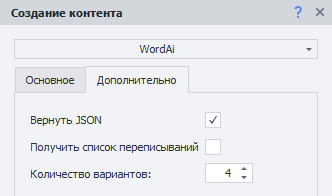
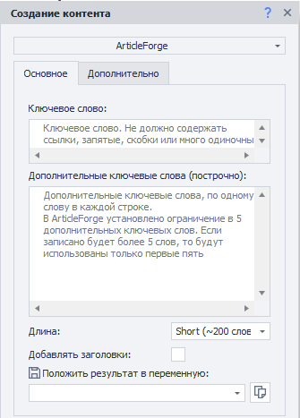
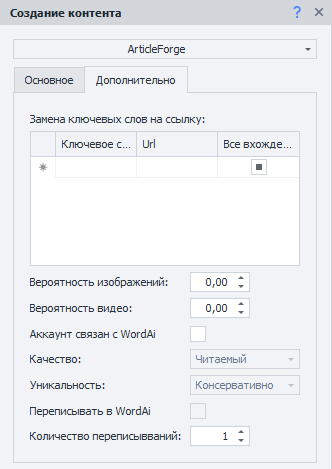
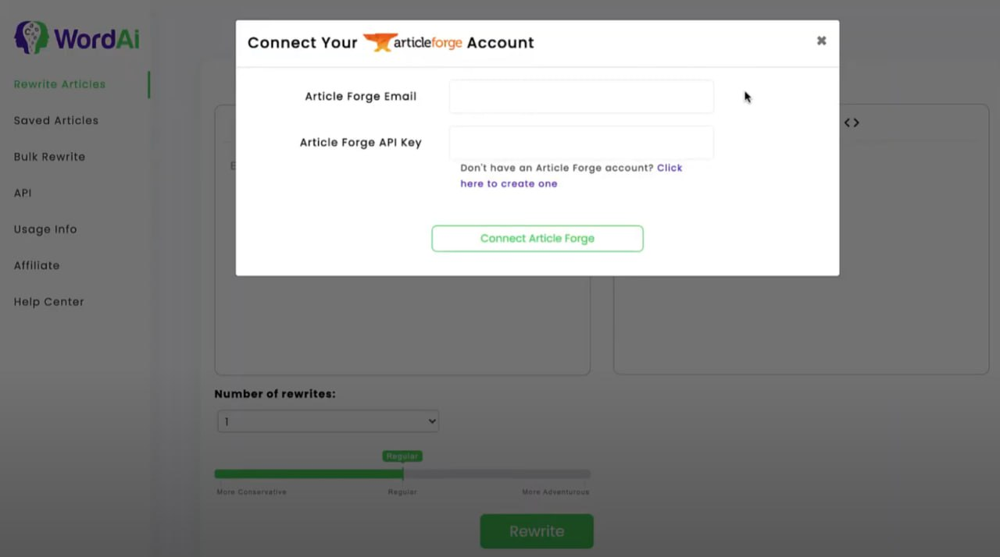

:::info **Пожалуйста, ознакомьтесь с [*Правилами использования материалов на данном ресурсе*](../Disclaimer).**
:::
_______________________________________________  
## Описание.  
**ZennoDroid** позволяет подключить и использовать сервисы для создания уникального текста: [**WordAI**](https://wordai.com/) и [**ArticleForge**](https://www.articleforge.com/).  

Эти сервисы используют искусственный интеллект для понимания текста. Они способны сделать автоматический рерайтинг, читабельность которого сравнима с текстом, написанным человеком.  

Но у них есть большой минус — **сервисы не поддерживают русский язык**. Поэтому их использование актуально только для тех, кто работает в англоязычном сегменте интернета.  
_______________________________________________ 
## Как добавить в проект?    
Через контекстное меню: **Добавить действие → Данные → Создание контента**.  

  

:::info **Не забудьте авторизоваться в сервисах через *Настройки программы*.**  

:::
_______________________________________________  
## [WordAi](https://wordai.com/).  
Сервис переписывает уже готовый текст в его новую форму.  

  
### Вкладка «Основное». 
#### Текст.  
В это поле мы вводим текст, который хотим переписать (на английском).  

| Количество вариантов    | Число слов текста |
| :--------: | ------- |
| От **1** до **4** включительно  | Не более **5000** слов    |
| **5** или более  | Не более **1000** слов    |  

#### Уникальность. 
Определяет степень свободы, которую вы даёте искусственному интеллекту для создания нового текста.  
- **Консервативно**. Текст перепишется с минимальными изменениями.  
- **Обычно**. Нейросеть будет работать в стандартном режиме, допуская некоторые отклонения от исходного текста.  
- **Авантюрно**. Допускается много вольности при составлении текста. Это значительно повышает уникальность, но также увеличивает вероятность частого выхода из контекста.  

#### Защитные слова.  
Эта функция позволяет добавлять слова и фразы, которые вы не хотите изменять при переписывании контента. Например, можно запретить изменение цитат, заголовков и URL. 

#### Пользовательские синонимы.  
Данная опция включает определённые слова и фразы, которые вы хотите заменить другими словами и фразами. WordAi будет автоматически заменять их при переписывании контента.  

:::warning **Включение двух верхних функций снизит уникальность и может повлиять на общую читабельность текстов.**
:::  

В ZennoDroid вы просто ставите галочку, которая отвечает за Включение/Отключение этих функций. Сами же слова и фразы задаются непосредственно в личном кабинете WordAI.  
_______________________________________________
### Вкладка «Дополнительно».  
  
#### Вернуть JSON.  
После переписывания текста вы получите результат работы в формате JSON.  

#### Получить список переписываний.  
Дополнительно в итоговый JSON будут включены все изменения, которые внесла нейросеть в исходный текст.  

#### Количество вариантов.  
Указываем число вариантов для нашего текста, которые мы хотим получить от сервиса. Сколько раз он попытается его переделать.  
_______________________________________________
## [ArticleForge](https://www.articleforge.com/).  
Каждая статья пишется полностью с нуля, поэтому вы никогда не получите дублированный или плагиатный контент.   
### Вкладка «Основное».  
 
#### Ключевое слово.  
Представьте, что работаете с внештатным автором. Вы даёте ключевое слово, а он на его основе формирует уникальную статью менее, чем за минуту.  

:::warning **Ссылки, запятые, скобки и одиночные символы — не поддерживаются.**
:::
#### Дополнительные ключевые слова (построчно).  
Тут мы задаём дополнительные ключевые слова, по одному в каждой строке. Они имеют меньший приоритет по сравнению с основным словом.  

:::info **Система имеет ограничение в 5 дополнительных слов.**  
Если запишите больше, то использоваться всё равно будут только первые пять.
:::
#### Длина.  
Задаём длину итогового текста, от 50 до 750 слов.  
#### Добавлять заголовки.  
Разные части текста будут по смыслу разделены заголовками.  
_______________________________________________
### Вкладка «Дополнительно».  
  
#### Замена ключевых слов на ссылку. 
Пишем в таблицу ключевые слова и ссылки, на которые мы хотим их заменить. 
#### Вероятность изображений.  
Указываем вероятность, с которой нейросеть добавит в текст тематическую картинку. Где `0.1` — это 10%, а `1` — 100%.  
#### Вероятность видео.  
А тут уже задаём вероятность появления в тексте видео, `0.03` — это 3%, а `0.75` — 75%, и так далее.
#### Аккаунт связан с WordAi.  
В личном кабинете WordAi можно настроить интеграцию с ArticleForge, указав свой Email и API-ключ.  

#### Качество.  
Задаём то, насколько качественно будет переписан наш текст в WordAi.  
- **Обычный**. Перепишет текст, сохраняя исходный вид, не внося сильных изменений.    
- **Уникальный**. Делает получившийся материал более уникальным, добавляя новые детали.   
- **Более уникальный**. Может давно сильно изменить текст, заменяя начальные предложения. Есть риск того, что содержание станет менее понятным.  
- **Читаемый**. Упрощает восприятие текста, делая его более понятным, но при этом убирает некоторые детали.   
- **Более читаемый**. Сильно упрощённый вариант текста. Подходит для случаев, когда нужно как можно меньше "воды", оставляя при этом самое главное.

#### Уникальность.  
Определяет степень свободы, которую вы даёте искусственному интеллекту для создания нового текста.  
- **Консервативно**. Текст перепишется с минимальными изменениями.  
- **Обычно**. Нейросеть будет работать в стандартном режиме, допуская некоторые отклонения от исходного текста.  
- **Авантюрно**. Допускается много вольности при составлении текста. Это значительно повышает уникальность, но также увеличивает вероятность частого выхода из контекста.  

#### Переписывать в WordAi.  
Написанный на основе ключевых слов текст в ArticleForge можно отправлять в WordAi на доработку. Он будет переписан на основе параметров, которые вы задали выше (качество и уникальность).  

#### Количество переписываний.  
Указываем число вариантов для нашего текста, которые мы хотим получить от сервиса. Сколько раз он попытается его переделать.  

| Количество переписываний    | Число слов текста |
| :--------: | ------- |
| От **1** до **4** включительно  | Не более **5000** слов    |
| **5** или более  | Не более **1000** слов    |   
_______________________________________________