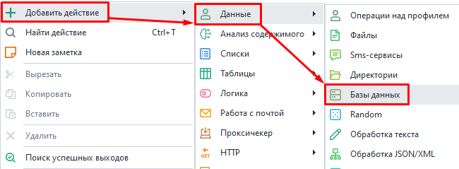
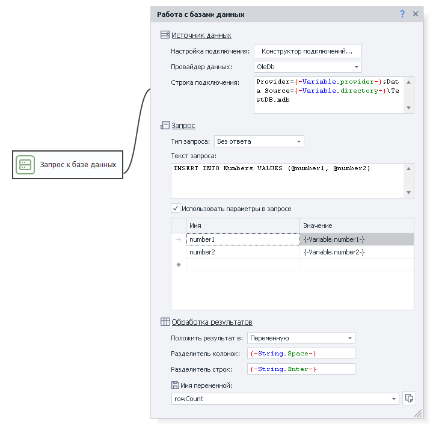
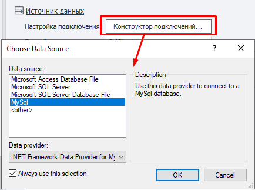
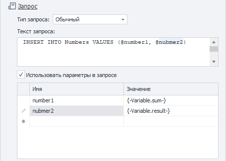
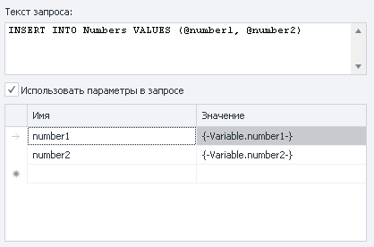
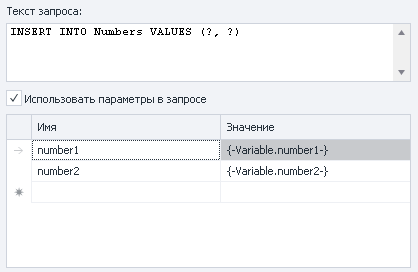
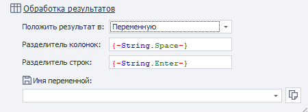
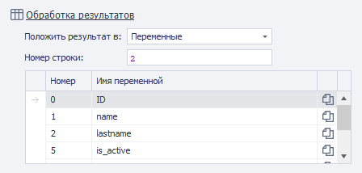
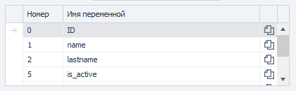

:::info **Пожалуйста, ознакомьтесь с [*Правилами использования материалов на данном ресурсе*](../Disclaimer).**
:::
_______________________________________________  
В ZennoDroid вы можете работать с различными типами баз данных. Например, с Microsoft SQL, MySql, PostgreSQL, SQLite и др. Вы можете подключаться к ним с локального компьютера или на удаленном сервере, а затем загружать туда нужные данные.  
_______________________________________________ 
## Как добавить в проект?  
Через контекстное меню: **Добавить действие → Данные → Директории**.  

    
_______________________________________________
## Внешний вид экшена.  
  
_______________________________________________
## Источник данных.  
Для того чтобы корректно работать с базой данных, необходимо правильно настроить подключение. Требуемые параметры будут зависеть от конкретной ***СУБД** (Системы Управления Базами Данных)*.  

### Конструктор подключений.  
  

Он предназначен для облегчения создания *Строки подключения*. Она будет сформирована после заполнения основных данных. Сначала нужно обозначить источник данных, а затем выбрать файл с базой.   
 
|              | 
| :----------------: | 
| *Доступны также расширенные настройки* |  

:::warning **В *Конструкторе* недоступны макросы переменных.**
:::  

### Провайдер данных.  
Доступно несколько провайдеров данных:  
- **SqlClient**.  
Провайдер для нативного подключения к Microsoft SQL Server;   
- **MySqlClient**.  
Провайдер для нативного подключения к MySQL от Oracle;  
- **OleDb** *(Object Linking and Embedding Database)*.  
Это технология для доступа к различным источникам данных через единый интерфейс (в том числе к SQL Server);  
- **Odbc** *(Open Database Connectivity)*.  
Это единый интерфейс для выполнения SQL-запросов, работающий независимо от используемой СУБД;   

### Строка подключения.  
В ней указываются различные параметры входа (например, логин и пароль). Чтобы не составлять эту строку вручную, можно использовать Конструктор подключений, который описан выше.  

[**Примеры строк подключения для разных СУБД.**](https://www.connectionstrings.com/)  
_______________________________________________
## Запрос.  
  

### Тип запроса.  
#### Запрос без ответа.  
Применяется для операций, которые не возвращают данные из БД (например **INSERT** или **DELETE**). В качестве ответа такие операции передают число задействованных в запросе записей.  

#### Скалярный запрос.  
Позволяет получить единственное значение. Например, если нужно выполнить агрегатную функцию: `select sum(price) from fruit`.  

#### Обычный запрос.  
Возвращает таблицу с данными.  

### Текст запроса.  
Поле для ввода SQL запроса.  

### Использовать параметры в запросе.  
Параметры используются, чтобы упростить создание запроса, так как они подставляются в заданные места текста.  

Существуют именованные и неименованные параметры. Для первых важно имя, а для вторых порядок переменных. Какой тип параметров использоваться зависит от конкретной СУБД.  

:::info **Текст автоматически экранируется внутри параметров.**
:::  

|     |  |
| :--------: | :-------: |
| Именованные параметры  | Неименованные параметры    |  
_______________________________________________
## Обработка результатов.  
В этом разделе мы выбираем, куда сохранить результат запроса.  

### Положить результат в:  
#### Переменную.  
Все строки и колонки, которые будут получены в результате запроса, сохранятся в одну переменную.  

Так же необходимо выбрать разделители для отделения строк и колонок друг от друга.  

#### Список.  
Сохраняет результат работы в список. Важно указать разделить для столбцов. В итоге каждая строчка из базы будет занесена в новый элемент списка, а между столбцами вставлен соответствующий разделитель.  

#### Таблицу.  
При записи данных в таблицу ячейки заполнятся в соответствии с запросом.  

#### Переменные.  
Этот вариант позволяет сохранить результат сразу в несколько переменных.  

  

**Номер строки**. В результате запроса может вернуться несколько строк, поэтому необходимо указать номер той, которую будем разбирать (нумерация с нуля).  

В таблице ниже выбирается номер ячейки в строке и переменная, в которую эта ячейка будет сохранена (нумерация с нуля!).

