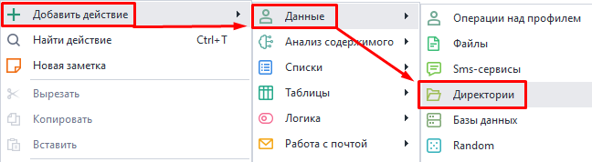
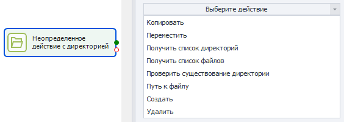
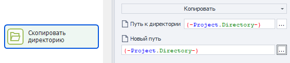
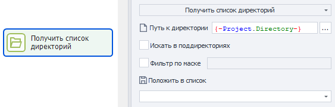
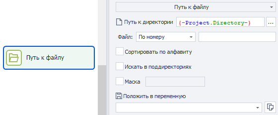
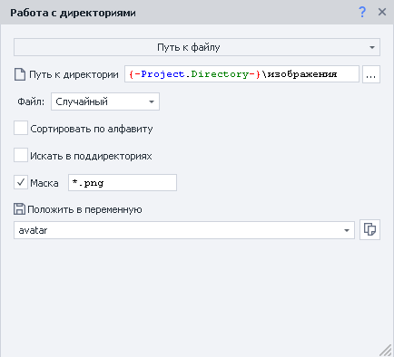

:::info **Пожалуйста, ознакомьтесь с [*Правилами использования материалов на данном ресурсе*](../Disclaimer).**
:::
_______________________________________________  
## Описание.  
Данный экшен предназначен для работы с директориями. Вот что он может делать с ними:  
- *создавать*,  
- *копировать*,  
- *перемещать*,  
- *удалять*,  
- *получать из них один или несколько файлов. Например:*  
    - *файлы статей для постинга на канал или в блог*,  
    - *картинка для автарки при регистрации в приложениях или на сайтах*.  
- *проверять, существует ли директория*.  

При парсинге можно создавать для каждого товара свою директорию, а затем сохранять туда картинки, описание и другую информацию.  
_______________________________________________ 
## Как добавить в проект?  
Через контекстное меню: **Добавить действие → Данные → Директории**.  

  
_______________________________________________
## Как работать с экшеном?  
Для работы с директориями предусмотрены следующие действия, которые выбираются в окне свойств:  

  
_______________________________________________
### Копировать.  
Данное действие копирует директорию со всем содержимым и вставляет по новому пути.  

  

#### Путь к директории.  
Здесь указываем путь к исходной папке.  

#### Новый путь.  
А тут то место, куда хотим переместить директорию.  

:::warning **Обратите внимание.**  
Если по новому пути уже существует такая же директория, то ничего не будет скопировано. Экшен при этом завершится успехом (зеленая ветка).
:::  
_______________________________________________
### Переместить.  
Действие аналогичное прошлому. С той лишь разницей, что оно "забирает" директорию, не сохраняя копию по прежнему пути.  
_______________________________________________
### Получить список директорий.  
С помощью этого экшена можно получить список всех директорий по указанному пути.  

  

#### Путь к директории.  
Указываем путь к папке.  

#### Искать в поддиректориях.  
После включения этой опции поиск будет производиться во всех поддиректориях, не зависимо от их количества.  

Если же не ставить галочку, то возвратятся только папки из верхнего уровня вложенности.  

#### Фильтр по маске.  
В этом поле можно указать маску для поиска. Их может быть несколько, разделенных символом `|`.    

#### Положить в список.  
Результат работы можно сохранить в список.  
_______________________________________________
### Получить список файлов.  
Действие аналогичное прошлому. Но в этом случае мы ищем не директории, а отдельные файлы.  
_______________________________________________
### Проверить существование директории.  
Это действие позволяет узнать, существует ли директория по указанному пути. В случае успешного поиска выход пойдет по зеленой ветке, но если папка не будет найдена, то по красной.  

#### Путь к директории.  
Указываем путь к папке, существование которой нужно проверить.  

#### Таймаут ожидания.  
Время в секундах, которое экшен будет ждать обнаружения папки.  
_______________________________________________
### Путь к файлу.  
Этот экшен получает путь к одному из файлов в выбранной директории.  

  

#### Путь к директории.  
Пишем путь к папке, в которой будем искать файл.  

#### Файл.  
- **По номеру**. Указываем конкретный номер файла (нумерация с нуля).  
- **Случайный**. Будет получен случайный файл из доступных.  

#### Сортировка по алфавиту.  
Если поставить здесь галочку, то файл будет браться из списка, отсортированного в алфавитном порядке.  

#### Искать в поддиректориях.  
После включения этой опции поиск файла будет производиться во всех поддиректориях, не зависимо от их количества.  

Если же не ставить галочку, то файл возьмется из основной папки, по которой мы выполняем поиск.  

#### Маска.  
В этом поле можно указать маску поиска. Их может быть несколько, разделенных символом `|`.  

#### Положить в переменную.  
Полученный файл можно привязать к переменной.  
_______________________________________________
### Создать.  
С помощью этого экшена можно создать новую директорию по указанному пути.  

:::warning **Обратите внимание.**  
Если по этому пути уже существует такая директория, то она не будет перезаписана. Экшен при этом завершится успехом (зеленая ветка).
:::  
_______________________________________________
### Удалить.  
Это действие удаляет выбранную папку со всем ее содержимым. Если попытаться удалить несуществующую директорию, то экшен все равно выйдет по зеленой ветке.  

:::warning **Удалённые таким образом папки не попадают в Корзину, а удаляются безвозвратно!**  
:::  
_______________________________________________
## Пример использования.  
При регистрации на различных ресурсах часто требуется загрузить аватарку. Представим, что у нас есть папка с подготовленными картинками в расширениях *jpg*, *jpeg*, *png*, *tiff*. Нам нужно выбрать только одну из них.  

Ресурс, на котором мы создаем аккаунт, требует от нас файл именно в формате *PNG*. Поэтому при поиске мы воспользуемся маской `*.png`. А саму картинку выберем случайно.  

  

После запуска данного экшена в переменной `avatar` сохранится абсолютный путь к файлу.  

:::tip **Системная переменная `{-Project.Directory-}`.**  
В ней хранится полный путь к папке с файлом проекта. 
:::  
_______________________________________________
## Поиск по маске.  
Для задания маски можно использовать специальные символы:  
- `?`. Может обозначать один любой символ кроме точки.  
- `*`. Означает любое количество любых символов, включая точку.  
- `|`. Используется для одновременного добавления нескольких масок.  

### Примеры.  
| Написание             | Пояснение | 
| :---------------- | :------: | 
| `*.*`        |   Любые файлы с любым расширением.   | 
| `*.jpg`           |   Файлы с расширением **.jpg** (`image.jpg`, `аватарка.jpg`, `1.jpg`).  | 
| `*.p*`    |  Файлы, у которых расширение начинается на **p.** (`document.pdf`, `презентация.ppt`, `документ.project`, `1.p`).   | 
| `кар*.*` |  Файлы с любым расширением, но имя которых начинается на **кар.** (`карета.jpg`, `картинка.ico`, `картошка.html`).   |  
| `*mat?.html` |  **.html** файлы, имя которых начинается с любой последовательности символов. Затем идёт часть **mat**, после которой **1 любой символ**. (`automate.html`, `tomato.html`, `mate.html`).   |  
| `doc?????.xls` |  **.xls** файлы, начинающиеся на **doc**, после чего идёт **5 любых символов** (кроме точки). (`document.xls`, `doc-1208.xls`, `doctrine.xls`).   |  
| `???.??` |  Файл с **3 символами в имени** и **2 в расширении**. (`abc.ps`, `job.ai`, `123.45`)   |  
| `?????` |  Файл с **5 символами** в имени и **без расширения**. (`house`, `image`, `tasks`) |  
| `*.xlsx` или `*.docx` |  Любой **xlsx** и/или **docx** документ. (`invoice.docx`, `resume.docx`, `project.xlsx`, `default.xlsx`)   |  
 

