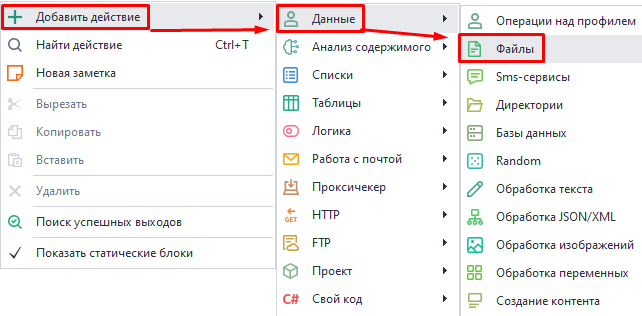
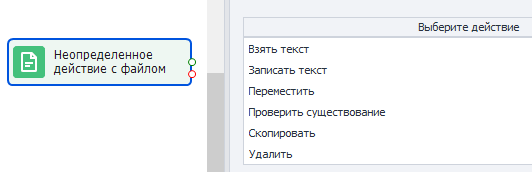
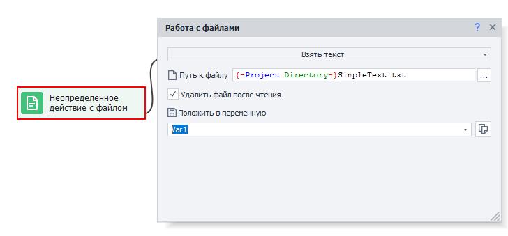
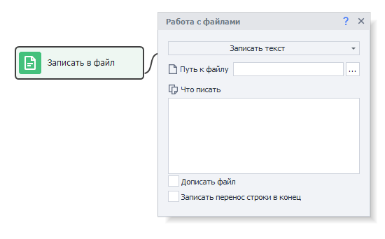
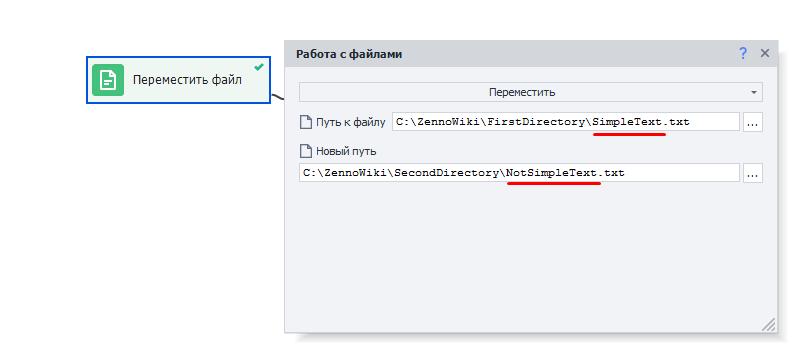
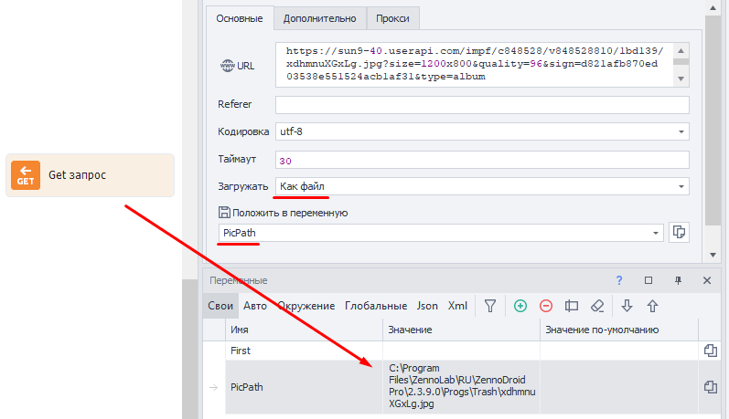
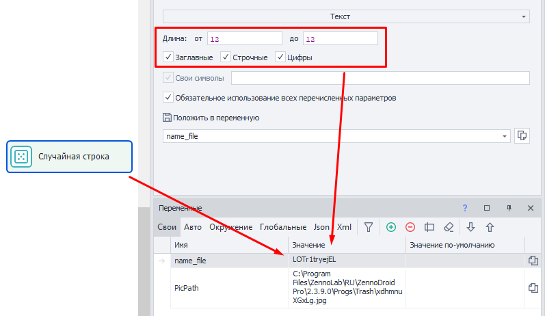
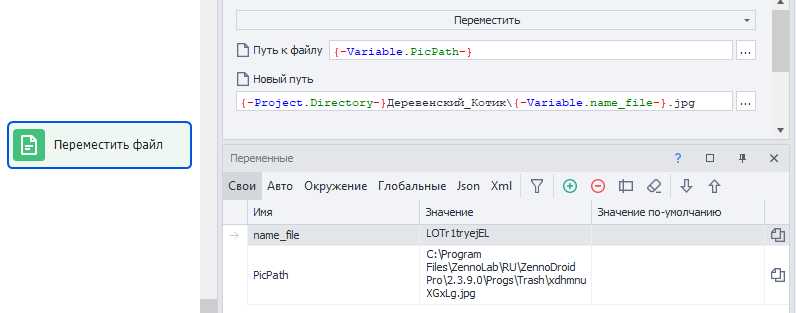

:::info **Пожалуйста, ознакомьтесь с [*Правилами использования материалов на данном ресурсе*](../Disclaimer).**
:::
_______________________________________________  
## Описание.  
В ZennoDroid вы можете автоматизировать работу с файлами. Например:  
- *вставлять заготовленный текст из файла при постинге на форумах, социальных сетях и мессенджерах;*  
- *добавлять описание для объявлений на маркетплейсах и прочих сайтах;*  
- *отправлять массовые комментарии и сообщения;*  
- *записывать в файл данные при парсинге;*  
- *вести подробное логирование с записью в файл;*  
- *удаление и перемещение ненужных файлов.*  
_______________________________________________ 
## Как добавить в проект?  
Через контекстное меню: **Добавить действие → Данные → Файлы**.  

 
_______________________________________________ 
## Доступные действия.  
  
_______________________________________________  
### Взять текст.  
  

Позволяет скопировать текст из файла и записать его в переменную.  

Доступна опция удаления файла после выполнения экшена.  
_______________________________________________ 
### Записать текст.  
  

Это действие записывает указанный текст из поля в выбранный файл.  

#### Дописать в файл.  
Если поставить здесь галочку, то новый текст будет **дописан** в файл. Тогда как без нее, мы **полностью перезапишем** текст в файле.  

#### Записать перенос строки в конец.  
Эта опция добавляет в конец текста перенос строки с помощью `\r\n`. Это позволяет корректно записывать несколько строк данных в файл.  
_______________________________________________ 
### Переместить.  
Перемещение файла в указанную директорию. Нужно указать текущий полный путь к существующему файлу, а затем новые путь и имя для него после переноса.  

  

Этим действием также можно просто переименовать файл.  
_______________________________________________ 
### Проверить существование.  
Позволяет узнать, существует ли файл по указанному пути.  
- **Результат**. Если файл существует, то экшен выйдет по зеленому пути, если отсутствует, то по красному.  
- **Таймаут ожидания**. Указываем время в секундах, которое экщен будет ждать появления файла.  
_______________________________________________ 
### Скопировать.  
Работает, как и **Переместить**, но без удаления исходного файла.  
_______________________________________________ 
### Удалить.  
Этим действием вы можете удалить файл по указанному пути.  
_______________________________________________ 
## Пример использования.  
**Скачаем картинку с сайта vk.com, переименуем ее и переместим в нужную папку.**  

Представим, что мы уже получили [**прямую ссылку на картинку**](https://sun9-40.userapi.com/impf/c848528/v848528810/1bd139/xdhmnuXGxLg.jpg?size=1200x800&quality=96&sign=d821afb870ed03538e551524acb1af31&type=album). Теперь, используя ***Get-запрос***, скачаем ее на устройство. В качестве переменной указываем `PicPath`. В ней появится прямой путь к файлу после выполнения экшена.  

  

После этого добавляем экшен ***Random*** для генерации имени файла.  

  

Далее создаем экшен **Файлы** с опцией *Переместить*.  

  

**Путь к файлу:** `{-Variable.PicPath-}`   
**Новый путь:** `{-Project.Directory-}Деревенский_Котик\{-Variable.name_file-}.jpg`  

:::tip **`{-Project.Directory-}`.**  
Это макрос для указания директории, в которой находится проект.
:::  

После выполнения этого действия файл переместится в нужную папку, а вы сможете приступить к загрузке следующей картинки.  

:::warning **Расширение файла.**  
При работе с изображениями следует указывать то же расширение файла, что и было при загрузке.
:::

