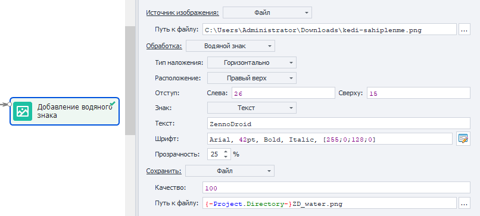

:::info **Пожалуйста, ознакомьтесь с [*Правилами использования материалов на данном ресурсе*](../Disclaimer).**
:::
_______________________________________________  
## Описание.  
Экшен используется для редактирование и сохранения изображений. Вот что можно делать с помощью него:  
- визуально обрабатывать картинки;  
- изменять или удалять метаданные изображения;  
- сохранять скриншот приложения.    
_______________________________________________ 
## Как добавить в проект?  
Через контекстное меню: **Добавить действие → Данные → Обработка изображений**.  

  
_______________________________________________   
## Источник изображения.  
  

### Скриншот инстанса.  
Выполняет скриншот активного окна эмулятора/устройства.  

### Файл.  
Обрабатывает выбранный файл, к которому указываем путь. Допустим использования макросов.  

### URL.  
Работа будет производиться с картинкой, ссылку к которой мы укажем.  

:::warning **Скачивание картинки произойдет с вашего реального IP.**
Даже если в проекте установлены прокси!
:::  
_______________________________________________
## Обработка.  
### Без обработки.  
Изображение не будет как-либо изменяться. Эта опция полезна при сохранении скриншота или картинки из интернета.  
_______________________________________________
### Изменение размеров.  
Позволяет  изменить размер изображения. Доступные параметры:  
- **Ширина и Высота**. Задаем цифровые значения для этих параметров.  
- **Размеры**. Определяет тип двух верхних значений: *В процентах* от оригинального размера или же напрямую *Пиксели*.  
- **Сохранять соотношение сторон**. В случае выбора этой опции **Ширина** и **Высота** будут принудительно привязаны к оригинальному соотношению сторон. Так что вы не сможете изменять их независимо.  
- **Не увеличивать изображение**. Если указанные **Ширина** и **Высота** стали больше, чем оригинальные значения, то изменение размера не будет применено.  
_______________________________________________
### Обрезка.  
С помощью этого действия можно обрезать изображение. Доступные опции: 
- **Область**. Выбираем то, что будем обрезать.  
    - *Видимая*. Актуально только для **Скриншот инстанса**. Обрезает скриншот экрана по границам открытого окна. Это позволяет получить только видимую часть приложения.  
    - *Заданная*. Обрезает изображение по заданным параметрам, которые задаются ниже.  
- **Слева / Сверху / Ширина / Высота**. Указываем значения в пикселях или процентах (выбираются ниже).   
- **Размеры**. Определяет тип верхних значений: *В процентах* от оригинального размера или же напрямую *Пиксели*.  
_______________________________________________
### Поворот.  
Поворачивает изображение на указанное количество градусов.  
_______________________________________________
### Водяной знак.  
Накладывает текст или изображение на обрабатываемый файл.  

**Тип наложения:**  
- *Горизонтально*.  
- *По диагонали*.  

#### Подробнее про Горизонтальный тип наложения.  
  

- **Расположение**.  
Выбираем расположение для текста/изображения:  
    - *В центре*;  
    - *Правый верх*;  
    - *Правый низ*;  
    - *Левый верх*;  
    - *Левый низ*;  
- **Отступ**.  
Указываем отступ слева или сверху в пикселях относительно **Расположения**, которое мы задали выше.  
- **Знак**.  
    - **Изображение**. Указываем путь к файлу.  
    - **Текст**. Пишем необходимый текст и выбираем для него шрифт.  
    :::tip **Визуальный конструктор текста.**
    Открывается нажатием специальной кнопки справа от поля **Шрифт**.  
    
    :::  
- **Прозрачность**.  
Процентное количество прозрачности наложенного текста или изображения. Чем выше значение, тем прозрачнее.  

#### Пример.  
  

С такими настройками, как на верхнем скриншоте, мы получим такой водный знак:  

_______________________________________________
### Зеркальное отражение.  
Позволяет отзеркалить изображение. Доступные типы отражения:  
- **Горизонтальный**;   
- **Вертикальный**;  
- **Горизонтальный и Вертикальный**.  
_______________________________________________
### Очистить Exif.  
Это действие может очистить все метаданные изображения.  
_______________________________________________
## Сохранить.  
Раздел для настройки вывода изображения.  

### Качество.  
Определяем его в процентах, где 1% — это очень пережатое, а 100% — оригинальное.  

### Путь к файлу.  
Указываем путь на компьютере, куда мы хотим сохранить картинку. Необходимо также в конце добавить формат файла. Допустимо использования ***переменных***.  
_______________________________________________
## Редактирование метаданных (EXIF).  
В этом блоке вы можете изменять различные метаданные.  

  

:::info **Не работает с режимом *Очистить Exif*.**
:::  
_______________________________________________
## Пример использования.  
Допустим, мы написали шаблон, но на каком-то этапе работы он завершается ошибкой. Чтобы попытаться понять причину, мы можем сделать скриншот в момент ошибки и визуально оценить ситуацию.  

Создаем экшен ***Random*** и генерируем случайно число или имя для *потока*. Кладем это в переменную `{-Variable.thread-}`.  

Теперь добавляем действие ***BadEnd*** и проводим от него ветку в **Обработку изображений**. Укажем настройки, как на этом скриншоте:  

  

**Путь к файлу:** `{-Project.Directory-}{-Variable.thread-}\App_screenshot.jpg`.  

Сюда также можно добавить сохранение кода страницы `{-Page.Dom-}` через экшен ***Записать в файл***. Это позволит выявить ошибки, возникающие в ходе работы с браузером.