:::info **Пожалуйста, ознакомьтесь с [*Правилами использования материалов на данном ресурсе*](../Disclaimer).**
:::
_______________________________________________  
## Описание.  
Этот экшен нужен для работы с JSON и XML. Чаще всего эти форматы применяются в [API](https://ru.wikipedia.org/wiki/API) различных сервисов. Например, сервисы [**по распознаванию капчи**](../Settings/Captcha) или [**СМС сервисы**](./SMS_Services) обычно работают с одним из этих форматов (либо сразу с двумя).  

:::warning **Одновременно в проекте может обрабатываться только один JSON или XML объект.**  
Если нужно обработать сразу несколько объектов, то сделать это можно только по очереди.
:::  

### Что такое JSON?  
**JSON (JavaScript Object Notation)**. Простой и удобный для чтения формат обмена данными. Он позволяет хранить информацию в виде структурированного текста, который легко читается как компьютером, так и человеком.  

Его основная особенность в том, что информация записывается в пары `"ключ":значение`. Ключ используется для названия данных, а в значения можно поместить строки, числа, массивы, логику и объекты.  

#### Пример.  
```js
{
  "имя": "Алексей",
  "возраст": 28,
  "город": "Москва",
  "профессия": "Программист",
  "опытРаботы": 5,
  "владеетЯзыками": [
    "Python",
    "JavaScript",
    "C++"
  ],
  "удалённаяРабота": true,
  "интересы": {
    "спорт": "Футбол",
    "музыка": "Рок",
    "хобби": ["Фотография", "Путешествия", "Чтение"]
  }
}
```  

### Что такое XML?
**XML (eXtensible Markup Language)** — это язык разметки, который используется для хранения и передачи данных. Главное отличие от JSON в том, что XML использует **теги** для обозначения данных, а JSON — пары *ключ: значение*.  
В отличие от HTML, где есть фиксированные теги (например, `<div>`, `<p>`), в XML вы сами создаете теги, которые описывают данные.  

#### Пример.  
```js
<CATALOG>
	<CD>
		<TITLE>Имперская Пародия</TITLE>
		<ARTIST>Боб Дилан</ARTIST>
		<COUNTRY>США</COUNTRY>
		<COMPANY>Колумбия</COMPANY>
		<PRICE>10.90</PRICE>
		<YEAR>1985</YEAR>
	</CD>
	<CD>
		<TITLE>Спрячь свое сердце</TITLE>
		<ARTIST>Бонни Тайлер</ARTIST>
		<COUNTRY>Соединенное Королевство</COUNTRY>
		<COMPANY>Записи си-би-эс</COMPANY>
		<PRICE>9.90</PRICE>
		<YEAR>1988</YEAR>
	</CD>
	<CD>
		<TITLE>Лучшие Хиты</TITLE>
		<ARTIST>Долли Партон</ARTIST>
		<COUNTRY>США</COUNTRY>
		<COMPANY>Ар-Си-Эй</COMPANY>
		<PRICE>9.90</PRICE>
		<YEAR>1982</YEAR>
	</CD>
</CATALOG>  
```  
_______________________________________________
### Beautify.  
Иногда сервисы возвращают не красиво отформатированный текст (как в примерах выше), а всё в одну строку. Это значительно затрудняет чтение. В таких случаях можно воспользоваться так называемыми *улучшателями (beautifier)*. Например, в [**Тестере X/JSON Path**](../Tools/JSON_Tester) уже встроен этот компонент — **кнопка Beautify**.  

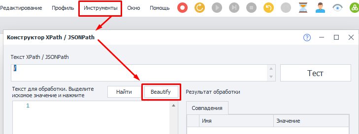 

Однако, для экшена не важно, как записан текст — красиво или в одну строку. Главное, чтобы он был корректно составлен.

_______________________________________________ 
## Как добавить в проект?  
Через контекстное меню: **Добавить действие → Данные → Обработка JSON/XML**.  

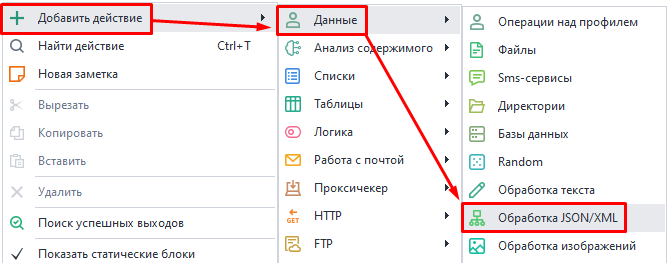  
_______________________________________________ 
## Доступные действия.  
   
_______________________________________________
## Парсинг.  
Это действие нужно для обработки полученных данных.  

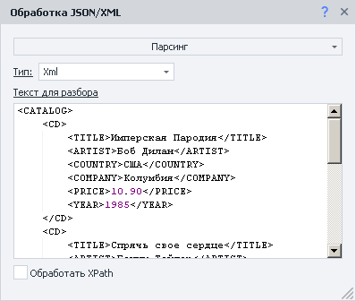   

### Окно переменных.  
Результат выполнения экшена заносится в переменную проекта Json или Xml. Содержимое можно посмотреть в [**Окне переменных**](../pm/Interface/Variables). Так как ранее в примере мы парсили XML, то и выбираем соответствующую вкладку:  

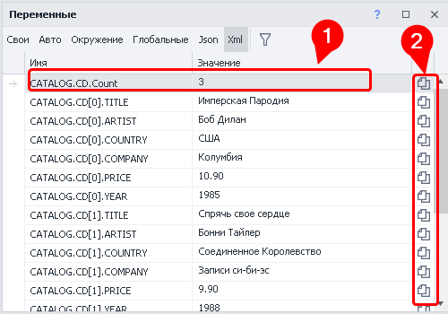   

В переменной **Count (1)** хранится количество элементов. Так что ее удобно использовать в качестве ограничителя при обходе данных в цикле.  

Если бы в нашем примере ещё были тэги `<DVD>` на одном уровне с `<CD>`, то была бы переменная `CATALOG.DVD.Count` с количеством тэгов `<DVD>`:  

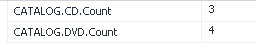   

С помощью **специальных кнопок (2)** можно сразу скопировать макрос переменной в буфер обмена.  

### Макросы переменных.  
Пример одного из макросов: `{-Xml.CATALOG.CD[1].ARTIST-}`.  

Внутри этого макроса можно использовать другие переменные:  

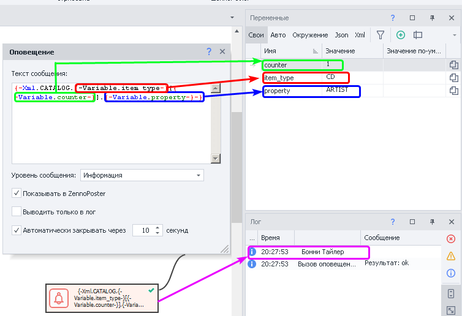 

:::tip **Быстрая вставка переменных.**  
Нажмите `CTRL+ПРОБЕЛ` в любом текстовом поле для вызова выпадающего меню. Далее двойной клик по JSON или XML для их выбора и поставьте `.`, тем самым открыв меню со спарсенными переменными.  

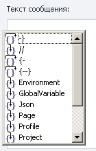  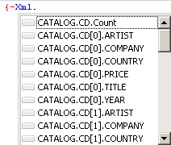 
:::  

### Обработать JsonPath/XPath.  
Данная опция нужна для выделения подмножества из данных, которые спарсили. Чтобы она работала потребуется составить выражение XPath (для XML) или JsonPath (для JSON). С этим, опять же, поможет [**Тестер***]((../Tools/JSON_Tester)).  

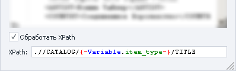   

В поле для вставки выражения можно использовать макросы.  
_______________________________________________
### Особенности XML.  
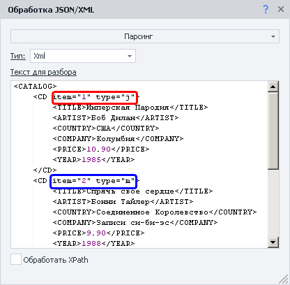  

У XML есть атрибуты узлов. Для доступа к ним нужно использовать в макросах квадратные скобки вместе со строковым значением: `{-Xml.CATALOG.CD[0]["item"]-}`.  

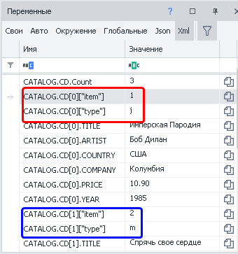   

### Скорость обработки.  
Парсинг большого текста JSON или XML во время отладки проекта в ProjectMaker может занимать длительное время. Но зато при работе в ZennoDroid парсинг будет проходить гораздо быстрей.  
_______________________________________________
## Добавить в список.  
Данное действие используется для получения из всех данных **одного конкретного свойства** для каждого элемента. В нем можно использовать ***переменные***.  

| 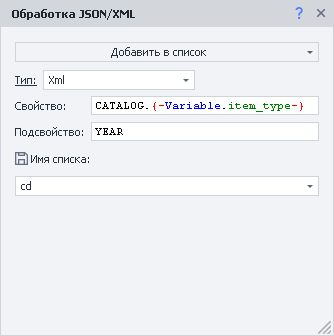            | 
| :----------------: | 
| *В переменной `{-Variable.item_type-}` находится **CD*** | 

### Свойство.  
Тут мы указываем поле, которое будем разбирать как массив.  

Есть возможность использования вложенности. Указывать параметры нужно через точку, например: `store.employees`.  

Если поле не является массивом, то в список занесется только один элемент.  

### Подсвойство. 
Иногда в массивах могут находиться сложные объекты, поэтому есть возможность указать, какое именно значение брать из него для списка.  
_______________________________________________
## Добавить в таблицу.  
Это действие похоже на предыдущее, но тут можно получить сразу несколько свойств. Также можно использовать ***переменные***.  

| 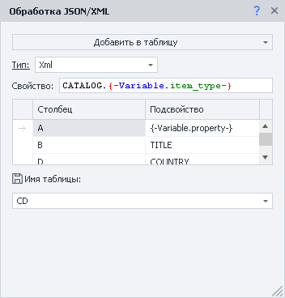            | 
| :----------------: | 
| *В переменной `{-Variable.item_type-}` находится **CD**, а в `{-Variable.property-}` — **ARTIST*** |  

Столбцы именуются, как и в Excel — большие латинские буквы в алфавитном порядке. Если пропустить один из столбцов, то он просто останется пустым. Как, например, столбец **С** на скриншоте:  

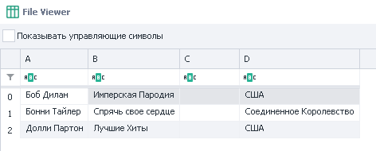  
_______________________________________________
## Работа с кодом.  
В коде С# JSON и XML находятся в объекте *project* и имеют тип *dynamic*. Из-за этого редактор кода не может полноценно показывать выпадающие подсказки.  

### Пример 1.  
```c  
project.Xml.FromString(project.Variables["XmlText"].Value);
return project.Xml.PurchaseOrder.Address[0]["Type"];
```  

### Пример 2.  
```c  
var list = new List<string>();
for(int i = 0; i < project.Xml.PurchaseOrder.Address.Count; i++)
{
    list.Add(project.Xml.PurchaseOrder.Address[i].Name.Value);
}
return string.Join(", ", list);
```  

### Пример 3.  
```c  
var list = new List<string>();
foreach(dynamic i in project.Xml.PurchaseOrder.Address)
{
    list.Add(i.Name.Value);
}
return string.Join(", ", list);
```  

Аналогично происходит и с JSON. Однако стоит учесть, что доступ к свойствам происходит без использования `Value`.  
Вот так: `return project.Json.employees[1].firstName;`  
_______________________________________________
## Пример с JSON.  
Для тестирования возьмем сайт http://ip-api.com/, который использует простейший API для возврата подробной информации про ваш ip-адрес. В реальных сценариях это полезно:  
- Для проверки, что проект работает через прокси, а не через основной IP.  
- Для выбора страны/города при регистрации.  

Этот сайт [**может возвращать**](https://ip-api.com/docs) данные в разных форматах. Но мы будем использовать именно JSON.  

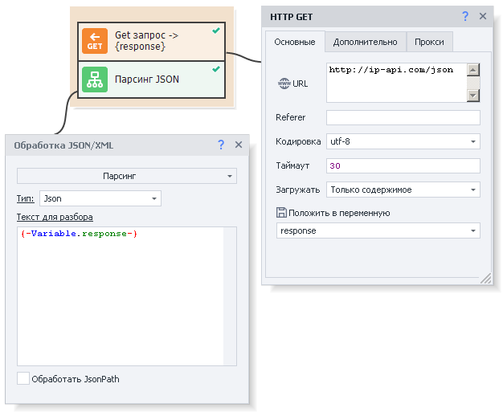

Для получения информации делаем [**GET-запрос**](../Project%20Editor/HTTP%20and%20FTP/GET) по адресу http://ip-api.com/json, а затем обрабатываем результат через действие *Парсить*. После этого можно работать с полученными данными.  

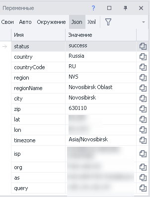  
_______________________________________________
## Пример с XML и Обработка XPath.  
Представим, что из всех данных нам нужны только названия альбомов. Тогда для этой задачи составим XPath выражение: `//CATALOG/CD/TITLE`.  

| 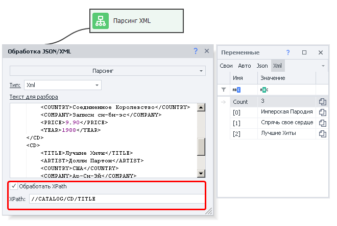           | 
| :----------------: | 
| *Настройки экшена и результат его работы (справа)* | 
_______________________________________________  
## Полезные ссылки.   
- [**C# код**](../Project%20Editor/CustomCode/С).  
- [**Что такое парсинг сайтов и зачем он нужен?**](https://blog.capmonster.cloud/ru/blog/sel-1/what-is-website-parsing-and-why-do-you-need-it). 
- [**Окно переменных**](../pm/Interface/Variables).
