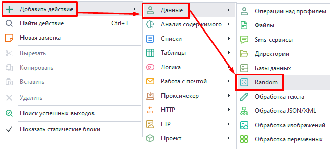
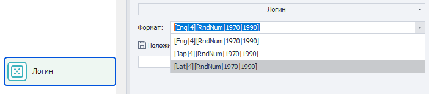
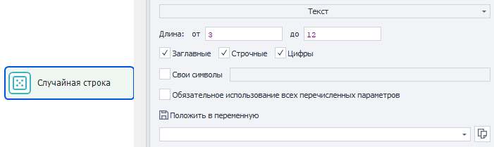
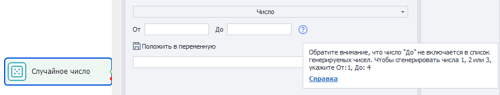

:::info **Пожалуйста, ознакомьтесь с [*Правилами использования материалов на данном ресурсе*](../Disclaimer).**
:::
_______________________________________________  
## Описание.  
Этот экшен используется для генерации случайных данных: строк, чисел и авторизационных логинов.  

### Его можно применить:  
- для выбора случайного элемента на странице;  
- для генерации пароля;  
- для генерации даты рождения;  
- для генерации почтового индекса;  
- для генерации логинов.  
_______________________________________________ 
## Как добавить в проект?  
Через контекстное меню: **Добавить действие → Данные → Random**.  

    
_______________________________________________  

## Генерация логина.  
  

Логин генерируется на основе заданной формулы. Доступно три предустановленных формата:  
- `[Eng|4][RndNum|1970|1990]`;  
- `[Jap|4][RndNum|1970|1990]`;  
- `[Lat|4][RndNum|1970|1990]`;  

Между собой они отличаются только языком: `Eng` - английский, `Jap` - японский, `Lat` - латынь.  

`[Eng|4]` означает, что будет сгенерирован никнейм длиной в 4 английских слога. Есть вероятность, что слоги будут сочетаться также, как и в реальных словах.  

Давайте поэкспериментируем с формулой и создадим более сложную конструкцию:  

`[RndSym|[RndNum|0|4]|0123456789][Lat|3][RndSym|[RndNum|0|2]|-][Jap|1][RndText|2|D]`  

- `[RndSym|[RndNum|0|4]|0123456789]` — в начале нашего ника будет от 0 до 3 (4 не включается) случайных цифр;  
- `[Lat|3]` — далее в логине идут три слога на латыни;  
- `[RndSym|[RndNum|0|2]|-]` — есть вероятность генерация дефиса;  
- `[Jap|1]` — следом будет добавлен один японский слог;  
- `[RndText|2|D]` — завершат ник случайные 2 буквы или цифры.  

*Пример того, какие будут сгенерированы ники.*
  

- 053bomenca-iem  
- 7lialeme-nozr  
- 46atbemig-poex  
- simpvido-se8f  
- 3afosuxhif6    
- frigulimdeif    
- misssefu-yucn    
- 5grasacin-maew    
- trodalcelfu88   
- 6nasercia-risc   

  
_______________________________________________ 
## Генерация текста.  
:::info **Используются только символы английского алфавита.**
:::
  

### Длина.  
Здесь мы задаем минимальную и максимальную длину итоговой строки. Верхняя граница указывается **не включительно**, то есть при генерации строки случайной длины от 3 до 10 символов мы сможем получить максимум 9 символов.  

### Дополнительные параметры.    
- **Заглавные**.  
- **Строчные**.  
- **Цифры**.  

Отмечаем те пункты, которые хотим использовать в итоговой строке.  

### Свои символы.  
Если включаем эту опцию, то в специальное поле справа нужно ввести символы, которые будут содержаться в генерируемой строке. Прочие символы использоваться не будут.  

### Обязательное использование всех перечисленных параметров.  
Когда отмечен данный чекбокс, итоговая строка будет содержать как минимум один символ каждого прошлого пункта *(Заглавные, Строчные, Цифры, Свои символы)*.  
_______________________________________________ 

*Примеры ответов, которые можно получить, включив все опции и выставив длину от 5 до 9.*
  

- w6ZxAw    
- 0M5oke7    
- ZlE3SY    
- Tos6KRZ    
- l5a640Pk     

   
_______________________________________________ 
## Генерация числа. 
  

- **От**. Нижняя граница генерируемого числа.  
- **До**. Максимальное значение, **НЕ ВКЛЮЧИТЕЛЬНО**.  

*Пример:* при генерации числа от **3** до **6** может быть сгенерировано только одно из этих чисел: **3**, **4**, **5**.
