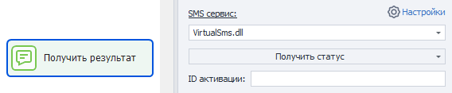

:::info **Пожалуйста, ознакомьтесь с [*Правилами использования материалов на данном ресурсе*](../Disclaimer).**
:::
  

Данный экшен используется для работы с SMS. Он позволяет получать номер из выбранного сервиса и использовать его в работе. Это может пригодится, например, для регистрации на сайтах, требующих SMS-подтверждения.  
_______________________________________________ 
## Как добавить в проект?  
Через контекстное меню: **Добавить действие → Данные → SMS-сервисы**.  

  
_______________________________________________
## Как пользоваться экшеном?  
:::info **Для начала работы потребуется подключить API-ключ одного из СМС-сервисов в настройках программы.**  

:::   
_______________________________________________
### SMS-сервис.  
  

Выбор одного из SMS-сервисов для работы.    
_______________________________________________
### Действие — Получить номер.  
  

#### Сервис.  
Сайт или приложение, для которого надо получить номер. Это значение можно уточнить в документации выбранного сервиса активации.

#### Оператор (страна).  
В этом поле указываем код страны, номер которой нужно получить.  

Коды стран отличаются от сервиса к сервису, поэтому их также уточняем в документации.  

#### Выполнить переадресацию.  
Отмечаем, нужно ли выполнять переадресацию. Ее возможность тоже зависит от конкретного сервиса.  

#### Положить ID активации в переменную.  
В указанную здесь переменную сохранится ID активации. Он понадобится в дальнейшем, когда проект будет ожидать получения СМС.  
_______________________________________________
### Действие — Изменить статус.  
Уведомление сервиса об изменении статуса номера.  

  

#### ID активации.  
Тут указываем ID активации, который был получен в действии **Получить номер**. Можно использовать макрос переменной.  

#### Статус:  
- **SMS отправлено**. Сообщение было успешно отправлено на указанный номер.  
- **Повторный запрос кода**. При необходимости отправить СМС еще раз.  
- **Отмена запроса**. Используется, когда номер больше не нужен. В некоторых случаях сервисы возвращают использованные деньги.  
- **Номер уже использовался**. Нужен для уведомления сервиса о том, что номер не подходит по причине его занятости.  
- **Завершение**. Сообщает сервису, что задача, для которой брался номер, успешно выполнена.  

#### Переадресация.  
Здесь пишем номер, на который будет происходить переадресация.  
_______________________________________________
### Действие — Получить статус.  
С помощью этого действия можно узнать состояние номера.  

Программа ожидает получение СМС в течение 3 минут. Если за это время оно не было получено, то в итоговую переменную попадет значение `Wait`. А это действие придется повторить заново. Учитывайте, что некоторые сервисы имеют долгое время отклика на СМС (до 15 минут).  

 

#### ID активации.  
Тут указываем ID активации, который был получен в действии **Получить номер**. Можно использовать макрос переменной.  
_______________________________________________
### Дополнительные параметры.  
У некоторых сервисов также есть дополнительные параметры, которые не входят в общие настройки экшена. Их можно задать в специальном поле, используя вот такой формат: `параметр=значение`.  

Можно передавать сразу несколько параметров. Друг от друга они должны отделяться символом `&`. Вот так: `параметр1=значение1&параметр2=значение2&параметрN=значениеN`.  

У каждого сервиса свои названия параметров, поэтому их нужно узнавать в документации выбранного сервиса.  
_______________________________________________
### Положить в переменную.  
Как и в прочих экшенах, это поле служит для указания перменной, в которую будет сохранен результат работы.  
_______________________________________________
## Алгоритм работы.  
**1.** Заказать номер и получить его.  
**2.** Отправить на полученный номер SMS сообщение.  
**3.** Уведомить сервис, что сообщение отправлено.  
**4.** Ожидать получения сообщения.    
**5.** Завершить сессию.  

|   |
|:--:|
| *Примерная схема работы с SMS-сервисом* |  

:::warning **Не используйте в своих проектах бесконечные циклы.**  
Это приведет к зависанию шаблона и потере денег. Например, если проект не сможет выйти из цикла на получение номера, то он будет постоянно запрашивать номера, пока не кончатся деньги. 
::: 
_______________________________________________  
## Полезные ссылки.   
- [**Установить значение**](../Android/SetValue).  
- [**Выполнить событие**](../Android/RunEvent). 
- [**Оператор Switch**](../Project%20Editor/Logic/Switch).
