:::info **Пожалуйста, ознакомьтесь с [*Правилами использования материалов на данном ресурсе*](../Disclaimer).**
:::
_______________________________________________  
## Описание.  
Данный экшен нужен для различных манипуляций с текстом. Например, обработать спарсенный текст, очистить его от мусора или даже перевести на другие языки – всё это, и многое другое, может данный «кубик».  

### Как добавить в проект?  
Через контекстное меню **Добавить действие → Данные → Обработка текста**:  

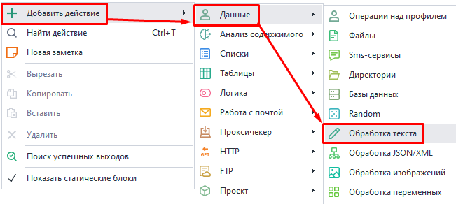  

### Внешний вид экшена.  
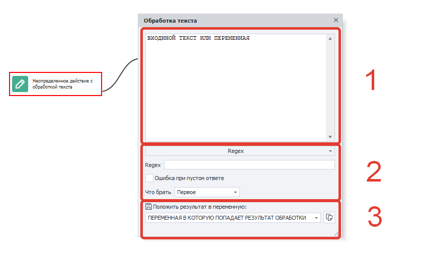  

Окно состоит из трех областей:  
**1.** Входная строка. Сюда можно поместить текст, переменную или их комбинацию.  
**2.** Действия над строкой и ее свойства, а также их настройки.  
**3.** Строка с выводом результата в переменную.  

Если установить курсор в поле входной строки и нажать **Ctrl+Пробел**, то появится выпадающий список с полезными константами и переменными проекта.  

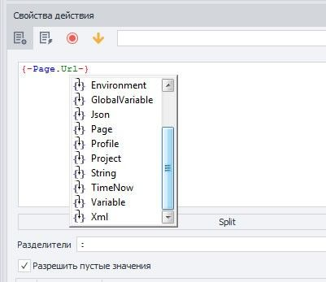  
_______________________________________________  
## Escape строки (Экранирование символов).  
Этот экшен экранирует пробел и символы: `*` `+` `?` `|` `{` `[` `(` `)` `^` `$` `.` `#`. То есть он размещает слэш `\` перед каждым из этих символов.  

Данный метод часто используется для работы с запросами. Также это помогает обработчику ***регулярных выражений*** использовать символы буквально, а не как команды или метасимволы.  
_______________________________________________ 
## Regex (Обработка текста регулярными выражениями).  
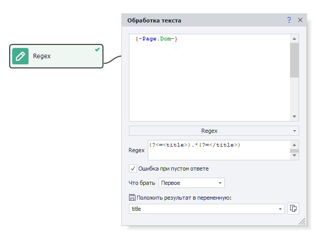  

С помощью регулярных выражений очень удобно парсить строки по заданному паттерну для нахождения нужной. Этот экшен может спарсить не только первое найденное значение, но и всю группу, а также сохранить значения в переменные или таблицу.  

### Поле ввода Regex.  
В данное поле необходимо ввести регулярное выражение, с помощью которого будет производиться поиск по тексту. Пример: `(?<=<title>).*(?=</title>)`.  

:::tip **В составлении регулярных выражений поможет [*Тестер регулярных выражений*](../Tools/RegEx_Tester).**  
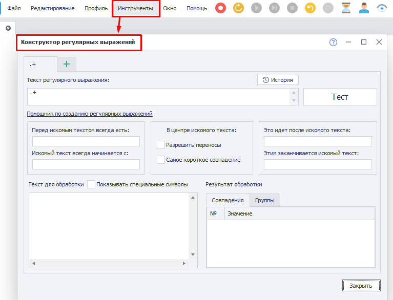
:::  

### Ошибка при пустом ответе.  
Когда включена данная настройка, экшен завершается ошибкой, если регулярное выражение **не находит ничего** в тексте.  

**Обратите внимание** на то, что если регулярное выражение **вернёт пустую строку**, то даже при включении этой настройки экшен все равно **выйдет по зеленой ветке**. Например, на сайте нет ничего в теге *title*: `<title></title>`. Тогда регулярное выражение `(?<=<title>).*(?=</title>)` сработает, но вернёт пустую строку, а экшен завершится успехом. А вот если в тексте совсем нет *title*, то действие завершится ошибкой.  

### Что брать.  
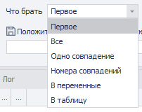  

#### Первое.  
В переменную сохранится первое найденное совпадение.  

#### Все.
Сохранить весь результат поиска в список.  

#### Одно совпадение.  
Сохраняет только одно совпадение, которое выбирается исходя из порядкового номера (**нумерация с нуля**).  

Также можно выбрать **Последнее** или **Случайное (*Random*)** значение.  

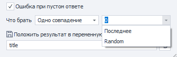 

#### Номера совпадений.  
Позволяет сохранить в список только номера совпадений, которые указаны через запятую (**нумерация с нуля**).  

#### В переменные.  
Данная функция используется при работе с групповыми регулярными выражениями.  

<details>
<summary>**Для лучшего понимания мы подготовили развернутый пример.**</summary>  

Представим, что есть следующий текст:  
```  
21.01.2003, 11:34:00.9299
11.12.2013, 01:22:55.3021
04.01.2007, 08:00:06.0032  
```  
И нам нужно разобрать его на составляющие. Для этого воспользуемся таким регулярным выражением:  
`(\d{2}).(\d{2}).(\d{4}), (\d{2}):(\d{2}):(\d{2}).(\d{4})`  

Вот как выглядит результат выполнения в ***Тестере регулярных выражений***:  

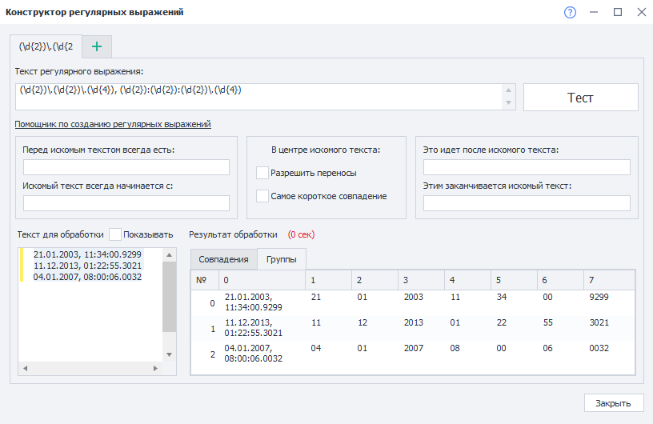  

Теперь нам надо взять в переменные: день, месяц и год из второй строки. Вот как это можно сделать:  

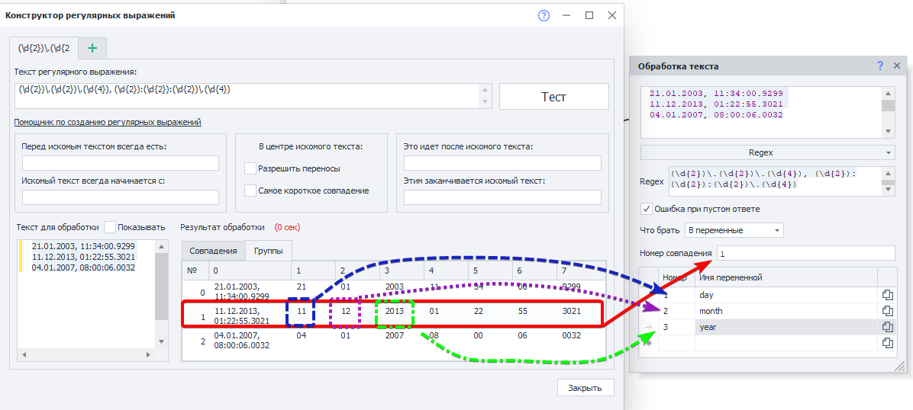 

**Номер совпадения** в этом случае — номер строки. Так как нумерация начинается с нуля, то пишем `1`, чтобы взять вторую строку.  

Далее нужно указать номер группы и переменную, в которую сохранится результат. В группе **0** находится вся найденная строка: `11.12.2013, 01:22:55.3021`. Так что для получения раздельных данных указываем следующие номера групп: `1` для дня, `2` для месяца, `3` для года.   
</details>  

#### В таблицу.  
Сильно похоже на предыдущую функцию, но с тем отличием, что здесь сохраняется не один результат, а сразу все и именно в таблицу. Но из итогового результата можно исключить некоторые группы.  

<details>
<summary>**Здесь также рассмотрим пример.**</summary>  

Текст оставим из прошлого примера:  
```  
21.01.2003, 11:34:00.9299
11.12.2013, 01:22:55.3021
04.01.2007, 08:00:06.0032  
```  
И регулярное выражение тоже:  
`(\d{2}).(\d{2}).(\d{4}), (\d{2}):(\d{2}):(\d{2}).(\d{4})`  

Вот как выглядит результат выполнения в [**Тестере регулярных выражений**](../Tools/RegEx_Tester):  

 

В итоговой таблице нам не нужны секунды и миллисекунды:  

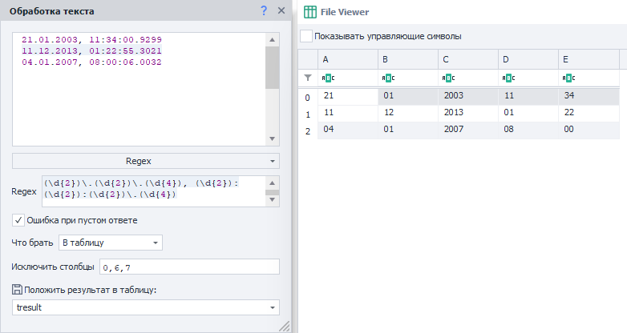 

В группе под индексом **0** находится вся найденная строка, поэтому ее исключаем. Также игнорируем группы **6** и **7**, так как там лежат секунды и миллисекунды соответственно.   
</details>  

### Пример использования Regex.  
В этом примере мы выполним парсинг ссылок с помощью регулярных выражений, которые составим через [**конструктор**](../Tools/RegEx_Tester#конструктор-регулярных-выражений).  

**Задача:** получить ссылки на профили активных пользователей [**форума ZennoLab**](https://zenno.club/discussion/)  

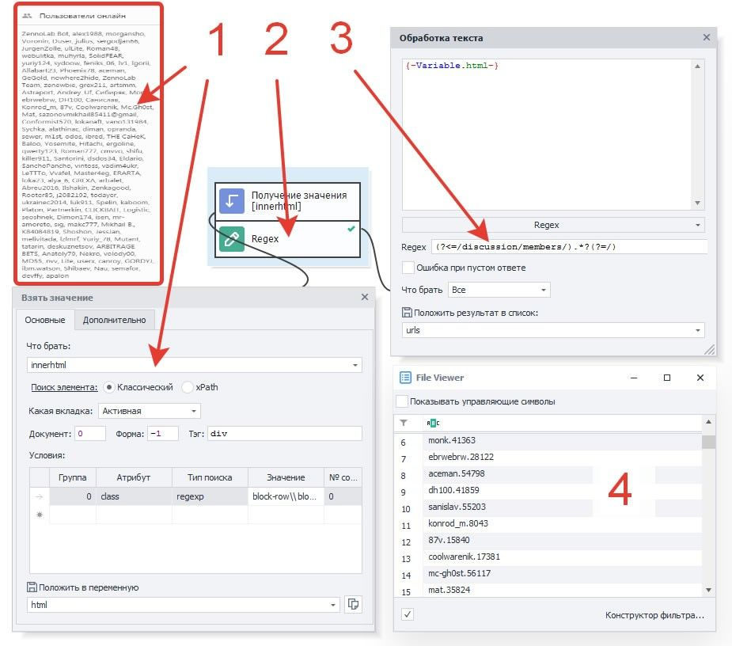  

**1.** С помощью действия [**Взятие значения**](../Android/GetValue) получаем HTML-код элемента, в котором размещены ссылки на пользователей, находящихся в статусе *Онлайн*.  
**2.** Добавляем экшен **Regex**. Для составления паттерна используем [**Конструктор регулярных выражений**](../Tools/RegEx_Tester#конструктор-регулярных-выражений).  
**3.** В свойства экшена на вход добавляем переменную *html*, а результат сохраняем в список *urls*.  
**4.** После запуска кубика мы получим в списке уникальные id, которые можно использовать для формирования URL с профилями юзеров.  
_______________________________________________
## Spintax (Рандомизация и уникализация текста).  
С помощью этого инструмента удобно создавать синонимизацию текстов. Это такая конструкция из обрамляющих фигурных скобок и вертикальных слэшей, которая позволяет в случайном порядке подставлять строки.  

В простейшем варианте спинтакс выглядит так: `{вариант1|вариант2|вариант3}`. При выполнении этого действия в результирующую переменную случайно попадет один из трёх вариантов. Однако конструкции спинтакса бывают более сложными и обладают многоуровневой вложенностью, так что из одного текста можно получить тысячи разных вариантов.  

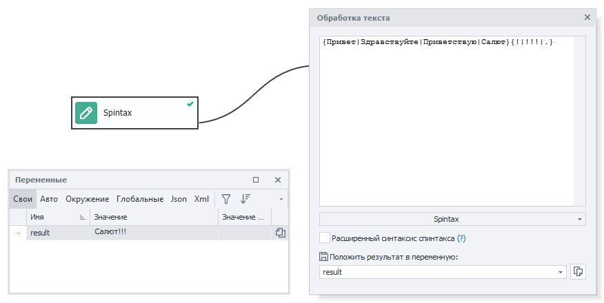 

### Расширенный синтаксис.  
- `{Red|White|Blue}` — в этом случае в результирующий текст попадает одно из значений, например: **White**.  
- `[ Red| White| Blue]` — в результате будет выполнена перестановка значений: **White Blue Red**.  
- `[+_+Red|White|Blue]` — значения также будут перетасованы, но уже с наличием разделителя между ними: **White_Red_Blue**.  

Хотим отметить, что вложенность шаблонов неограничена: `[+{_|-}+Red|White|Blue {1|2}]` = **White-Blue 2-Red**.  
Спец. символы можно экранировать: `[+\++Red|\[White\]|Blue]` = **[White]+Red+Blue**.  
_______________________________________________
## Split (Разделение текста).  
Разделение выполняется через специальный символ (делиметер). В результате обработки строка превратиться в массив из строк. По сути это более простой аналог RegExp для разделения строки символами. 

### Разделители.  
Здесь мы указываем символы, через которые будут разбиваться данные.  

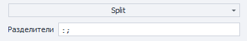  

### Разрешить пустые значения.  
Эту опцию легче рассмотреть на примере:  

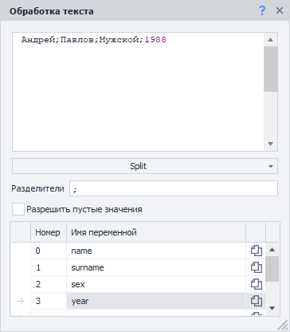 

Здесь у нас есть строка в формате: `имя;фамилия;пол;год рождения`. Если вы пропустите одно из значений, например, не указав пол: `Андрей;Павлов;;1988`, то `1988` запишется именно в переменную **пол (sex)**, а не в **год (year)**, как ожидается.  

Чтобы это избежать, нужно включить настройку *Разрешить пустые значения*. Тогда появится возможность записывать в переменные пустые строки.  

### Пример использования Split.  
Разобьем строки с прокси на составляющие части. 

Покупные прокси обычно имеют подобный формат: `логин:пароль@хост:порт`. То есть тут сразу два разделителя — `:` и `@`. Настройки экшена в этом случае могут выглядеть вот так:  

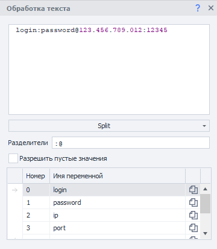 
_______________________________________________
## ToChar (Преобразование целого числа в Unicode).  
Каждый символ Юникод имеет свой цифровой код. И именно эта особенность позволяет конвертировать любое числовое значение в соответствующие символы. Например, у символа ♛ числовое значение `9819`.  

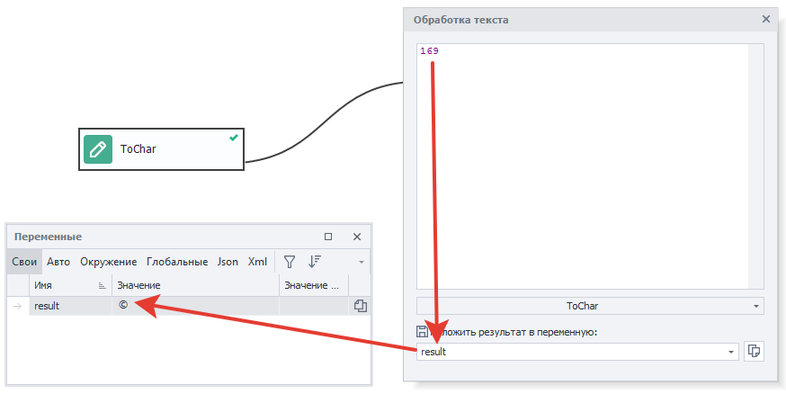  
_______________________________________________
## ToLower (К нижнему регистру).  
Это действие меняет регистр букв на нижний в зависимости от выбранного свойства.  

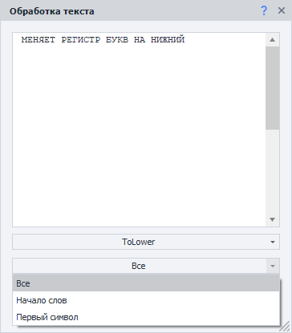 

### Все.  
Заменит все символы верхнего регистра в тексте на нижний.  

| **Было**    | **Стало** |
| -------- | ------- |
| МЕНЯЕТ РЕГИСТР БУКВ НА НИЖНИЙ  | меняет регистр букв на нижний    |  

### Начало слов.
Меняет регистр на нижний только у первого символа каждого слова в тексте.  

| **Было**    | **Стало** |
| -------- | ------- |
| МЕНЯЕТ РЕГИСТР БУКВ НА НИЖНИЙ  | мЕНЯЕТ рЕГИСТР бУКВ нА нИЖНИЙ    |  

### Первый символ.  
Станет маленькой только первая буква первого слова.  

| **Было**    | **Стало** |
| -------- | ------- |
| МЕНЯЕТ РЕГИСТР БУКВ НА НИЖНИЙ  | мЕНЯЕТ РЕГИСТР БУКВ НА НИЖНИЙ    |  
_______________________________________________
## ToUpper (К верхнему регистру).  
Это действие меняет регистр букв на верхний в зависимости от выбранного свойства.  

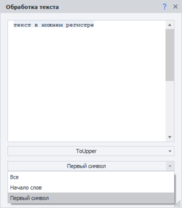  

### Все.  
Заменит все символы нижнего регистра в тексте на верхний.  

| **Было**    | **Стало** |
| -------- | ------- |
| текст в нижнем регистре  | ТЕКСТ В НИЖНЕМ РЕГИСТРЕ    |  

### Начало слов.
Меняет регистр на верхний только у первого символа каждого слова в тексте.  

| **Было**    | **Стало** |
| -------- | ------- |
| текст в нижнем регистре  | Текст В Нижнем Регистре    |  

### Первый символ.  
Станет большой только первая буква первого слова.  

| **Было**    | **Стало** |
| -------- | ------- |
| текст в нижнем регистре  | Текст в нижнем регистре    |  
_______________________________________________
## Trim (Удаление символов в начале/конце строки).  
Эта функция используется для удаления лишних символов в начале и\или конце переданной строки.  

Чаще всего приходит на помощь, когда нужно очистить строку от лишних пробелов, переносов и табуляций, которые остаются после парсинга.

### Что обрезать.  
Тут мы выбираем символы, которые нужно удалить. Это может быть предустановленный вариант для всех типов пробельных символов, либо укажите нужные вам.  

### Где обрезать.  
Определяем, где надо удалить символы:  
- *Начало строки*;  
- *Конец*;  
- *Начало **и** Конец*.  
_______________________________________________
## UrlDecode (Декодировка).  
Декодирует строку закодированную с помощью UrlEncode (описано ниже).  

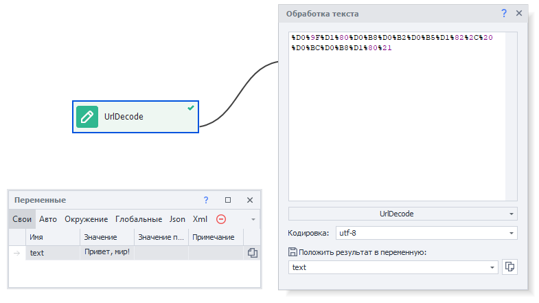

Наиболее наглядно этот экшен выглядит при раскодировании кириллицы:  
**Было:** `%D0%9F%D1%80%D0%B8%D0%B2%D0%B5%D1%82%2C%20%D0%BC%D0%B8%D1%80%21`.  
**Стало:** `Привет, мир!`.  
_______________________________________________
## UrlEncode (Кодировка).  
В URL разрешается использовать только латинские буквы, цифры и несколько знаков пунктуации. Все остальные символы, которые передаются в HTTP-запросах, должны быть закодированы с помощью **UrlEncode**. Иначе сервер неправильно интерпретирует запрос.  

### Кодировать только значения в переменных.  
Эта опция пригодится при формировании [**HTTP запросов**](../Project%20Editor/HTTP%20and%20FTP/HTTP). Так как кодировать надо только параметры, но не адрес сайта.  
Вот как могут выглядеть настройки экшена:  

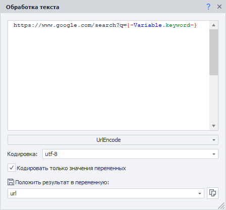 

В переменной `{-Variable.keyword-}` находится текст *`что такое urlencode`*. А после выполнения в переменную `{-Variable.url-}` запишется такая строка:  
`https://www.google.com/search?q=%d1%87%d1%82%d0%be+%d1%82%d0%b0%d0%ba%d0%be%d0%b5+urlencode`  
_______________________________________________
## В переменную.  
Это действие просто сохраняет всё что вы добавите во входное окно – переменные, текст, символы, константы проекта, в *одну* отдельную переменную.  

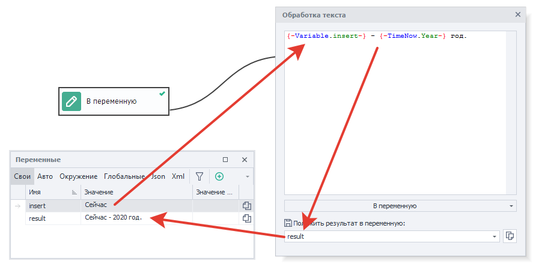 
_______________________________________________
## В список.  
Данный экшен разбивает текст на строки с помощью указанного разделителя, а затем записывает их в список.  

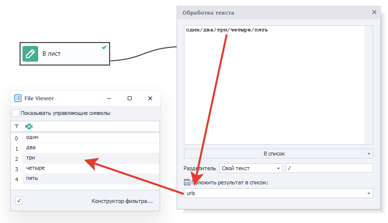

### Разделитель.  
- **Enter**. Символ новой строки.  
- **Пробел**.  
- **Свой текст**. Здесь можно указать как единичный символ (например `;`), так и несколько символов (но при этом они будут рассматриваться **как один разделитель!**).  
- **Свой Regex**. Будет использовано регулярное выражение.  
_______________________________________________
## В таблицу.
Данное действие разбивает переданный текст на строки и столбцы через указанные разделители, а затем помещает данные в таблицу.  

### Разделители 
- **Enter**. Символ новой строки.  
- **Пробел**.  
- **Свой текст**. Здесь можно указать как единичный символ (например `;`), так и несколько символов (но при этом они будут рассматриваться **как один разделитель!**).  
- **Свой Regex**. Будет использовано регулярное выражение.  
_______________________________________________
## Замена.  
Это действие заменяет одну строку на другую, а получившийся результат сохраняет в переменную.  

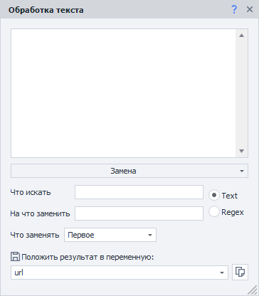 

### Что искать.  
Здесь указываем строку, которую нужно найти. Либо Regex, если выбран соответствующий вариант.  

### На что заменить.  
Каким текстом мы заменим то, что нашли в прошлом пункте.  

### Тип поиска.  
- *Text*. Будет в точности искаться заданный текст.  
- *Regex*. В этом случае мы пишем регулярное выражение, по которому будет искаться совпадение.  

### Что заменять.  
#### Первое.  
Будет заменено первое найденное совпадение.  

#### Все.  
Заменятся сразу все совпадения.  

#### Одно совпадение.  
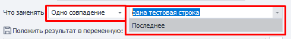  

В этом случае заменится только указанное совпадение (или *Последнее* найденное).  

#### Номера совпадений.  
Указываем номера совпадений для замены через запятую (*нумерация с нуля*).  
_______________________________________________
## Перевод.  
Этот экшен переводит строки с одного языка на другой.  

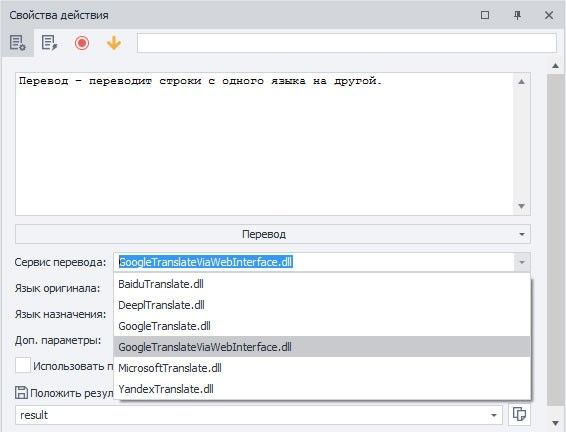  

### Сервис перевода.  
Доступно сразу несколько вариантов, что помогает сделать текст наиболее качественным и уникальным.  
- [**Baidu**](https://www.npmjs.com/package/baidu-translate-api)    
- [**DeepL**](https://www.deepl.com/ru/docs-api/)  
- [**Google**](https://cloud.google.com/translate)    
- [**Google через веб-интерфейс**](https://translate.google.com/)    
- [**Microsoft**](https://www.microsoft.com/en-us/translator/business/translator-api/)    
- [**Yandex**](https://tech.yandex.com/translate/)  

<details>
<summary>**Ключи API для сервисов нужно добавить через *Настройки программы*.**</summary>  

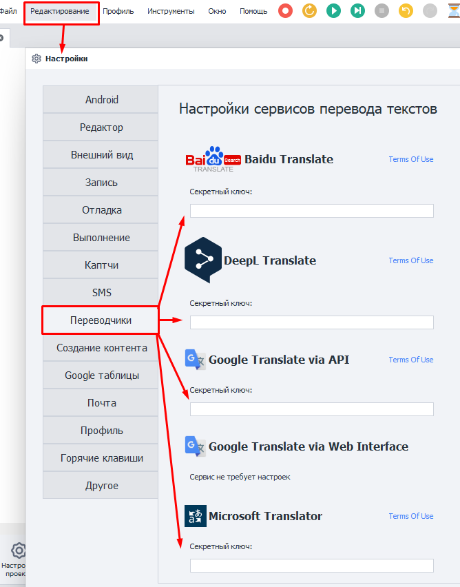  
</details> 

### Язык оригинала/Язык назначения.  
Тут указываем, с какого и на какой язык нужно перевести текст. 

:::tip Можно указать язык «*auto*».  
Тогда система *попробует* сама определить язык, но **результат не гарантируется**.
:::

Писать нужно именно код языка, а не его привычное название. Например:  
- *Английский: **en***  
- *Испанский: **es***  
- *Немецкий: **de***  
- *Русский: **ru***  
- *И так далее. [**Полный список**](http://www.loc.gov/standards/iso639-2/php/code_list.php).*  

:::warning **Коды языков отличаются для каждого сервиса.**  
Для полного и достоверного списка кодов рекомендуем обратиться к документации выбранного сервиса.
:::  
_______________________________________________
## Подготовка JavaScript.  
Это действие нужно для обработки строки под корректное использование в JavaScript. В основном, оно экранирует кавычки, апострофы и другие спец. символы. В результате текст будет подготовлен для вставки в экшены ***JavaScript*** и ***IF***.  

**Было:** `<a href="https://zennolab.com/">`.  
**Стало:** `<a href=\"https://zennolab.com/\">`.

:::tip Протестировать код можно через ***тестер JavaScript***.  
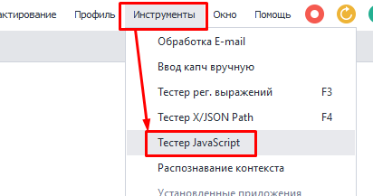  
:::  
_______________________________________________
## Подстрока.  
Берет из строки заданный кусок текста. Интервал задается с помощью значений **От** и **До**, в них мы указываем номера символов.  

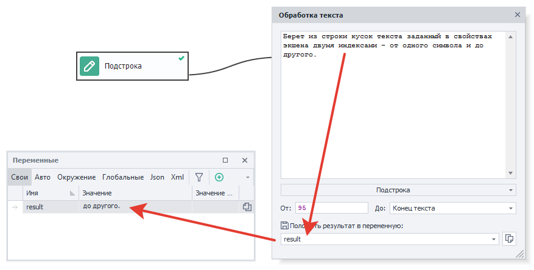  

В примере выше мы берем подстроку **с 95 символа** по **Конец текста**, получая в итоге *«до другого.»*.  
_______________________________________________
## Транслитерация.  
В редких случах до сих пор требуется *perevesti* кириллицу в латиницу. Для этого и нужен данный экшен.  

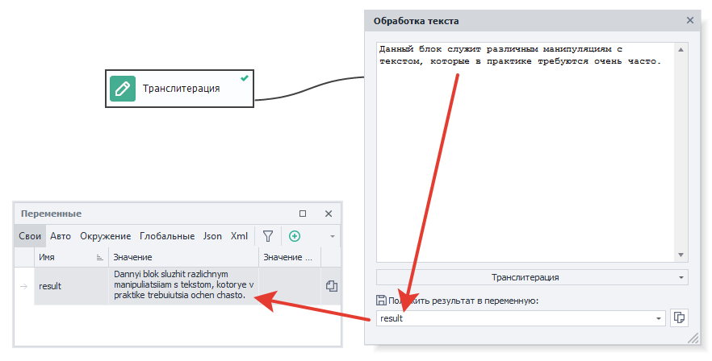
_______________________________________________  
## Полезные ссылки.   
- [**Тестер JavaScript**](../Tools/Java_Tester).  
- [**Подключение сервисов перевода текста**](../Settings/Translators). 
- [**Взять значение**](../Android/GetValue).