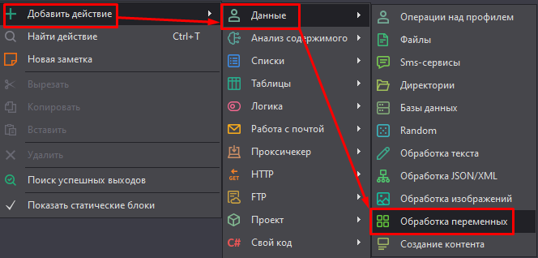
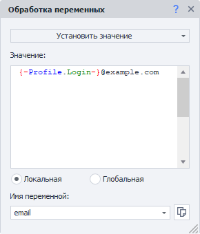
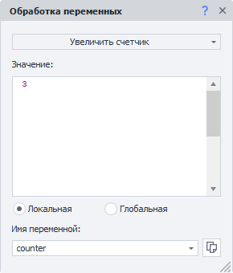
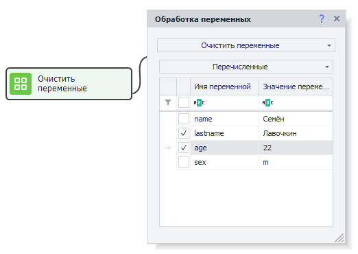
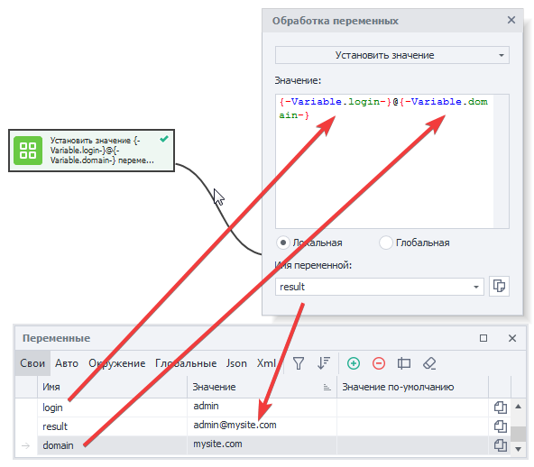
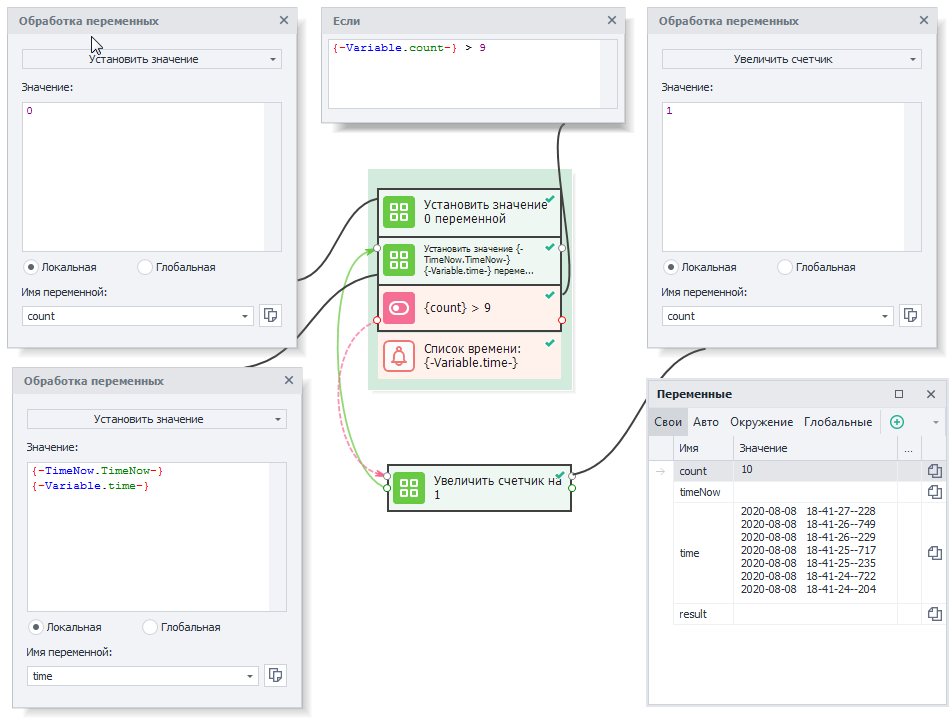

:::info **Пожалуйста, ознакомьтесь с [*Правилами использования материалов на данном ресурсе*](../Disclaimer).**
:::
_______________________________________________  
## Описание.  
**Переменная** — это контейнер в памяти, который может принимать заданное или вычисляемое значение. Это основа любого проекта в программировании.   

В ZennoDroid переменные можно создавать и удалять, менять им названия, а также присваивать им различные значения. Удобнее всего заниматься этим через ***Окно переменных***.  

Мы рекомендуем разделять переменные C#, которые строго типизированы, с переменными проекта, которые напротив не имеют строгой типизации. Однако значения этих двух типов всегда можно конвертировать без потери и искажения данных.   

**Экшен можно использовать для:**  
- *установки и изменения значений переменных*;  
- *увеличения или уменьшения значения счётчика*.  
_______________________________________________ 
## Как добавить в проект?  
Через контекстное меню: **Добавить действие → Данные → Обработка переменных**.  

  
_______________________________________________   
## Как работать с экшеном?  
### Установить значение.  
  

Можно присваивать статические строки, числа, значения других переменных, а также все перечисленные данные вместе.  
_______________________________________________
### Увеличить/Уменьшить счётчик.  
 

Режим счетчика работает как на увеличение, так и на уменьшение значения. При этом регулировать его можно не только по единице, а на любое число указанное в поле **Значение**.  

В **Имя переменной** указываем ту, значения которой собираемся изменять.  
_______________________________________________
### Очистить переменные.  
С помощью этого действия можно удалить содержимое переменных.  

  

Доступно три режима очистки:  
- **Все**;  
- **Перечисленные**;  
- **Все, кроме перечисленных**.  

Удаление содержимого, например, может пригодиться перед началом новой итерации, когда шаблон работает в цикле, а мы не хотим, чтобы значения из предыдущей фазы попали в новую.  
_______________________________________________
### Пространство имён.  
**Локальные** переменные видны только **в пределах одного потока**. То есть если проект работает в многопоточном режиме, то у каждого потока будет своя независимая переменная.  

**Глобальные** же переменные, напротив, **доступны для всех проектов и их потоков**.  

**Пространство имён** было придумано как дополнительное свойство для избежания путаницы. Его нужно указывать при создании глобальных переменных и при обращении к ним.  
_______________________________________________
## Примеры использования.  
Рассмотрим два практических примера использования переменных в проектах.  
_______________________________________________
### Присвоение значения.
Значения переменных можно присваивать или изменять. Делается это в ***Окне переменных***, либо с помощью данного экшена **Обработка переменных**.  

  

В данном примере формируется адрес электронной почты на основе строковых переменных: *логин* и *домен сайта*.  
_______________________________________________
### Работа со счётчиком.  
Представим задачу, в которой требуется составить список десяти текущих отметок времени.  

**1.** Создаём переменную `count`, которая выступит счётчиком. Присвоим ей значение `0`.  
**2.** Теперь получим текущую отметку времени с помощь ***переменной окружения*** под названием `{-TimeNow.TimeNow-}`. Добавим её к переменной `time` и сохраним полученное значение туда же.  
**3.** Далее нам нужно повторить процедуру из прошлого пункта еще **9 раз**. Для этого сравниваем экшеном ***IF*** значение нашего счётчика `count` с максимальным значением `9`.  
**4.** Если условие не выполнено (счетчик меньше или равен `9`), то увеличиваем `count` на `1` (действие **Увеличить счётчик**) и повторяем *пункт 2*.  
**5.** Когда условие выполнится (счетчик более `9`), завершим обработку и выведем в лог полученное значение переменной `time`. Мы можем увидеть результат работы проекта в ***Окне переменных***. 

