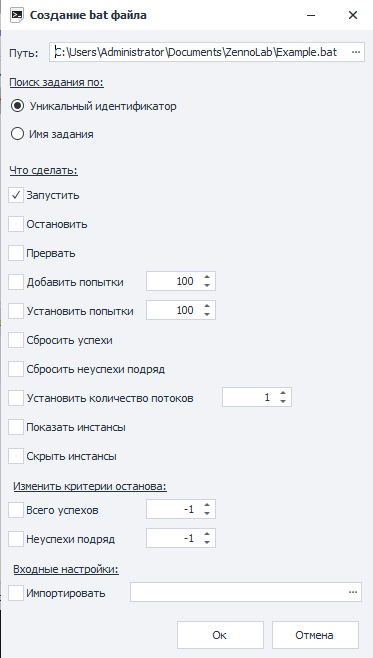
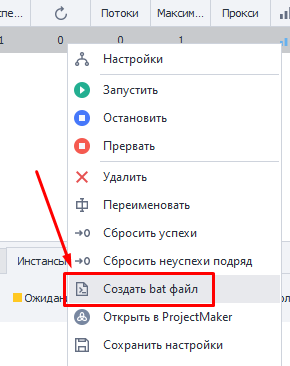

---
sidebar_position: 7
title: Создать .bat файл
description: Создать .bat файл
---  
:::info **Пожалуйста, ознакомьтесь с [*Правилами использования материалов на данном ресурсе*](../Disclaimer).**
:::
_______________________________________________  
## Описание.  
  

Для каждого добавленного в ZennoDroid проекта вы можете создать отдельный .bat файл. С его помощью, например, можно:  
- Запускать и останавливать шаблон;  
- Добавлять попытки;  
- Изменять количество потоков;  
- Задавать новые входные настройки.  

Для одного .bat файла можно задать сразу несколько функций.  

:::warning **.bat файлы не работают в *Демо версии* программы.**
:::  

### Как создать?  
В **Таблице проектов** кликаем ПКМ по нужному шаблону и в ***Контекстном меню*** выбираем **Создать bat файл**.  

_______________________________________________
## Работа с окном.  
### Путь.  
Тут мы указываем место на компьютере, куда хотим сохранить bat файл.  

### Поиск задания по.  
В этом пункте нужно выбрать, по какому признаку bat файл будет искать проект для работы с ним.  

- **Уникальный идентификатор**.  
У каждого добавленного в ZennoDroid проекта есть уникальный идентификатор (пример - `81ca46b9-8eaa-94e3-92be-33b22ba4ca1a`).  
:::warning **Каждый раз генерируется новый идентификатор.**  
Если несколько раз добавить и удалить один и тот же шаблон в программу, то каждый раз для него будет формироваться новый id.  

Учитывайте это при работе.
:::  

- **Имя задания**.  
Поиск шаблона выполнится по его имени.  

Если же добавить сразу несколько проектов с одинаковым именем, то настройки будут применены к первому из них.  

### Что сделать.  
- **Запустить/Остановить/Прервать**. Позволяет запустить, либо же плавно/резко завершить работу проекта.  
- **Добавить попытки**. К текущим попыткам выполнения будет добавлено указанное здесь количество. 
- **Установить попытки**. Для выбранного шаблона будет установлено указанное здесь количество попыток выполнения.  
- **Сбросить успехи/неуспехи подряд**. Сбрасывает счётчик количества успешных или неуспешных выполнений.  
- **Установить количество потоков**. Задаёт число потоков для шаблона.  
- **Показать/скрыть инстанс**. Данные опции позволяют запустить отображение инстансов у работающих потоков.  

### Изменить критерии останова.  
Здесь можно задать условия, при наступлении которых шаблон прекратит работу. Работает аналогично функциям из вкладки ***Остановка***.  

### Входные настройки.  
Тут нужно указать место на диске, где находится файл с сохранёнными ***Входными настройками***.  
_______________________________________________