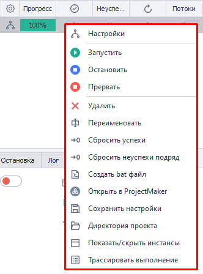
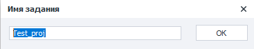
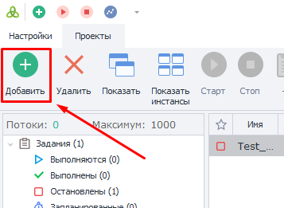
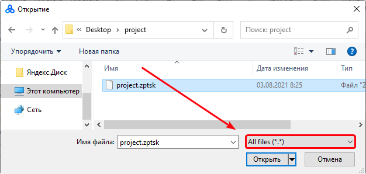
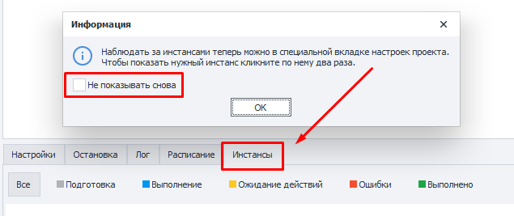

---
sidebar_position: 6
title: Контекстное меню
description: Контекстное меню выполнения
---  
:::info **Пожалуйста, ознакомьтесь с [*Правилами использования материалов на данном ресурсе*](../Disclaimer).**
:::
_______________________________________________  
## Описание.
Контекстное меню можно вызвать, кликнув ПКМ по любому из заданий в таблице.  

  

Можно даже выделить сразу несколько проектов, тогда выбранное действие применится сразу к каждому из них.  
_______________________________________________
## Пункты меню.  
### Настройки.  
Этот пункт открывает ***Входные настройки*** проекта.  

Их также можно открыть, если дважды кликнуть по заданию.  

### Запустить.  
Запускает выполнение шаблона.  

:::info **Во вкладке *Настройки проекта* при этом должно быть выставлено количество потоков и повторений.**
:::
  
### Остановить.  
Отвечает за плавную остановку работу.  

После нажатия все работающие потоки дойдут до своего логического конца и больше не будут запускаться. Старт произойдёт только после клика по кнопке **Запустить**.  

### Прервать.  
Резко прерывает выполнение задания. То есть проект немедленно прекратит свою работу, независимо от текущего этапа.  

### Удалить.
Удалит выбранное задание из **Таблицы проектов**.  

### Переименовать.  
Данная функция позволяет изменить имя проекта.  



Это также можно сделать, нажав на задание, а потом на **F2**.  

### Сбросить успехи/неуспехи подряд.  
Сбрасывает счётчик успехов или неуспехов до нуля.  

Это может быть полезно, когда настроена ***Остановка*** по их числу.

### Создать .bat файл.  
Создаёт отдельный файл для запуска шаблона.  

Принцип действия описан в статье ***Создать .bat файл***.  

### Открыть в ProjectMaker.  
Открывает выбранный проект в ProjectMaker для редактирования.  

:::warning **У вас должны быть права на открытие и редактирование этого проекта.**
:::  
_______________________________________________
### Сохранить настройки.  
Эта функция сохраняет все настройки и данные проекта. Такие как количество потоков и их выполнений, теги, условия для остановки, текущий статус, id, расписание и прочие.  

У полученного файла будет расширение `.zptsk`. Его можно открыть через любой текстовый редактор (Notepad++, SublimeText и другие). Внутри будут данные в формате XML.  

<details>
<summary>**Пример данных в виде XML.**</summary>
<!--All you need is a blank line-->
```xml
     <Id>e6a601d1-fd0e-4198-a667-80614726186f</Id>
  <Name>ProjectZ</Name>
  <IsNewbie>True</IsNewbie>
  <IsEnable>True</IsEnable>
  <CreateTime>08/08/2021 12:14:32</CreateTime>
  <SettingsType>InputSettings</SettingsType>
  <BrowserType></BrowserType>
  <FilterLogSettings></FilterLogSettings>
  <ShowAutoFilterRow>False</ShowAutoFilterRow>
  <ExecutionSettings>
    <Id>552d0abb-9629-4521-a960-c11ac9274676</Id>
    <LimitOfThreads>1</LimitOfThreads>
    <MaxAllowOfThreads>0</MaxAllowOfThreads>
    <DoneSuccessfully>1</DoneSuccessfully>
    <DoneAll>1</DoneAll>
    <NumberOfTries>0</NumberOfTries>
    <LastNumberOfTries>1</LastNumberOfTries>
    <Priority>100000</Priority>
    <Proxy>UseProxyWithoutRemove</Proxy>
    <Status>Complete</Status>
    <ProxyLabels></ProxyLabels>
    <ShouldBeExecutedRandomly>False</ShouldBeExecutedRandomly>
    <GroupLabels>sometag</GroupLabels>
    <GroupStates>Выполнены</GroupStates>
    <MaxNumOfSuccessStop>1024</MaxNumOfSuccessStop>
    <Timeout>-1</Timeout>
    <MaxNumOfFailStop>128</MaxNumOfFailStop>
    <NumOfFailStop>0</NumOfFailStop>
    <ShowTask>False</ShowTask>
    <TraceTask>False</TraceTask>
    <PerformBadEndOnInterrupt>True</PerformBadEndOnInterrupt>
  </ExecutionSettings>
  <Scheduler7Settings>
    <Id>e6a601d1-fd0e-4198-a667-80614726186f</Id>
    <IsActive>False</IsActive>
    <ExecutePeriod>EveryDay</ExecutePeriod>
    <StartDateType>Immediately</StartDateType>
    <AttemptsRange>12</AttemptsRange>
    <IsClearSuccess>False</IsClearSuccess>
    <Intervals>09:00 - 17:00</Intervals>
    <StopExecutionOutsideOfIntervals>True</StopExecutionOutsideOfIntervals>
    <RepeatType>Continued</RepeatType>
    <EndDateType>Count</EndDateType>
    <RepeatCountTotalRange>525252</RepeatCountTotalRange>
    <LastScheduleTime></LastScheduleTime>
    <NextScheduleTime></NextScheduleTime>
    <TaskName>ProjectZ</TaskName>
    <GroupName></GroupName>
    <IsOneTimeRunning>False</IsOneTimeRunning>
    <IsTaskRunning>False</IsTaskRunning>
  </Scheduler7Settings>
  <Project>
    <ProjectFileLocation>C:\ProjectZ.zp</ProjectFileLocation>
    <ProjectType>Assembly</ProjectType>
  </Project>
  <SchedulerSettings>
    <Id>4095f5b5-141f-43a1-888e-fa809fe3404d</Id>
    <StartDate>08/08/2021 12:14:00</StartDate>
    <SchedulerOnDate>01/01/0001 00:00:00</SchedulerOnDate>
    <EndDate>08/08/2022 12:14:00</EndDate>
    <RepetitionCount>1</RepetitionCount>
    <ScheduleType>EveryMinutes</ScheduleType>
    <RepeatType>FinishAfter</RepeatType>
    <ActivateTime>01/01/0001 00:00:00</ActivateTime>
    <ActivateWorkTime>01/01/0001 00:00:00</ActivateWorkTime>
    <IsActive>False</IsActive>
    <NumberOfTries>0</NumberOfTries>
    <Minutes>1</Minutes>
    <Days>1</Days>
    <LastScheduleDate>01/01/0001 00:00:00</LastScheduleDate>
    <NextScheduleDate>null</NextScheduleDate>
    <IsClearSuccess>False</IsClearSuccess>
    <GroupName></GroupName>
  </SchedulerSettings>
  <PurchaseState>None</PurchaseState>
  ```
</details>
> 

#### Как загрузить эти настройки?  
Сделать это можно с помощью `.bat` файла с таким содержимым:  

`"%ZennoPosterCurrentPath%\TasksRunner.exe" -o LoadSettings -o "c:\path\to\file.zptsk"`  

#### Для чего может пригодиться?  
- **Динамическая смена настроек проекта**.  
Вы можете заранее создать несколько файлов с настройками и затем загружать их с помощью экшена ***Запуск программ***. Или же через действие ***Работа с файлами*** динамически создавать файл, а потом сохранять в него все данные и подгружать по необходимости.  

- **Восстановление удалённого из таблицы шаблона**.   
Для добавления настроек нажмите кнопку **Добавить** в главном меню.  

  

А в открывшемся окне сделайте поиск по всем файлам (*`All files (*.*)`*), чтобы не искать только среди `.zp`.  

  

После чего выберите необходимый файл и откройте его. В таблицу проектов будет добавлен шаблон со всеми его настройками.  
_______________________________________________
### Директория проектов.  
При нажатии в Проводнике откроется папка, в которой сохранён файл выбранного проекта.  

### Показать/скрыть инстансы.
Перенаправляет вас на вкладку **Инстансы** и показывает информационное окно, которое можно скрыть навсегда.  

 

### Трассировать выполнение.  
Запускает ***Трассировку проектов***.
_______________________________________________