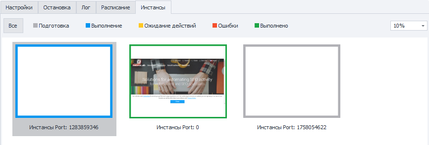
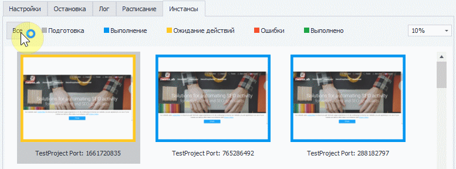
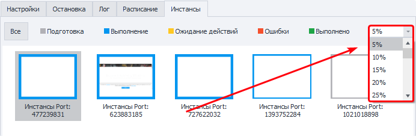
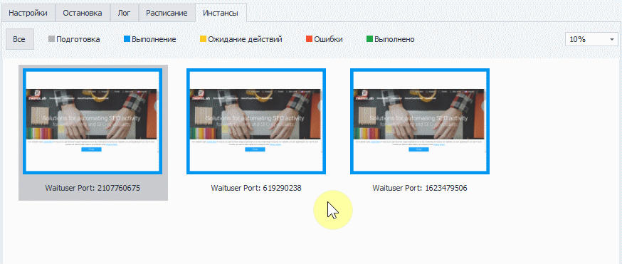
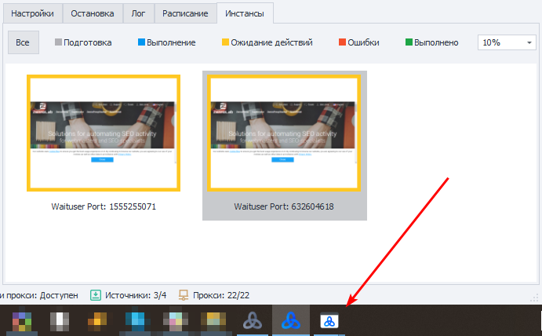
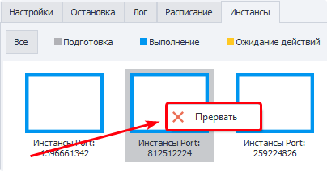

---
sidebar_position: 5
title: Вкладка «Инстансы»
description: Наблюдение за работой инстансов
---  
:::info **Пожалуйста, ознакомьтесь с [*Правилами использования материалов на данном ресурсе*](../Disclaimer).**
:::
_______________________________________________  
## Описание.  
В этой вкладке можно в реальном времени наблюдать за работой всех инстансов.  

  

### Статусы выполнения.  
Цвет рамки инстанса зависит от его текущего состояния:  
- **Серый** — идёт подготовка;  
- **Синий** — выполнение;  
- **Оранжевый** — ожидание действий пользователя;  
- **Красный** — произошла ошибка;  
- **Зелёный** — успешно выполнено.  

#### Фильтрация по статусу.  
Дополнительно инстансы можно фильтровать по их текущему состоянию:  

  
_______________________________________________
## Работа с окном.  
### Изменение масштаба.  
С помощью выпадающего списка в правой части вкладки можно изменить масштаб отображения.  

|     | 
| :--------: | 
| *Инстансы на этом скриншоте имеют масштаб 5%*  |  

### Открытие инстанса.  
Если дважды нажать по любой миниатюре, то окно инстанса откроется в реальном размере.  

 

Для закрытия окна достаточно кликнуть по крестику в правом углу окна.  

  
_______________________________________________
### Ожидание действий пользователя.  
Окна в режиме **Ожидание действий пользователя** дополнительно отображаются на панели задач вашего компьютера, их можно сворачивать и разворачивать. Когда у инстанса истечёт таймаут ввода, он пропадёт из панели.  

  
_______________________________________________
### Прерывание работы.  
Вы можете прервать работу инстанса в любой момент. Для этого кликните по его миниатюре и нажмите **Прервать**.  

