---
sidebar_position: 4
title: Вкладка «Расписание»
description: Работа с «Планировщиком»
---  
export const VideoSample = ({source}) => (
  <video controls playsInline muted preload="auto" className='docsVideo'>
    <source src={source} type="video/mp4" />
</video>
); 

:::info **Пожалуйста, ознакомьтесь с [*Правилами использования материалов на данном ресурсе*](../Disclaimer).**
:::
_______________________________________________
## Описание.  
В этой вкладке ведётся работа с **Планировщиком расписания**. Это инструмент, который позволяет детально настроить и автоматизировать выполнение проектов по расписанию.  

**Его возможности:**  
- **Создание простых расписаний.**   
Однократное выполнение заданий.  
- **Установка сложных расписаний.**  
Которые учитывают интервалы времени, количество попыток и повторений для них.  
- **Отладка расписаний.**  
Для проверки того, что всё выполняется корректно.  

:::tip **Независимо от сложности необходимого расписания.**
Планирование заданий в нашем **Планировщике** доступно пользователям с любым уровнем подготовки. Последовательность элементов интерфейса делает процесс составления расписания понятным и логичным. 
:::

### Начало работы.  
По умолчанию планировщик выключен и просто так его включить не получится, появится ошибка. **Сначала нужно настроить расписание** в соответствии с вашими нуждами. 

Когда вы проверите через отладчик, что все настройки выставлены корректно, то можно переместить слайдер в положение **Включить**.  

  

:::warning **Если в настройках расписания будут ошибки.**
То они будут подсвечены красной рамкой, а слайдер включения планировщика станет неактивным.
:::

### Меню планировщика.  
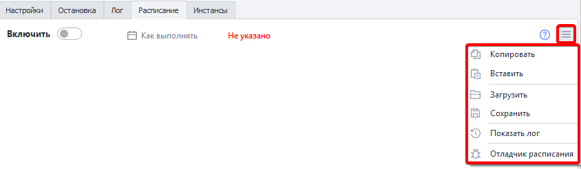 

- **Копировать**. Скопировать всё расписание проекта для использования с другим проектом.  
- **Вставить**. Вставить расписание из другого проекта.  
- **Загрузить**. Загрузить файл с компьютера, который содержит настройки расписания.  
- **Сохранить**. Сохранить текущие настройки во внешний файл.  
- **Показать лог**. Показать историю добавления попыток планировщиком.  
- **Отладчик расписания**. Запускает утилиту, которая позволяет рассчитать приблизительное время выполнения заданий. *Будет подробнее рассмотрен ниже.*
_______________________________________________
## Основные функции.  
### Как выполнять.  
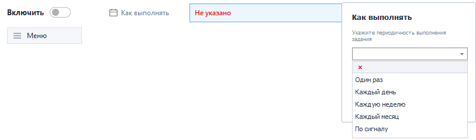  

Данный пункт отвечает за настройку периодичности выполнения задания. Всего доступно 5 опций:  
- **Один раз**. Задание выполнится ровно один раз.  
- **Каждый день**. Проект будет выполняться каждый день с Понедельника по Воскресенье.  
- **Каждую неделю**. С этой опцией задание станет выполняться в указанные дни недели.  
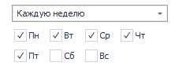  
- **Каждый месяц**. Ставим проект на выполнение ежемемячно в определённые даты. Отдельные числа месяца нужно указывать через запятую, а интервалы дат через дефис.   

| 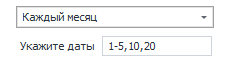    | 
| -------- | 
| *Проект будет выполняться с 1 по 5 число каждого месяца, а также 10 и 20.*  | 

- **По сигналу**. Выполнение задания будет начинаться при появлении загруженного файла.  
*Если хотите, чтобы файл удалялся после старта задания, тогда отметьте чекбокс **Удалять файл**.* 

### Начать.  
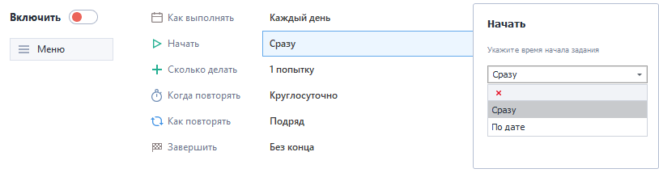  

В данной опции мы указываем принцип начала задания:  
- **Сразу**. Начнёт выполняться сразу после включения планировщика.  
- **По дате**. Задание выполнится в указанную дату по времени.

### Сколько делать.  
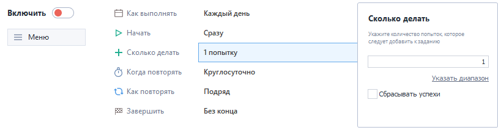  

Тут мы указываем количество попыток выполнения задания.  

Его можно задать как точным числом, так и диапазоном (кнопка **Указать диапазон**). Во втором случае количество попыток будет определено случайным образом.  

Опция **Сбрасывать успехи** отвечает за то, будет ли обнуляться счётчик успехов с вкладки *Остановка*.

### Когда повторять. 
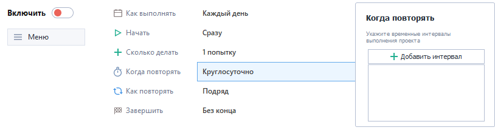 

В этом пункте мы указываем временные интервалы для повторения проекта.  

Нажимаем на **Добавить интервал**, чтобы задать необходимый временной промежуток. Если понадобится ещё один, то просто снова кликаем на эту кнопку. Общее количество интервалов — **неограничено**.  

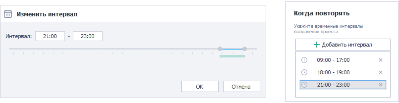  

:::tip **Если не указать интервалы, то проект будет выполняться круглосуточно.**
*Актуально только для режимов **Каждый день**, **Каждую неделю** и **Каждый месяц**.*
::: 

### Как повторять.  
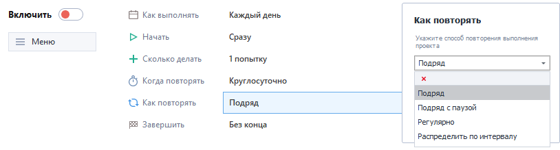  

Здесь мы задаём вид повторения проекта.  

:::info **Активируется в режимах *Каждый день*, *Каждую неделю* и *Каждый месяц*.**
:::  

На выбор доступно **четыре способа повторения**:  
- **Подряд**. Задание начнёт выполняться заново сразу же после завершения прошлого повторения.  
- **Подряд с паузой**. Теперь между повторами добавляется пауза. Её можно задать как точным числом, так и **Указать диапазоном** (в минутах), из которого время будет выбираться случайным образом.   
  
- **Регулярно**. Задание выполнится заново спустя указанное время. В этом случае оно не зависит от предыдущего повторения по сравнению с прошлым способом.  
- **Распределить по интервалу**. Повторы автоматически распределятся по интервалам, которые вы указали в разделе **Когда повторять**.

### Завершить.  
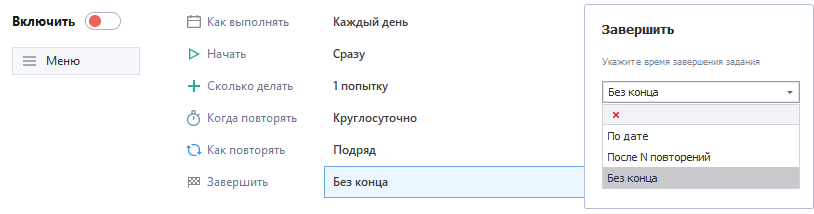

В последнем пункте мы указываем условия для завершения задания.  
:::info **Активируется в режимах *Каждый день*, *Каждую неделю* и *Каждый месяц*.**
:::

Доступно **три способа завершения** выполнения заданий:  
- **По дате**. Проект будет выполняться **До** указанной даты и времени.  
- **После N повторений**. Проект завершится после выполнения определённого количества раз. Можно задать точное число или **Указать диапазон**.  
  
- **Без конца**. В этом случае проект будет выполняться неограниченное число раз, пока вы не остановите его вручную.
_______________________________________________
## Примеры работы.  
### Один раз.  
| Выполнить проект *один раз* в заданный день в 12:30.    | 
| -------- | 
| 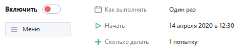  | 
### Каждый день.
| Выполнять задание *каждый день* с 10:00 до 15:00 не более одного раза с паузой между выполнением в 10 минут.    | 
| -------- | 
| 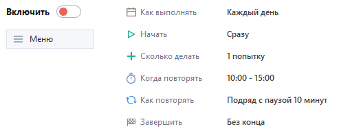  |  

### Несколько попыток. 
| Выполнять шаблон каждый день с 8:00 до 12:00 и с 13:00 до 19:00, повторяя его каждые 20-40 минут и делая при этом *от одной до семи попыток*.    | 
| -------- | 
|   | 

### Распределить случайно.
| Выполнять проект каждые Вторник, Среду и Четверг с 16:00 до 23:00, *случайно распределяя* 50 повторений по заданному интервалу.    | 
| -------- | 
| 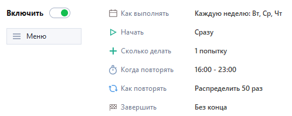  |  
_______________________________________________
## Видео с примером.  
<VideoSample source={require("@site/static/video/Schedule.mp4").default}/>
_______________________________________________
## Отладчик расписания.
### Общая информация.  
:::info **Отладчик расписания позволяет рассчитать приблизительное время выполнения заданий.**
А также посмотреть примерный ход выполнения проекта по расписанию.
:::  

Открыть его можно через **Меню расписания проекта**:  
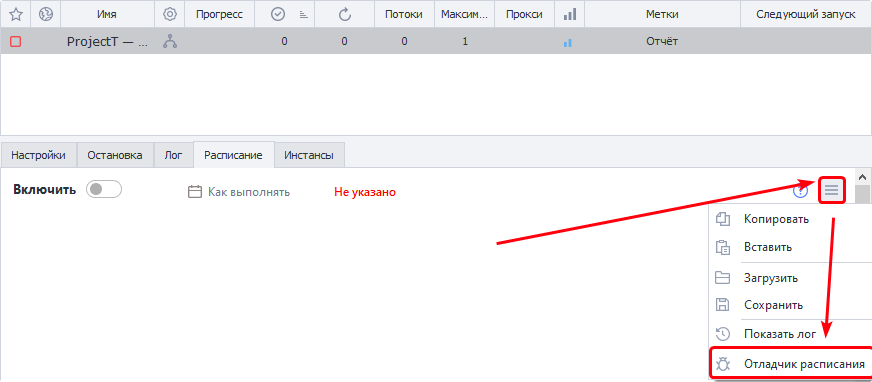

:::tip **Не забывайте пользоваться Отладчиком расписания каждый раз.**
Ведь это даёт уверенность в том, что задания будут выполнены корректно.
:::  

### Работа с Отладчиком расписания.  
#### Шаг 1.  
Первым делом нужно указать примерное время в секундах, выделенное для однократного выполнения проекта. Это нужно для того, чтобы отладчик смог отобразить более правдоподобный ход выполнения. Чем точнее указано время, тем более корректными будут расчеты.  

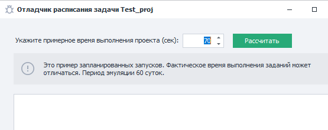  

#### Шаг 2.  
После указания времени выполнения проекта нужно нажать кнопку **Рассчитать** и подождать несколько секунд. Затем отладчик отобразит примерный ход выполнения проекта по заданному расписанию. Вы увидите ход от начала планируемого запуска до конца выполнения проекта или завершения периода эмуляции.  

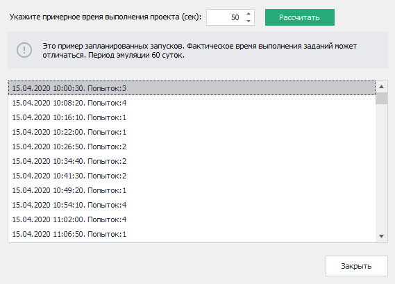  

По итогу произведённого расчёта отладчик покажет ход выполнения проекта в формате:  
**Дата выполнения** + **Время выполнения** + **Количество попыток**.  

С помощью полученных данных можно отследить, как именно будет работать расписание, и понять, правильно ли настроены его интервалы и повторения.  

Однако нужно понимать, что отладчик показывает только примерный ход выполнения. И при непосредственной работе задания по расписанию время его выполнения может отличаться от ранее заданного значения в отладчике.