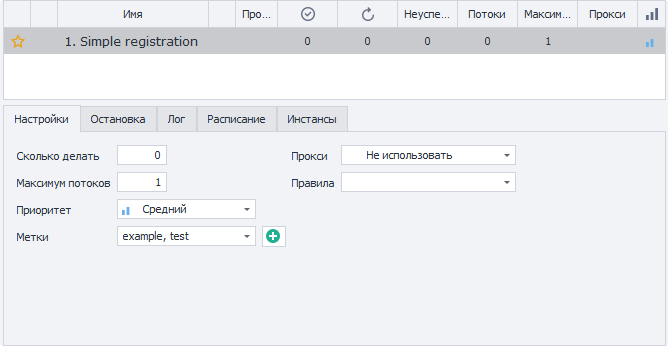
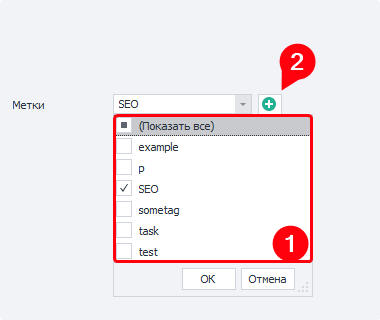

---
sidebar_position: 1
title: Вкладка «Настройки»
description: Настраиваем количество потоков и выполнений
---  
:::info **Пожалуйста, ознакомьтесь с [*Правилами использования материалов на данном ресурсе*](../Disclaimer).**
:::
_______________________________________________  
## Описание.
В данной вкладке можно настроить количество выполнений и потоков, а также использование прокси.  

Она находится на главной странице ZennoDroid, достаточно нажать на интересующее нас задание.   

  
_______________________________________________
## Доступные параметры.  
### Сколько делать.  
Тут указывается количество повторений для выбранного проекта.  

Можно написать значение **`-1`**, тогда задание будет выполняться бесконечное число раз, пока вы его не остановите. Прекратить выполнение можно кнопкой **Стоп**, или изменив значение с `-1` на `0`. Также остановка произойдёт при наступлении ***одного из специальных условий***.  

### Максимум потоков.  
Определяем максимально допустимое число одновременно запущенных потоков в проекте.  

:::tip **Далее в статье мы приведём несколько примеров**
Которые показывают связь параметров «Сколько делать» и «Максимум потоков».
:::

### Приоритет.  
Здесь устанавливается приоритет выполнения шаблона относительно других заданий.  

Приоритетные потоки, например, могут прерывать запрос на инстанс от менее приоритетных (если включена соответствующая настройка).  

### Метки.  
Проще говоря, это теги, которые позволяют группировать проекты. Для одного задания можно выбрать сразу несколько тегов.  

 

Если у вас уже есть метки, то их можно выбрать в выпадающем списке. Либо создайте новые, нажав на кнопку с ✙.  

### Прокси.  
Указываем, хотим ли использовать в проекте встроенные прокси из [**ProxyChecker**](https://zennolab.com/ru/products/zennoproxychecker/).  

#### Доступные варианты:  
- **Не использовать**.  
Задание будет выполняться на вашем реальном IP-адресе, без прокси.  
- **Если возможно**.  
Прокси будут использованы только в том случае, если среди них есть **Живые**.  
- **Использовать (без удаления)**.  
После использования прокси, они не будут удаляться из списка **Живых**.  
- **Использовать**.  
Когда прокси будет использовано в проекте, оно сразу удалится из списка **Живых**.  

:::info **Варианты с «Использовать».**
В двух последних опциях прокси однозначно используются для выбранного задания. Если подходящего прокси нет, то проект будет ожидать его появления.   
:::  

### Правила.  
Выбор [**Правил**](https://zennolab.atlassian.net/wiki/spaces/RU/pages/848560252), по которым будут браться прокси из списка **Живых**. Они создаются не в ZennoDroid, а в [ProxyChecker](https://zennolab.com/ru/products/zennoproxychecker/).  
_______________________________________________
## Многопоточный режим.  
На тарифах **Professional** и **Enterprise** открыта возможность одновременного запуска нескольких потоков выполнения для одного проекта.  

Для этого в параметре **Максимум потоков** указываем желаемое их количество, а в настройке **Сколько делать** число повторений.  

:::tip **Если проект находится в статусе «Остановлен».**
То для применения изменений нужно нажать кнопку **Старт**.   
:::  

### Что такое поток?  
Это отдельная единица выполнения со своим набором данных (переменные, списки, таблицы и подобное). Выполнение в несколько потоков равносильно выполнению определённых действий несколькими людьми.

#### Рекомендация.  
**Мы не советуем сразу пытаться выполнить проект в 100 и более потоков.**  

Потому что каждый поток потребляет ресурсы компьютера. В первую очередь RAM и CPU, но также и обращается к жёсткому диску. 

:::tip **Интенсивность потребления зависит от логики шаблона, с которым вы работаете.**   
:::  

Одновременный запуск большого количества потоков может привести к зависанию программы или даже операционной системы. Не редки в таких сценариях и аварийные завершению работы компьютера.  

### Пример №1.  
**Сколько делать: `60`.**  
**Максимум потоков: `1`.**  

**Выполнение:** запускается только **один поток**, а затем последовательно, один за другим, происходят **60 его повторений**.  

### Пример №2.  
**Сколько делать: `60`.**  
**Максимум потоков: `10`.**  

**Выполнение:** тут одновременно запускается 10 потоков, которые работают параллельно. Представим, что одно выполнение длится 1 минуту, тогда в этом случае на 60 выполнений нужно будет уже не 60 минут, а всего 6 минут. Происходит это потому, что теперь за 1 минуту делается сразу 10 выполнений.  

### Пример №3.  
**Сколько делать: `-1`.**  
**Максимум потоков: `10`.**  

**Выполнение:** снова одновременно запускается 10 потоков, но теперь они будут выполняться до тех пор пока вы не остановите проект. Если вы нажмёте **Стоп** или поменяете значение повторений на `0`, то работающие потоки завершатся, а новые не будут стартовать.  