:::info **Пожалуйста, ознакомьтесь с [*Правилами использования материалов на данном ресурсе*](../Disclaimer).**
:::
_______________________________________________
export const VideoSample = ({source}) => (
  <video controls playsInline muted preload="auto" className='docsVideo'>
    <source src={source} type="video/mp4" />
</video>
);  

## Что такое Frida?  
[**Frida**](https://frida.re/) — это набор инструментов для динамического кода. Позволяет легко внедрять собственный код в другие приложения.  
Frida умеет работать с приложениями, написанными для всех популярных ОС, включая Windows, Linux, macOS, iOS и даже QNX.  
Мы же будем использовать ее для модификации приложений под Android.  
:::info **Для работы Frida на реальном устройстве необходим Root.**
::: 
_________________

## Как открыть Frida Toolkit?  
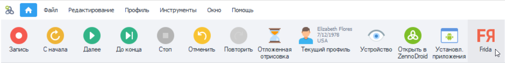   

В левом верхнем углу приложения на панели находим ***Инструменты → в самом низу Frida toolkit***.  

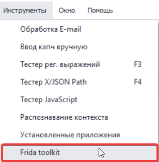 
:::info **Перед началом работы необходимо запустить устройство или эмулятор.**
:::  
_________________
## Описание доступных окон.  
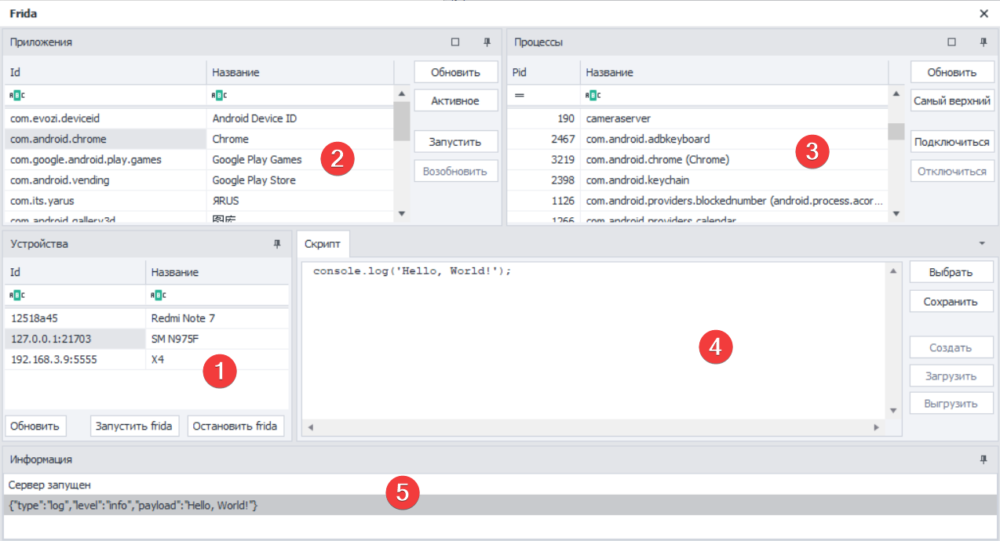   
### Устройства (1):  
Список всех устройств, подключенных через ADB. Он автоматически обновляется при подключении/отключении новых устройств или эмуляторов.  
В версии ZennoDroid Enterprise можно переключаться между разными устройствами, при этом в остальных версиях работа возможна только с запущенным в основном окне эмулятором.  
#### Доступные кнопки:  
- **Обновить**. Принудительно обновляет список устройств.  
- **Запустить frida**. Запускает сервер Frida на устройстве. После нажатия необходимо дождаться уведомления в информационном окне «*Сервер запущен*». При первом запуске происходит автоматическая установка сервера на устройство, что занимает некоторое время (~5-10 сек).  
- **Остановить frida**. Останавливает сервер, но не удаляет его, поэтому последующие запуски будут происходить значительно быстрее, чем в первый раз.  
_________________  
### Приложения (2):  
Здесь выводится список всех установленных приложений, для которых есть возможность запуска. Приложения, которые нельзя запустить (без стартовых activity), не отображаются в списке.  
#### Категории:  
-  **Id**. Тут можно посмотреть уникальный идентификатор приложения (package name).  
- **Название**. Понятное название приложения, которое обычно отображается на иконке.  
#### Доступные кнопки:  
- **Обновить**. Нажав на нее, можно обновить список приложений. Ее необходимо использовать после установки или удаления приложений.  
- **Активное**. После нажатия в таблице будет выбрано приложение, которое в данный момент отображается на экране устройства.  
- **Запустить**. Эта кнопка запускает выбранное приложение и автоматически подключается к его процессу. Если приложение уже было запущено, оно будет остановлено, а затем запущено заново.  
- **Возобновить**. Снимает с паузы приложение, которое ранее было приостановлено.  
_________________  
### Процессы (3):  
Здесь можно посмотреть все запущенные процессы на устройстве.  
#### Категории:  
- **Pid**. Идентификатор процесса (Process id).  
- **Название**. Имя процесса. Так как к одному приложению могут относиться несколько процессов,  
то их названия обычно содержат уточнения. Например, **com.android.settings** дает нам понять,  
что речь идет о **Настройках**.  
#### Доступные кнопки:  
- **Обновить**. Нажав на нее, можно обновить список текущих процессов. Необходимо использовать после запуска или остановки приложений.  
- **Самый верхний**. В таблице будет выбран основной процесс приложения, которое отображается на экране устройства.  
- **Подключить**. Подключается к выбранному процессу. После этого становятся доступными операции создания и загрузки скрипта.  
- **Отключиться**. Отключается от процесса. Если приложение завершило работу, то отключение от процесса произойдет автоматически.  
_________________  
### Скрипт (4):  
Окно работы со скриптом. Поддерживаются макросы.  
#### Доступные кнопки:  
- **Выбрать**. Открывает форму загрузки файлов. Файл скрипта должен иметь расширение *.js*  
- **Сохранить**. Сохранение содержимого окна в файл с расширением *.js*  
- **Создать**. Компиляция скрипта. Если скрипт содержит ошибки, то в окно информации будет выдано соответствующее уведомление. Ошибки на данном этапе обычно связаны с неправильным синтаксисом.  
(*Действие становится активным после подключения к процессу приложения.*)  
- **Загрузить**. Непосредственная загрузка скрипта. Если скрипт содержит ошибки, то в окно информации будет выдано соответствующее уведомление. Ошибки на данном этапе обычно связаны непосредственно с выполнением скрипта, например, из-за отсутствия в коде приложения нужного класса.  
(*Действие становится активным только после успешного выполнения кнопки **Создать**.*)  
 - **Выгрузить**. Выгружает скрипт. Он также выгружается автоматически при завершении процесса приложения.  
 _________________  
 ### Информация (5):  
 В это окно выводится различная служебная информация и сообщения, возникающие в процессе выполнения скрипта, а также ошибки и т.д.  
 #### Горячие клавиши:  
 - **(Ctrl + C)**. Скопировать выделенные сообщения.  
 - **(Del)**. Удалить выделенные сообщения.  
 - **(Ctrl + Del)**. Удалить все сообщения.  
 _________________  

 ## Как проверить, что сервер Frida запустился и работает?  
 1. Нажать кнопку **«Запустить frida»** и дождаться уведомления в информационном окне: *«Сервер запущен»*.  
 2. На панели *Процессы* нажать **«Самый верхний»**. После этого будет выбран активный процесс.  
 3. Нажать **«Подключиться»**.  
 4. На панели *Скрипт* ввести код: `console.log('Hello, World!');`  
 5. Нажать **«Создать»**, а потом **«Загрузить»**.  
 6. Если все прошло успешно, то в информационном окне появится сообщение: `["type":"log","level":"info","payload":"Hello, World!"]`  
 7. После этого можно нажать **«Выгрузить»**. Сервер Frida работает!  
 _________________

 ## Стандартные сценарии.  
 ### Приложение будет перезапущено даже если уже запущено.  
 1. На панели *Приложения* выбрать нужное (по названию или с помощью кнопки **«Активное»**).  
 2. Нажать кнопку **«Запустить»**. Приложение запустится *(или перезапустится если уже было запущено)*, а затем встанет на паузу. Произойдет автоматическое подключение к его процессу.  
 3. На панели *Скрипт* нажать **«Выбрать»** и в появившейся форме открыть нужный скрипт (файл  
 с расширением .js).  
 4. Нажить кнопку **«Возобновить»**. Приложение продолжит работу.  
 ### Подключаемся к процессу запущенного приложения.  
 1. На панели *Процессы* нажать **«Самый верхний»**, будет выбран активный процесс.  
 2. Нажать **«Подключиться»**.  
 3. На панели *Скрипт* нажать **«Выбрать»** и в появившейся форме открыть нужный скрипт (файл  
 с расширением .js).  
 4. Нажать **«Создать»**, а потом **«Загрузить»**.  
 _________________  

 ## Перехват трафика с помощью Frida и Burp Suite.  

<VideoSample source={require("@site/static/video/Перехват трафика, Frida и Burp.mp4").default}/>  
_________________
 ### 1. Скачать и установить.  
 

1. Выбрать **Burp Suite Community Edition** и нажать **«Download»**
  

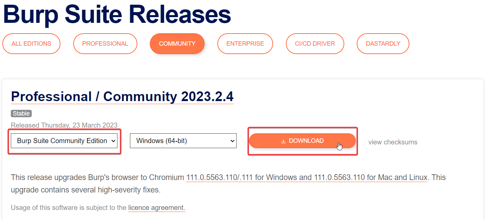

  

 

2. Создаем временный **(Temporary)** проект.
  

 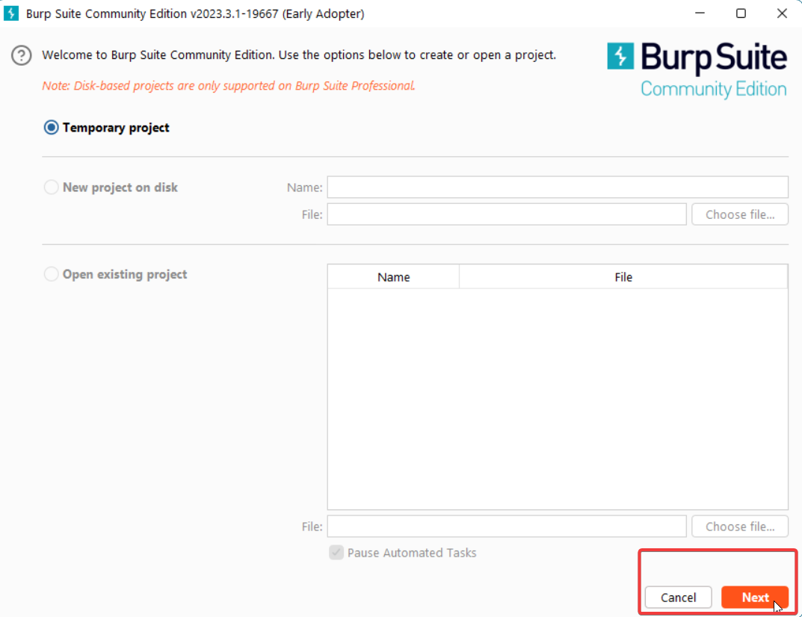 

   

 

3. Используем **настройки по умолчанию (Use Burp defaults)** для проекта.
  

 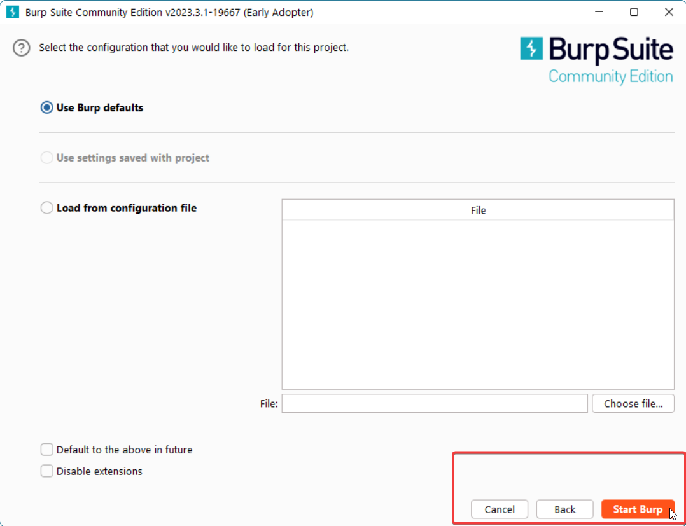 

 

 ### 2. Настроить Burp Suite на обработку трафика с локальной сети компьютера.  

1. Заходим в **настройки (Settings)**
  

 

  

2. Выбираем **Tools → Proxy** и нажимаем **«Import / Export CA certificate»**. 
  

 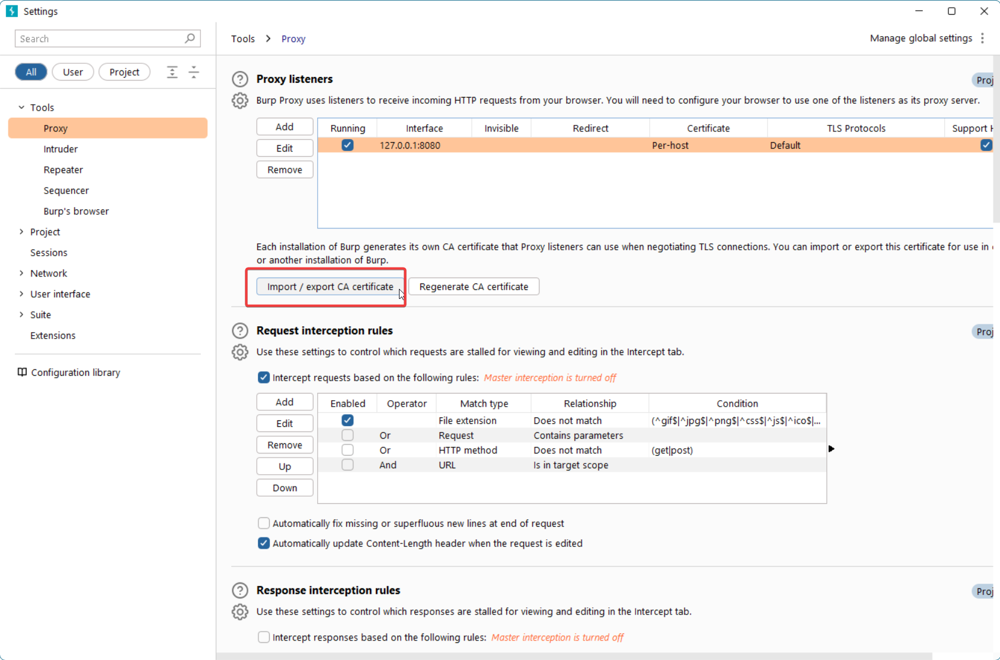

  

3. Затем выбираем ***Certificate and private key from PKCS#12 keystore*** → выбрать файл **zenno.pfx** (*пароль **123***).
  

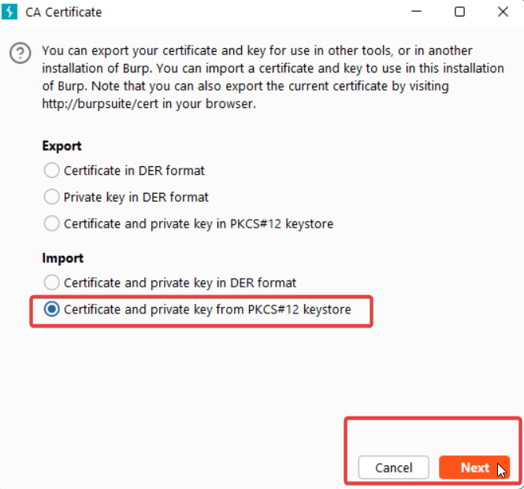  
_________________  
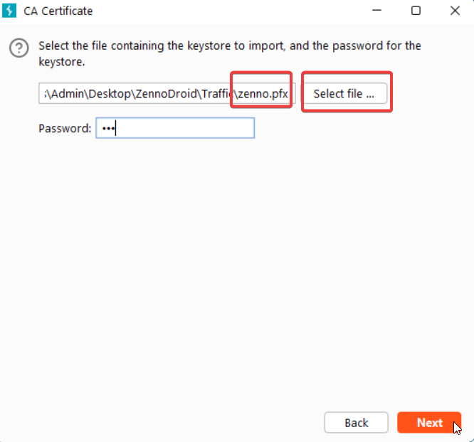 

    
 ### 3. Выбрать необходимое устройство и запустить в Project Maker.  
 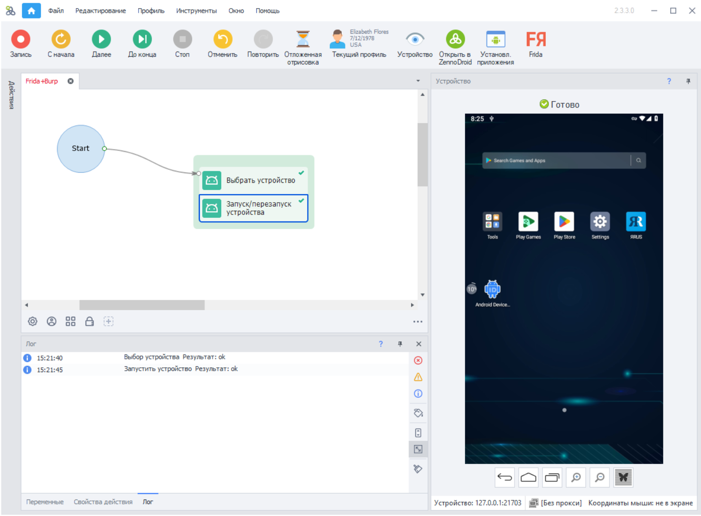  
:::info **Важно.**
*В версии ZennoDroid Enterprise необходимо, чтобы в настройках Android было включено использование интернет-подключения компьютера или использование Proxifier.*
::: 
_________________  
### 4. Перенаправить трафик с устройства в Burp Suite.  
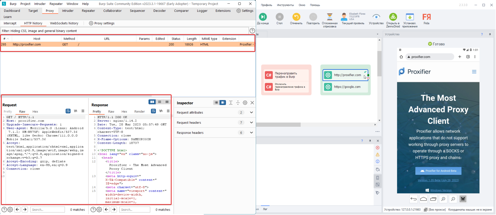  

Нужно выполнить экшен *Перенаправить трафик в Burp*. Для проверки, что все работает правильно, можно с помощью экшена открыть в браузере страницу **http://proxifier.com** (важно чтобы страница была **http://**,  
а не http**s**://).  Запрос к сайту должен отобразиться в Burp Suite (на вкладке *Proxy - Http history* или *Target Site map*).  
_________________ 
### 5. Установить сертификат на устройство.  
Сначала нужно выполнить экшен *Установить сертификат*. После этого сертификат Zenno появится в списке **Надежных сертификатов (Trusted credentials)**  

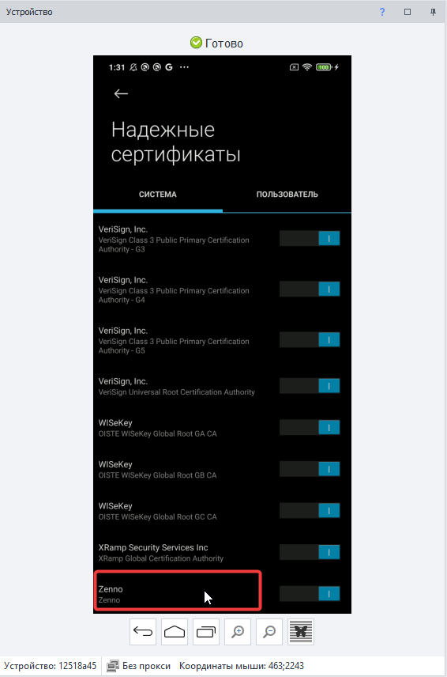  

При использовании эмулятора LDPlayer необходимо **включить Root** и разрешить доступ через ADB.
  

 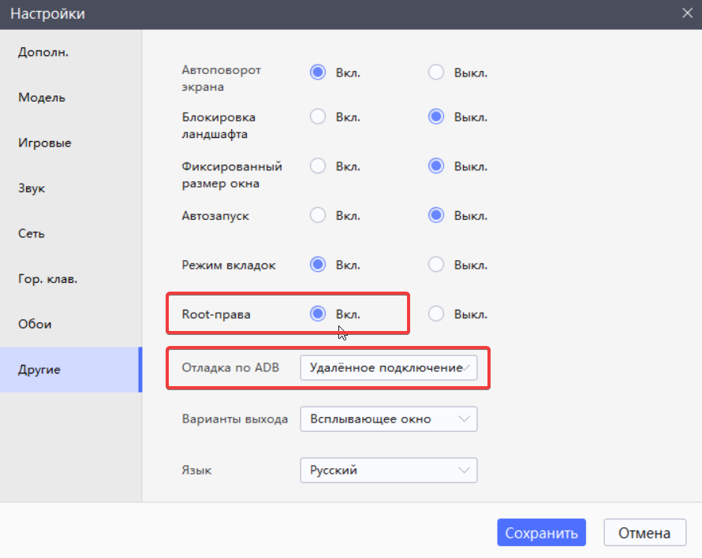

### 6. Выполнить скрипт в Frida для снятия ssl-pinning  
1. Запустить **Frida** на панели инструментов.  
2. Нажать кнопку **«Запустить frida»**.  
3. На панели *Приложения* выбрать нужное.  
4. Нажать кнопку **«Запустить»**.  
5. На панели *Скрипт* нажать **«Выбрать»** и в появившейся форме открыть скрипт `[*sslUnpin.js*]`.  
6. Нажать **«Создать»**, а потом **«Загрузить»**.  
7. Нажать кнопку **«Возобновить»**.  

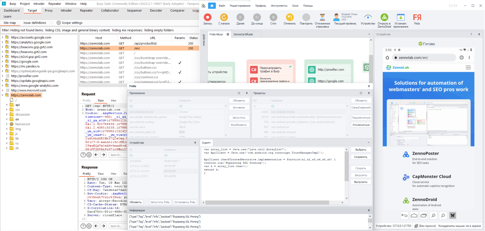  

Запросы приложения должны отобразиться в окне Burp Suite. В информационном окне будет написано: `[*"type":"log","level":"info","payload":"Bypassing SSL Pinning"*]`.     
_________________
### 7. Завершение анализа трафика  
1. Нажать кнопку **«Выгрузить»** на панели *Скрипт*.  
2. Нажать кнопку **«Отключиться»** на панели *Процессы*.  
3. Выполнить экшен *Отключить перенаправление трафика в Burp*.  
_________________
## Полезные ссылки.  
- *Официальный источник [**скриптов для Frida**](https://codeshare.frida.re/)*.  
- *[**Шаблон и все необходимые файлы**](https://www.dropbox.com/scl/fi/2d61v0e0rnsiwz8rww06x/Frida-Burp.zip?rlkey=asbr6w5eqlarbbfjoq4lc34e8&dl=0) (пароль на zenno.pfx - 123)*.  
- *Подключение реального устройства к ZennoDroid*.
 