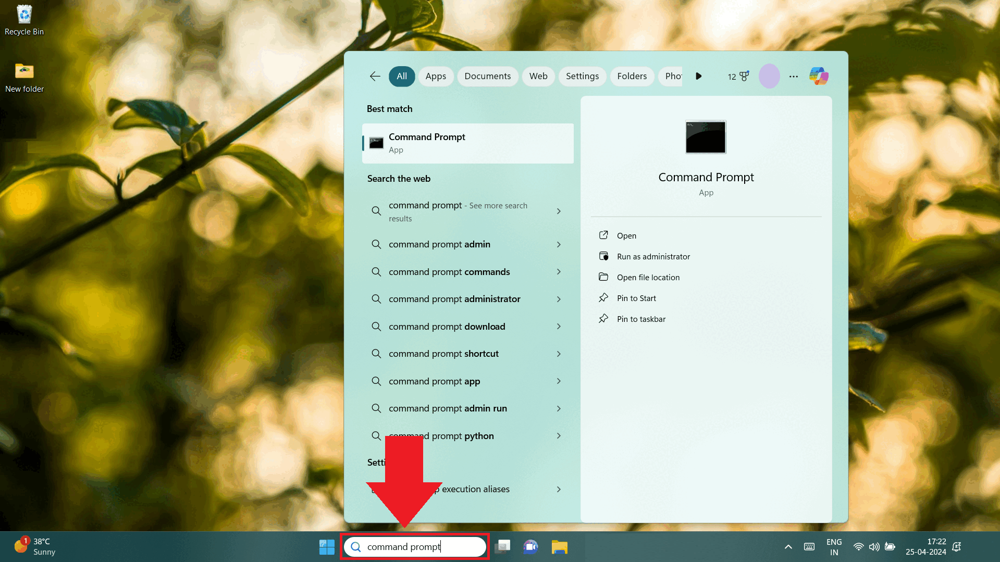
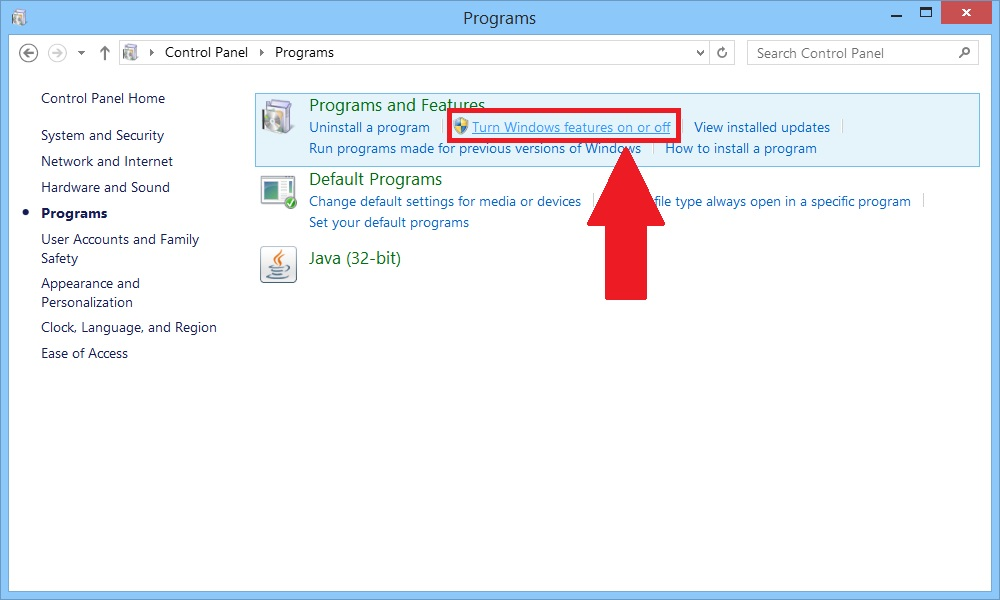
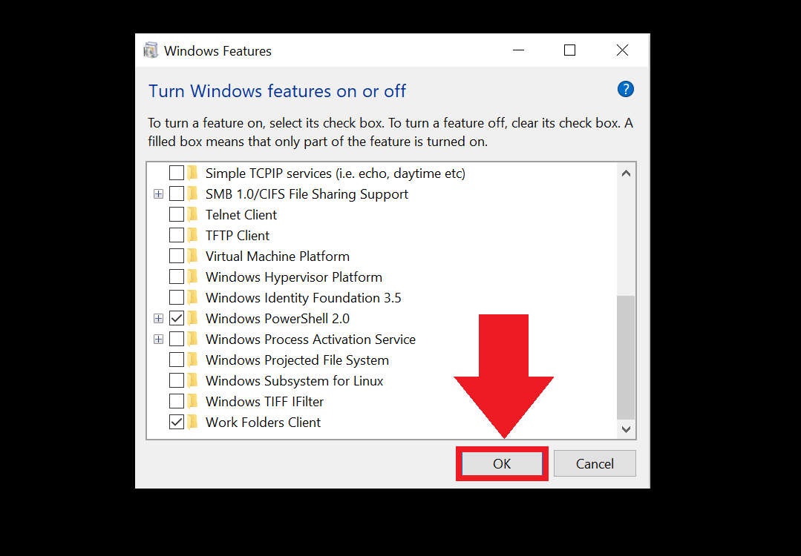
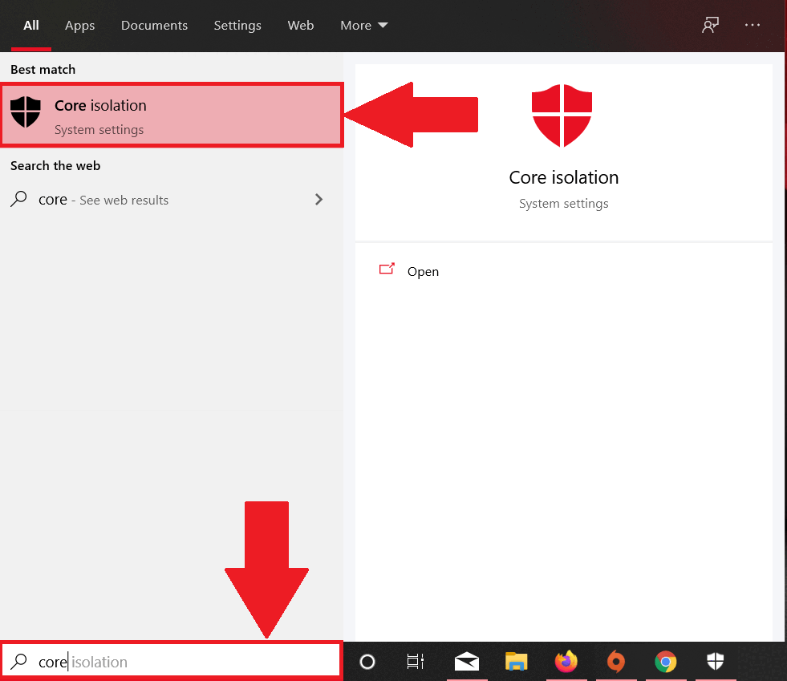

Hyper-V позволяет запускать несколько операционных систем в виде виртуальных машин в Windows. Также он  предоставляет возможность выполнять виртуализацию оборудования. Но при работе с ZennoDroid и эмуляторами Hyper-V может мешать, поэтому в этой статье мы расскажем, как его отключить.  
_________________
## Включен ли Hyper-V? 
Сначала проверим, запущена ли эта низкоуровневая оболочка:  
**1.** В поиске приложений введите ***msinfo32.exe***  
**2.** Выберите Сведения о системе.  
**3.** В окне сведений найдите эту запись:  
*«Обнаружена низкоуровневая оболочка. Функции, необходимые для Hyper-V, отображены не будут»*.  

  
_________________  
## Отключение через командную строку.
**1.** Нажмите на строку поиска и введите **Командная строка**. 
> *Или нажмите Win+R, введите ***cmd***, затем нажмите **Ok** или **Enter**.*

**2.** В командной строке введите эту команду и нажмите Enter:
`bcdedit /set hypervisorlaunchtype off`  
**3.** Готово, Hyper-V отключен 😎  

  
_________________ 
## Отключение через Панель управления.  
**1.** Заходим в Панель управления → Программы → Программы и компоненты → нажимаем на  
**Включение или отключение компонентов Windows**.  

  

**2.** Теперь нам нужно снять галочки со следующих строк:
    - *Hyper V*
    - *Платформа низкоуровневой оболочки Windows*
    - *Песочница Windows*
    - *Платформа виртуальной машины*
    - *Подсистема Windows для Linux*  

  

**3.** После этого нажмите **Ок** и <mark>перезагрузите компьютер</mark>.  

  
_________________
## Отключение целостности памяти.  
Для корректной работы без Hyper-V нам также нужно отключить целостность памяти.  
1. В поиске Windows введите **Изоляция ядра** и нажмите **Enter**.  
2. В настройках изоляции ядра отключите **Целостность памяти**.  

  
