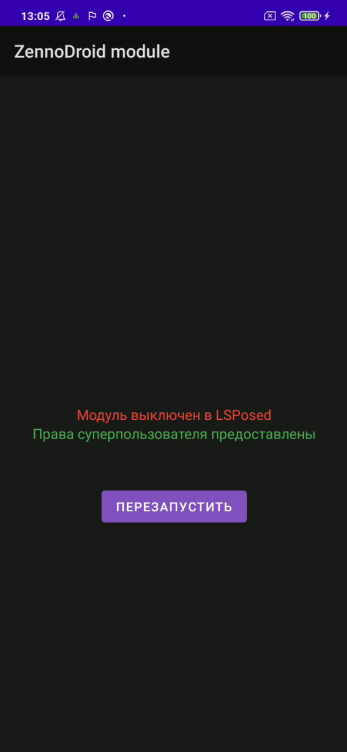
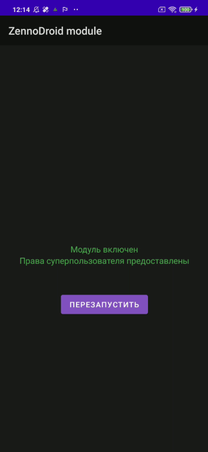

export const VideoSample = ({source}) => (
  <video controls playsInline muted preload="auto" className='docsVideo'>
    <source src={source} type="video/mp4" />
</video>
);  

> ***Краткое содержание**:*  
> **1.** *Установка LSPosed Framework*   
> **2.** *Установка модуля ZennoDroid*  
> **3.** *Полезные ссылки*  

### Описание. 
Модуль ZennoDroid необходим для подмены основных параметров устройства: IMEI, Android ID, сотового оператора, модели, WiFi, Bluetooth и других.  
> *Поддерживаются телефоны с Android 8.1-14. Для функционирования модуля необходимы **Root права**.*  
### 1. Установка LSPosed Framework.    
Для установки модуля необходим телефон с [**Magisk**](https://github.com/topjohnwu/Magisk) и активным [**LSPosed Framework**](https://github.com/LSPosed/LSPosed).  

   
Рекомендуется использовать версию для *zygisk*, т.к. разработка *riru* прекращена.  

[**Последнюю версию LSPosed**](https://github.com/LSPosed/LSPosed/releases/tag/v1.9.2) нужно скачать на телефон в папку **sdcard/Download/** и установить с помощью стандартного меню.  

   
> ***Важно!** По умолчанию модуль LSPosed Framework не имеет иконки и открывается нажатием на уведомление в верхней шторке.*  

### 2. Установка модуля ZennoDroid.  
Модуль ZennoDroid устанавливается автоматически при первой попытке изменить параметры устройства.  
При первом запуске на экране устройства возникнет запрос прав суперпользователя.  
Необходимо нажать на кнопку **«Разрешить»**.  

  
Если Вы не успели этого сделать или случайно нажали на кнопку **«Запретить»**, необходимо открыть **Magisk**, перейти на вкладку **Superuser (Суперпользователь)** и включить *автоматическую выдачу прав суперпользователя для ZennoDroid*.  

  

После запуска модуля на экране устройства появится уведомление о том, что он выключен.  

  
Чтобы это исправить необходимо запустить LSPosed через меню в шторке, переключиться на вкладку *Модули* и включить *модуль ZennoDroid*.    

   

После этого можно будет выбрать программы, к которым будет применяться подмена параметров устройства.  

#### Важная информация.  
- Рекомендуется добавлять в список подмены только те приложения, для которых требуется изменять данные. Также для корректной работы часто требуется добавить в список *Сервисы Google Play (com.google.android.gms)*. Не нужно добавлять в список системный фреймворк (system framework).  
- Если после активации Вы удалили приложение, а затем установили его повторно, необходимо обязательно заново активировать приложение в списке подмены (снять и установить галочку).  
> *В LSPosed есть визуальный баг — после удаления приложения оно автоматически удаляется из списка подменяемых. После повторной установки приложение автоматически не попадает в список подменяемых (галочка при этом стоит, но подмены не работают).*  

- По умолчанию в списке программ отображаются не все приложения. Если вы не видите нужного, например, Google Play Services или Chrome, то нужно зайти в меню *Скрывать* и убрать галочку с нужной группы.  
- После выбора приложений для подмены нужно вернуться в модуль ZennoDroid и нажать на кнопку **«Перезапустить»**. После перезапуска на экране устройства будет выведено уведомление о том, что модуль готов к работе. Можно менять параметры устройства с помощью экшенов.  

- Завершите работу нужных приложений после подмены параметров устройства. Предпочтительно делать это экшеном **«Закрыть приложение»**. Если в список подмены добавлены *Сервисы Google Play (com.google.android.gms)*, то их также необходимо закрыть.  
> *Можно закрывать приложения и до подмены, но тогда некоторые системные приложения тут же перезапускаются, поэтому могут считать старые параметры.*  

### 3. Полезные ссылки.  
- Шаблон для подмены параметров устройства с помощью экшенов и API: [**fakeDeviceBrief.droid**](https://www.dropbox.com/scl/fi/xkyhg4e72l9su4xvqsdn9/fakeDeviceBrief.droid?rlkey=583ltzuficlyh0kxrma83qodb&dl=0)  
- [**Последняя версия LSPosed Framework**](https://github.com/LSPosed/LSPosed/releases/tag/v1.9.2)  
- Подключение реального устройства к ZennoDroid.  
- Настройки устройства.

 