:::info **Пожалуйста, ознакомьтесь с [*Правилами использования материалов на данном ресурсе*](../Disclaimer).**
:::
_______________________________________________
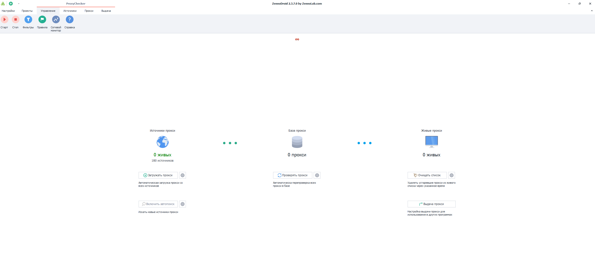
## Панель Управления.
Это окно открыто по умолчанию. Через него осуществляется контроль сбора прокси, а также настройка каждого этапа.  

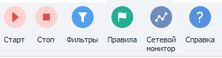
- **Старт\Стоп**. C помощью данных кнопок запускается\останавливается сбор и проверка прокси.
- **Фильтры**. Набор правил, которые применяются к прокси после загрузки их с источника, но до занесения в базу программы.  
- **Правила**. Набор условий, по которым можно взять прокси из списка *живых*.   
- **Сетевой монитор**. С помощью этой встроенной утилиты можно протестировать интернет подключение на максимальное количество одновременных потоков 
- **Справка**. Открывает в браузере Справку по продукту.
_________________
### Источники прокси.
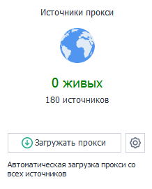  

Здесь настраивается загрузка прокси из источников. На значок планеты можно нажать, он перенаправит вас во вкладку **Источники**.
_________________
#### Количество источников.  
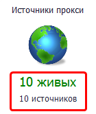  

Верхнее число отображает количество живых (рабочих) источников, а нижнее общее их количество.
#### Кнопка Загружать прокси.
При нажатии будет запущен сбор прокси из источников.  

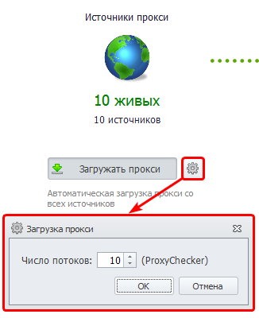  

С помощью кнопки с шестеренкой вы можете регулировать сколько потоков будет задействовано в загрузке прокси из источников.  
#### Включить автопоиск.
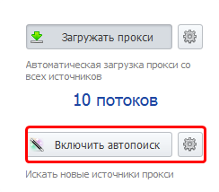
:::warning **Кнопка активна только тогда, когда включена Загрузка прокси.**
:::
После нажатия данной кнопки ProxyChecker будет самостоятельно искать в интернете источники с прокси. При нажатии на шестеренку можно гибко настроить параметры автопоиска.
_________________
### База прокси.
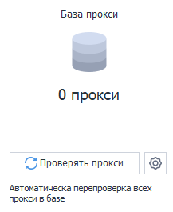  

Собственно, здесь и запускается процесс проверки прокси. На значок круглых ячеек можно нажать, он перенаправит вас во вкладку **Источники**. 
#### Кнопка Проверять прокси. 
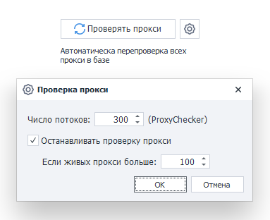  

Она запускает процесс проверки. Рядом также расположена уже привычная шестеренка, которая отвечает за настройки проверки. Тут можно задать число потоков для проверки и ограничение на количество живых прокси, по достижении которого проверка будет остановлена.  
_________________
### Живые прокси.
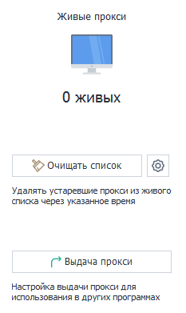  

Тут можно увидеть количество живых прокси, а также настроить время, в течение которого они будут считаться таковыми. На значок монитора можно нажать, он перенаправит вас во вкладку **Прокси**.  
#### Кнопка Очищать список.
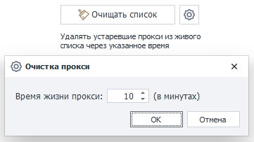  

При нажатии список живых прокси будет очищаться согласно настройке времени жизни, которую можно задать, кликнув на шестеренку.  
_________________
## Панель источники.
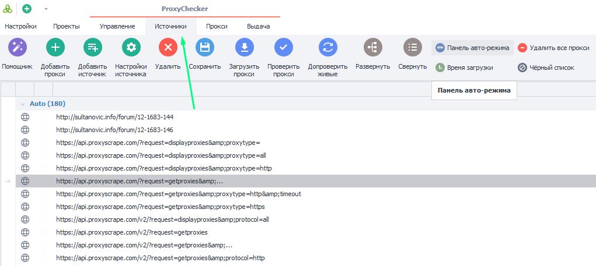  
### Помощник.
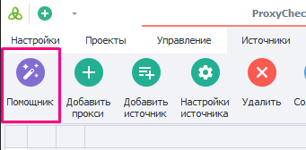  
Он предназначен для упрощения добавления **Источников парсинга** в программу.
#### Что нужно добавить?
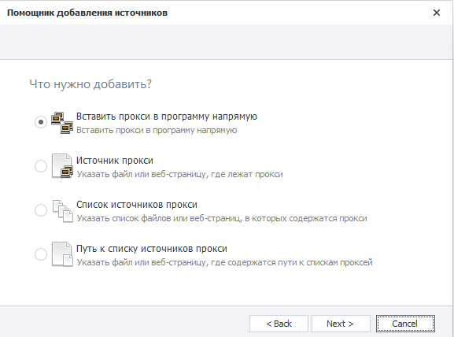  

Доступно четыре сценария:  
- **Вставить прокси в программу напрямую.** При выборе этого сценария, откроется пустое окно для внесения прокси.  
- **Источник прокси.** Здесь можно указать **Путь к файлу** или **Адрес URL (веб-страницу)**, откуда будут собираться прокси.  
- **Список источников прокси.** Буквально то же самое, что и первый вариант, но с возможностью указать сразу несколько источников.  
- **Путь к списку источников прокси.** Здесь как и во втором варианте, но указываются сразу несколько путей.  
_________________
### Главное окно Источников.  
На данной вкладке отображаются все добавленные в программу источники прокси. Также здесь находятся элементы управления, которые позволяют менять настройки источников, удалять их, добавлять, увидеть количество прокси и др.  

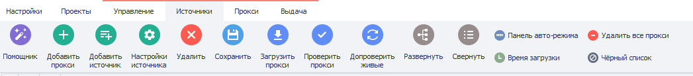
#### Доступные кнопки:
- **Добавить прокси.** Позволяет добавить прокси списком.  
- **Добавить источник.** Нужна для добавления источника сбора прокси.  
- **Настройки источника.** Данная кнопка изменяет настройки уже добавленных источников.  
- **Удалить**. С помощью нее можно удалить ненужные источники.  
:::warning **Удаление источника также повлечет удаление всех проксей этого источника.**
:::  
- **Сохранить**. Эта кнопка сохраняет адреса источников в файл.  
- **Загрузить прокси**. Загружает прокси из источника.  
- **Проверить прокси**. Запускает процесс проверки прокси на живых.  
- **Допроверить живые**. Позволяет повторно проверить уже найденные живые прокси источников.  
- **Развернуть**. Разворачивает группу со списком источников, если она была до этого в свёрнутом виде. 
- **Свернуть**. Сворачивает список.  
- **Панель авто-режима**. С помощью данной кнопки можно активировать панель для быстрого управления загрузкой и проверкой прокси. Появляется данная панель над списком источников: 

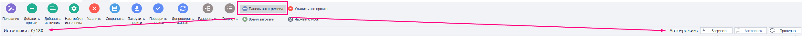 

В левой части панели отображено количество источников (живые источники/общее количество). А справа расположены кнопки для загрузки, поиска и проверки прокси.  
- **Время загрузки**. Добавляет три новых столбца в таблицу.

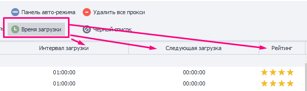  

- **Удалить все прокси**. Удаляет все прокси из программы.  
- **Чёрный список**. Если прокси не подходят для выполнения проекта или сам источник не вызывает доверия, то его можно добавить в черный список.  

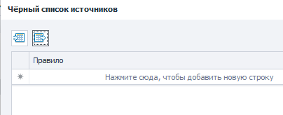
_________________
## Полезные ссылки.  
- [**Главная страница ZennoProxyChecker**](https://zennolab.com/ru/products/zennoproxychecker/)  
- [**Интерфейс ProjectMaker**](../category/интерфейс).  
- [**Подробная справка по ZennoProxyChecker**](https://zennolab.atlassian.net/wiki/spaces/RU/pages/475365507/ZennoProxyChecker).