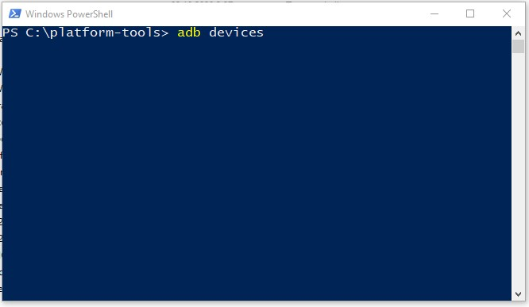

## Что такое Root-права и зачем они нужны?  

Простыми словами — это права суперпользователя, с которыми приложения могут использовать команду `su` и обходить стандартные ограничения Android, получать доступ к системным файлам и папкам, внедряться в память других процессов и так далее.  

Зачастую, в схеме root имеются 2 части — **сервер**, который выполняет основную программную работу, и **клиент**, который необходим для взаимодействия пользователя с первым, позволяя гибко настраивать систему выдачи этих самых прав.  

Но, как говорится, с великой силой приходит великая ответственность. При неумелом использовании Root-права могут нанести вред системе и вовсе превратить смартфон в «кирпич». 

#### Когда не нужно получать Root?
- Ваш телефон на гарантии. 
- Вы не можете сформулировать, зачем они вам нужны.  
- Вы работаете на телефоне с информацией содержащую банковскую/государственную/иную тайну.  
- У вас нет возможности сделать полный backup всех разделов системы, равно как и нет возможности восстановить устройство в случае утраты работоспособности из-за root-прав.  
_________________
## ADB и как с ним работать?  
Это инструмент, который позволяет вам управлять устройством Android с компьютера, чтобы вы могли устанавливать и удалять приложения, передавать файлы, смотреть логи.  

1. Прежде всего, нам нужно установить Android SDK на свой компьютер [**с официального сайт**](https://developer.android.com/tools/releases/platform-tools).  

  

2. Затем включаем на телефоне режим разработчика: **"Настройки → Система → О телефоне → нажимаем на Номер сборки несколько раз подряд**. Теперь в подразделе «**Система**» появится новый пункт «**Для разработчиков**». Находим «**Отладка по USB** (USB Debugging)» и включаем ее. 

3. Теперь открываем папку, в которую мы установили ADB  (обычно это будет папка ***platform-tools*** в каталоге Android SDK). Зажимаем ***Shift*** и кликаем правой кнопкой мыши по свободному месту окна, выбираем параметр «**Открыть окно PowerShell**». Подключите смартфон к компьютеру. Измените режим USB на режим «**передачи файлов (MTP)**». В окне командной строки введите команду `adb devices`.  

  

На экране телефона вы увидите всплывающее окошко — нажимайте ***разрешить доступ для отладки по USB***. Наконец, повторно введите команду `adb devices`. Если все прошло успешно, вы должны увидеть серийный номер вашего устройства в командной строке. Теперь вы можете запускать любую команду ADB на своем устройстве.  
#### Полезные команды.
- `adb install <путь к файлу APK>`. Эта команда устанавливает приложение APK на ваше устройство.  
- `adb uninstall <пакет приложения>`. Удаляет приложение с вашего устройства.  
- `adb shell`. Позволяет войти в оболочку (командную строку) вашего устройства Android прямо с компьютера.  
- `adb reboot`. Перезагружает устройство.  
- `adb pull <удаленный путь> <локальный путь>`. Копирует файлы с устройства на компьютер.  
- `adb push <локальный путь> <удаленный путь>`. Копирует файлы с компьютера на устройство.  
- `adb reboot recovery`. Загружает устройство в режим Recovery.
_________________
## Разблокировка загрузчика.  
Что за загрузчик и зачем его разблокировать? **Загрузчик** или **Bootloader**  – это относительно небольшой кусочек программного кода, который занимается запуском установленной системы. Сам по себе он — незаменимая часть устройства, но в его функции также входит реализация технологии **Verified Boot**. Эта технология призвана ограничить установку ОС до авторизованных производителем (путем проверки подписи файла). Наша цель — отключить механизм **Verified Boot**.  

Увы, универсальной инструкции для всех телефонов не существует. Более того – какие-то устройства вообще не имеют способа разблокировки загрузчика, а некоторые наоборот не блокируются производителем изначально. Проверить факт блокировки загрузчика можно с помощью ***adb*** в режиме **fastboot** - `fastboot oem device-info` (что это и как пользоваться этим инструментом разберем ниже). При ответе `true` – загрузчик заблокирован, иначе – нет.  

Если по результатам проверки вы обнаружили, что загрузчик заблокирован, вам придется искать инструкцию в интернете конкретно под ваш телефон. Мы рекомендуем воспользоваться сайтом производителя, форумом [**4PDA**](https://4pda.to/forum) или поисковиком в браузере (Google, DuckDuckGo и прочие).   
_________________
### Установка стороннего Recovery.
Раздел **Recovery** – аналог **BIOS** на компьютере, также именуется как «*Режим восстановления*». Этакая *подсистема*, которая призвана помочь в восстановлении работоспособности устройства. Заменить установленный производителем **recovery** необходимо потому, что он не даст вам ничего установить.  
#### Какие бывают Recovery?  
Существует 2 основных проекта стороннего **Recovery** – [***TWRP***](https://twrp.me/) и [***CWM***](https://www.clockworkmod.com/), а также все, что на них основано. Если на официальных сайтах этих проектов вы не нашли своего устройства, с высокой вероятностью вы найдете его на **4PDA** в теме своего аппарата.  
:::tip **Советуем.**
Мы рекомендуем использовать именно **TWRP-recovery**, поскольку он сильно превосходит в функциональности и удобстве **CWM**.
:::
  

_________________
После скачивания Recovery вы должны получить файл образа раздела android с расширением *.img*. Чтобы прошить новый раздел Recovery, необходимо перевести телефон в особый режим загрузчика – ***fastboot***. На большинстве устройств это делается с помощью зажатия **кнопки Питания + Громкость вниз** при включении телефона. Успешным входом в этот режим будет считаться черный экран с белой строкой ***fastboot mode***. После этого необходимо подключить устройство к компьютеру при помощи USB-кабеля.  

Для  прошивки раздела Recovery нам понадобится единственная ADB-команда:  
`fastboot flash partition PathToFile`.  
- `fastboot` — путь к файлу fastboot.exe, поставляется вместе с ADB; 
- `partition` — доступный для прошивки раздел Android. Мы шьем recovery;  
- `PathToFile`— путь к .img-образу recovery, который вы скачали;    
В итоге команда может выглядеть примерно так: `C:\adb\fastboot flash recovery C:\recovery.img`  
:::info **Интересно.**
*Некоторые recovery поставляются с автоматическими установщиками и ADB — вам нужно лишь запустить bat-файл.*  
:::   

После того, как в консоли появилось сообщение об успешном окончании процесса, можно пробовать запустить только что установленный Recovery. Через ADB-командну `adb reboot recovery` или нажатием **кнопки Питания + Громкость вверх** при включении телефона.  
_________________
## Получение Root-прав.
### Установка Magisk.

Первым делом нам необходимо, как обычно, сделать полный бекап разделов системы на внешний носитель  
(например, sd-карту), чтобы при возникновении проблем, вернуть все как было.  

Далее скачиваем [**Magisk**](https://github.com/topjohnwu/Magisk/releases). Это OpenSource-проект, который дает возможность внесистемного внесения изменений с помощью подключаемых модулей. Это означает, что с выключением Magisk-модуля, отменяются все изменения в системе, которые вносил этот модуль. В корне файловой системы создается *зеркало* раздела data (так и называется — ***data_mirror***), и необходимые изменения вносятся в систему посредством создания символических ссылок на этот раздел.  

Если ваш Recovery позволяет устанавливать **APK** как **zip-архивы**, то скачанный файл в исходном виде копируем на внешнюю память устройства. Так как внутренняя память зачастую шифруется, и вы в итоге не сможете достать этот файл. Если же ваш Recovery не умеет открывать APK-файлы, то Magisk.apk необходимо переименовать в **Magisk.zip** и таким же образом скопировать на устройство.

Теперь необходимо загрузиться в Recovery и сделать отдельно резервную копию раздела ***boot.img***. Если вдруг какой-то модуль выведет систему из строя, и у вас не будет возможности загрузиться в систему, то станет сложно отключить этот самый модуль или даже весь Magisk. Но имея на руках **boot** исходной системы (без Magisk), мы сможем восстановить конкретно этот раздел, а также работоспособность всей системы.  

После создания бекапов прошиваем установочный файл Magisk, как любой другой архив через Recovery (просто открываем его). После прошивки и загрузки системы в меню приложений появится приложение **Magisk**, которое при первом запуске обновится и сразу будет работать.  
_________________
### Настройка Magisk.  

С устройства переходим в настройки Magisk и активируем два пункта: **Zygisk** и **DenyList**. Для корректной работы этих функций нужно также установить два модуля из Github: [**Universal SafetyNet**](https://github.com/kdrag0n/safetynet-fix) и [**Shamiko**](https://github.com/LSPosed/LSPosed.github.io/releases). Теперь переходим в **Настройки DenyList** и ставим галочки рядом с приложениями, от которых мы хотим скрыть Root (например, банковские приложения).  
:::info **Внимание.**
Для некоторых приложений это не сработает. В этом случае открываем список компонентов приложения и ставим галочки напротив каждого из них. 
:::

Также в настройках Magisk нажимаем на **Скрыть приложение Magisk**, поскольку его наличие можно вычислить элементарно по списку установленных приложений  (так, например, делает MirPay). Вводим любое подменное название и нажимаем *Ок*. После проделанных действий перезагружаем телефон. Загрузка может быть слегка дольше, чем обычно.  

:::warning **Необходимо.**
Скрытие root для приложения необходимо делать до первого запуска целевого приложения!  
:::

### Полезные модули для Magisk.  
- ***Busybox***. Дает доступ приложениям к встроенному busybox от Magisk. Это компактная исполняемая программа, которая содержит набор утилит командной строки (например, ls, cp, mv, rm, и т. д.). Она объединяет множество стандартных утилит в единый исполняемый файл, что делает ее полезной для систем с ограниченными ресурсами.  
- ***No Storage Restricts***. Убирает ограничения в выборе папок в файловом менеджере.  
- ***LuckyPatcher***. Нужен для переноса приложений в системный раздел.  
- ***Move Certificates***. Перенос пользовательских сертификатов в систему.  
- ***NFC Screen Off***. Включает работу NFC при выключенном экране.