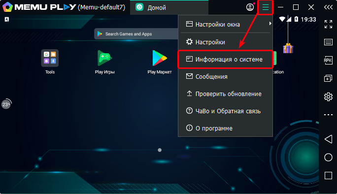
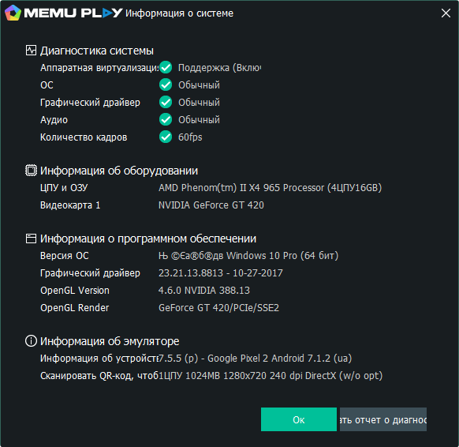

## Для версий Lite и Professional.  
### Как минимум вам понадобятся:
- **Процессор:** Intel или AMD от 2 ядер, частотой от 2 ГГц каждое.  
- **RAM:** не менее 4 Гб.  
- **Место на накопителе:** не менее 6 Гб.  
- **Видеопамять:** не менее 1024 Мб.  
- **Наличие Direct X 11+ или OpenGL 2.0.**  
- **Операционная система:** Windows 10 x64 и более поздние версии (Server Core не поддерживается).  
- **Наличие .Net Framework 2.0, 3.5 и 4.6.2+.** 
- **Также Visual C++ redistributable 2008, 2010, 2013, 2015, 2017, 2019 x86 или x64.**  
- **Права администратора.** Они понадобятся для установки и запуска программы.  
- **Аппаратная виртуализация.**  
- **Интернет.** Без него не получится работать.  
:::warning **Обязательно.**
Hyper-V должен быть отключён!
:::
_______________________________________________
## Как узнать о системе с помощью Memu?  
Запустите эмулятор, зайдите в меню и выберете пункт **Информация о системе**. 

   

Выглядеть она будет вот так:  

 