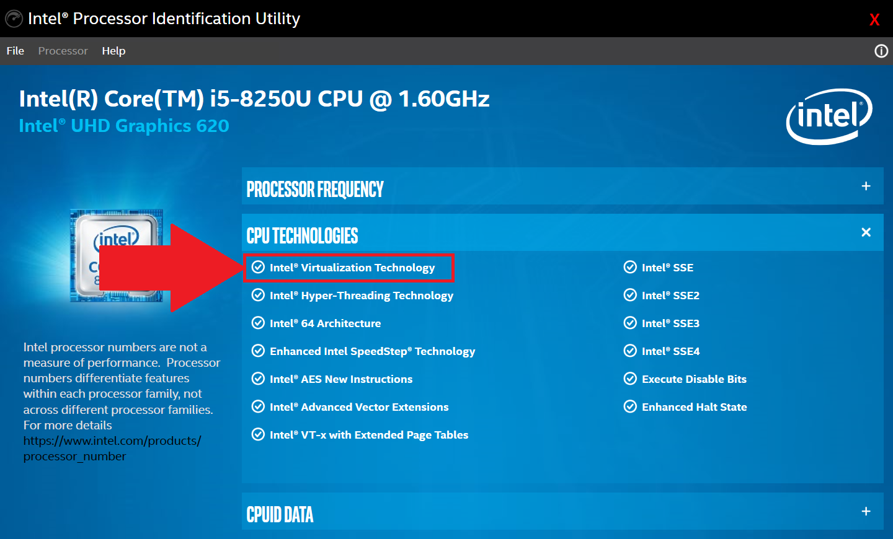
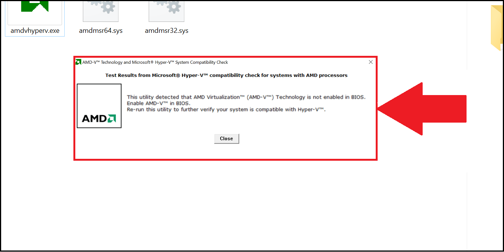
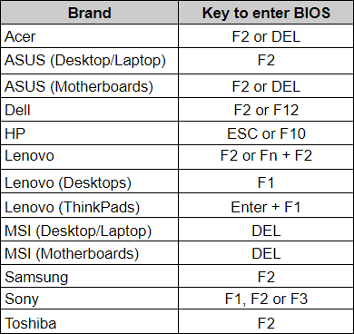
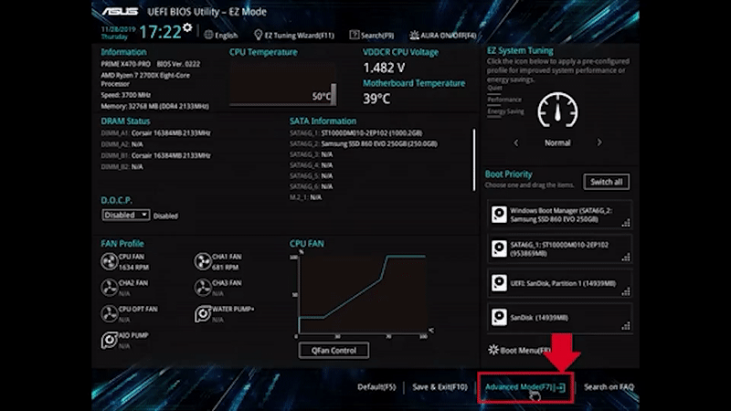

## Что такое виртуализация и зачем её включать?  

Виртуализация позволяет запускать на вашем устройстве различные операционные системы, например Android. В том числе ZennoDroid использует эту виртуальную среду для более эффективной работы с эмулятором. Мы настоятельно рекомендуем включать виртуализацию, так как вы получите более высокую производительность при работе с эмулированными устройствами.  

***Так можно узнать, включена ли уже виртуализация.***
  

  

  
## Проверим, доступна ли виртуализация.
### Компьютеры с процессорами (CPU) от Intel.  
Скачайте и установите [**Intel Processor Identification Utility**](https://www.intel.com/content/www/us/en/download/12136/28539/intel-processor-identification-utility-windows-version.html?v=t), откройте вкладку **CPU Technologies**. Галочка рядом с  
*Intel® Virtualization Technology* указывает на доступность включения виртуализации.  

### Компьютеры с CPU от AMD.
Скачайте [**AMD-V Detection Utility**](https://download.amd.com/techdownloads/AMD-VwithRVI_Hyper-V_CompatibilityUtility.zip) и распакуйте файлы. Запустите **.exe** как администратор. Программа сообщит, доступна ли вашему устройству функция виртуализации.  

 
## Как войти BIOS?
 
1. Зайдите в меню **Пуск** и перейдите в **Параметры/Настройки Windows**.  
2. Нажмите на **Центр обновления Windows** и выберите **Восстановление**, затем **Перезагрузить сейчас**.  
3. Выберите **Troubleshoot** и **Расширенные опции**.  
4. Выберите **UEFI Firmware settings** и нажмите **Перезагрузить сейчас**.  

Также вы можете попасть в BIOS, нажав на кнопку доступа во время включения компьютера:  

  

Мы собрали ряд самых популярных производителей для вашего удобства в этой таблице. Однако если вы не видите вашего варианта в списке, то мы рекомендуем уточнить информацию в инструкции к оборудованию.  
_________________
## Включаем виртуализацию.  
:::tip **Это нормально.**
*Содержание и внешний вид BIOS отличаются у разных производителей, но общая логика сохраняется.*
:::  
>   
### Intel CPU   
   
1. Нажмите **F7** или на вкладку **Advanced Mode (расширенные настройки)**.  
2. Там выберите **CPU Configuration**.  
3. Перейдите к строке **Intel Virtualization Technology** и нажмите на параметр **Disabled** чтобы сменить его на **Enabled**.  
4. Нажмите на **Exit** и выберите <mark>**Save changes & reset**</mark>, чтобы включить виртуализацию.  
:::warning **Важно.**
Обязательно сохраните изменение перед выходом, чтобы оно применилось.
::: 
### AMD CPU  

1. Нажмите **F7** или на вкладку **Advanced Mode (расширенные настройки)**. 
2. Там выберите **CPU Configuration**.  
3. Перейдите к строке **SVM Mode** и выберите **Enabled** из выпадающего меню.  
4. В конце нажмите на **Exit** и **OK**, чтобы применить настройки.  
:::warning **Важно.**
Обязательно сохраните изменение перед выходом, чтобы оно применилось.
:::