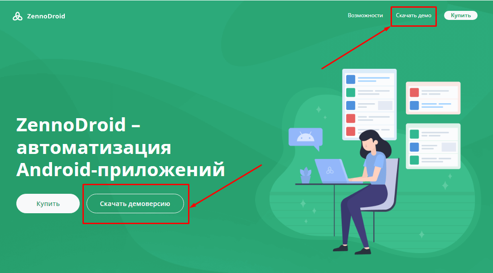
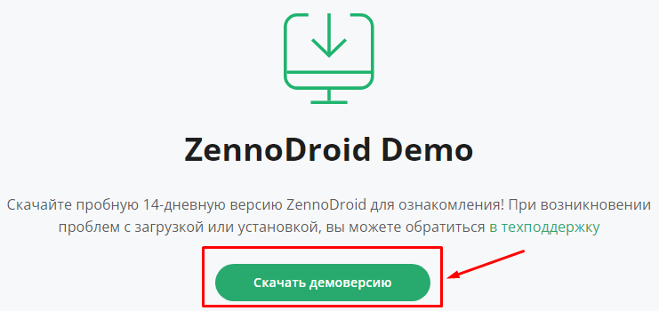
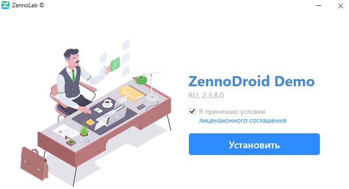
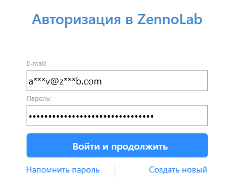

:::info **Пожалуйста, ознакомьтесь с [*Правилами использования материалов на данном ресурсе*](../Disclaimer).**
:::

## Как получить Демо?  
**1.** Откройте сайт [**ZennoDroid**](https://zennolab.com/ru/products/zennodroid/) и нажмите **Скачать Демо**.  

    
_______________________________________________
**2.** Вас перебросит на отдельную страницу с демо, там потребуется еще раз нажать на кнопку **Скачать демоверсию**.  

 
_______________________________________________
**3.** Начнется загрузка файла-установщика, по завершению запустите его.  
Читаем условия [***Лицензионного соглашения***](https://zennolab.com/ru/terms-of-service/) и ставим галочку, если согласны с ними.  

 
_______________________________________________
**4.** Выбираем путь для установки и вводим данные от [**аккаунта ZennoLab**](https://account.zennolab.com/personal-area-main).  

 
_______________________________________________
**5.** Установка завершена.  
_______________________________________________  
## Ограничения Демоверсии.  
- Программа работает только 14 дней.  
- Для выполнения доступен лишь 1 поток.  
- Использование прокси заблокировано.  
- Капчи вводятся вручную, использовать сервисы для автоматическое распознавания нельзя (например, [CapMonster.Cloud](https://capmonster.cloud/ru/)).  
- Если вы не авторизовались в аккаунт во время установки, то проекты не получится передать другим пользователям. После окончания Демоверсии все проекты станут недоступны.  
- Нельзя использовать .bat файлы для запуска проектов.  
_______________________________________________
### В чем отличие от Lite-версии?  
Lite — это полноценная программа и демоверсия не сможет ее заменить. Например, при выполнении проекта (отладки) запускается счетчик в 10 минут, который отсчитывает время работы автоматизации. При истечении этого времени пользователю нужно будет вручную ввести капчу, чтобы продолжить работу. Но тестировать функции и писать шаблоны можно без подобных ограничений.  
_______________________________________________
### Как продлить демо?  
По истечению пробного периода работа программы будет приостановлена. Вы не сможете запускать или создавать проекты. Если срок демо лицензии истек, вы сможете попробовать снова через 16 дней.  
_______________________________________________
### Могу ли я продолжить работать с демо-проектами после покупки лицензии?  
Да, но только если вы авторизовались во время установки демо.  
:::info **Напишите нам.**
Если проекты, сделанные в демоверсии, перестали открываться в новой демке или в лицензионной версии, можете прислать их нам в **support@zennolab.com**. Мы поможем восстановить доступ.  
:::
