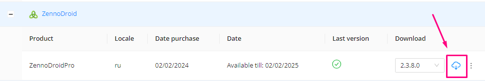
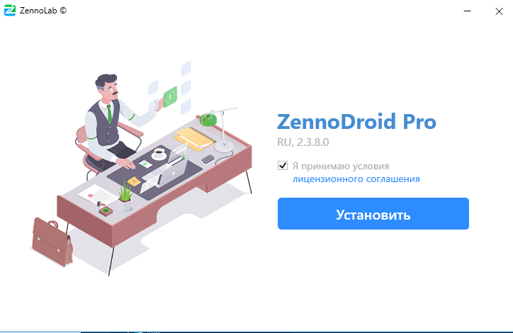
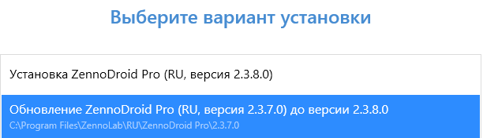
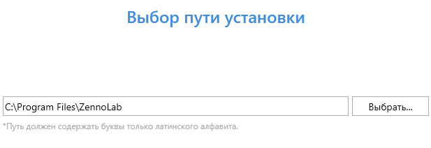
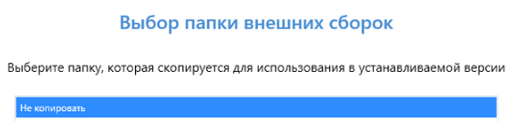
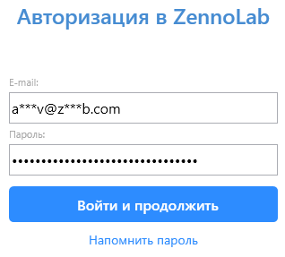
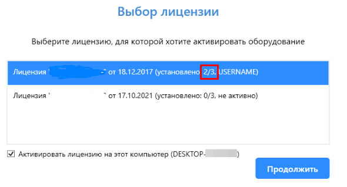
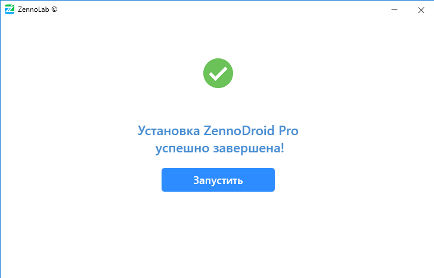
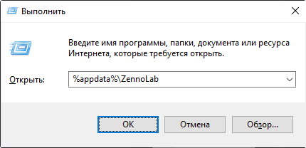

:::info **Пожалуйста, ознакомьтесь с [*Правилами использования материалов на данном ресурсе*](../Disclaimer).**
:::
_______________________________________________
## Разберем по шагам:  
**1.** Скачиваем установочный файл из своего [**Личного кабинета**](https://account.zennolab.com/personal-area-main/my-products) и запускаем его.  

  
_______________________________________________
**2.** Внимательно читаем условия [***Лицензионного соглашения***](https://zennolab.com/ru/terms-of-service/) и ставим галочку, если согласны с ними. Нажимаем на кнопку **Установить**.  

  
_______________________________________________
**3.** Если на компьютере есть старые версии ZD, то установщик предложит обновить одну из них. Также вы можете произвести отдельную установку, так как поддерживается наличие сразу нескольких версий программы.  

  
_______________________________________________
**4.** Выберите путь для установки или оставьте по умолчанию, а затем нажмите **Продолжить**.  
:::info **Оставьте путь по умолчанию, чтобы избежать возможных ошибок.**
:::  
  
_______________________________________________
**5.** Если в одной из предыдущих версий вы использовали внешние `dll` библиотеки и копировали их в папку **ExternalAssemblies**, то на этом шаге будет предложено автоматически скопировать их в новую установку.  

  
_______________________________________________
**6.** Далее введите свой *email* и *пароль* от [**Личного кабинета**](https://auth.zennolab.com/auth/realms/zennolab/account/password) и нажмите **Продолжить**.  

:::tip **Забыли пароль от учётной записи?**
Нажмите **Напомнить пароль**. Будет открыт браузер по умолчанию на [странице восстановления пароля](https://auth.zennolab.com/auth/realms/zennolab/login-actions/reset-credentials).  
:::  
_______________________________________________
**7.** Когда куплено несколько копий программы, на этом этапе вы сможете выбрать необходимую лицензию.  

  
:::info **Количество установленных экземпляров.**
Указано в скобках для конкретной лицензии. **2/3** означает, что программа уже была установлена на **два компьютера**, а максимальное количество установок - 3 (для **Lite** версии 1).
:::  
_______________________________________________
**8.** По завершению установки вы сразу можете запустить программу.  

  
_______________________________________________
## Где хранятся настройки программы и проектов?
Большая часть настроек хранится в папке **AppData**. Чтобы быстро попасть в эту директорию вызовите утилиту **Выполнить** нажатием `Win+R`, а затем введите `%appdata%\ZennoLab` и кликните на **ОК**.  

  
_______________________________________________
## Полезные ссылки.  
- [**Системные требования**](./SysReq). 
- [**Демо версия ZennoDroid**](./ZD_Demo).     
- [**Установка Memu**](./Memu_Install).  
  

