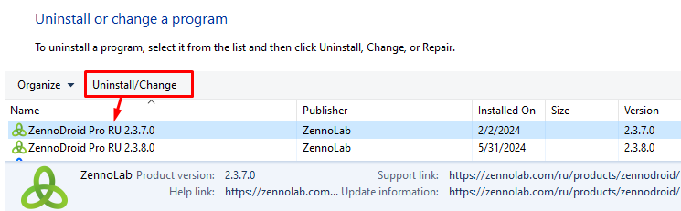

---
sidebar_position: 12
title: Удаление ZennoDroid
description: Как удалить программу с компьютера?
---  
:::info **Пожалуйста, ознакомьтесь с [*Правилами использования материалов на данном ресурсе*](../Disclaimer).**
:::
## Разберем удаление по пунктам:
**1.** Открываем **Панель управления** и переходим в пункт **Удаление программы**.  

  
_______________________________________________
**2.** Находим **ZennoDroid**, выбираем нужную версию и нажимаем **Удалить/Изменить**.

  
_______________________________________________
**3.** Запустится программа удаления с кнопкой **Удалить**  

   
_______________________________________________
**4.** Теперь можно выбрать дополнительные опции удаления.  

 

- ***Удалить директорию с программой полностью***.  
При включении этой опции будет полностью удалена директория программы. В том числе папка логов и ***ExternalAssemblies*** (в этом каталоге хранятся подключаемые к проектам внешние ***dll*** библиотеки).  
- ***Удалить пользовательские данные в AppData***.  
Большая часть настроек программ хранится по пути `C:\Users\USERNAME\AppData\Roaming\ZennoLab`. Там находятся настройки проектов и программы, а также расписания. Если будет отмечена данная опция, то все эти настройки будут безвозвратно утеряны.  
:::warning **ВНИМАТЕЛЬНО.**
Если вы удалите каталог в *AppData*, то пропадут настройки для всех версий программы, а не только для той, которую вы сейчас удаляете!
:::  
_______________________________________________
**5.** Когда вы определитесь и выберете подходящий вариант (можно вообще не ставить галочку), нажимайте **Продолжить**.  

 
_______________________________________________
**6.** Готово! Удаление завершено.  

 